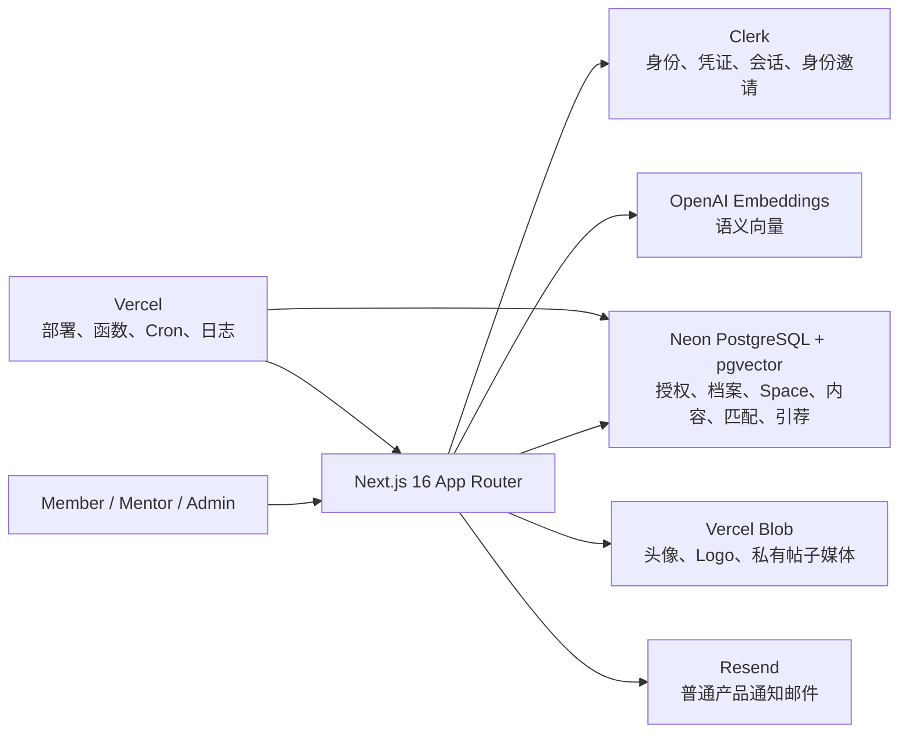

# Wavesparks Community

Wavesparks Community 是一个面向创业者、导师与运营团队的私密邀请制社区平台。它把长期主社区（Main Community）和每一场独立活动（Event）建模为边界清晰的 `Space`，并在每个 Space 内提供内容、成员发现、AI 匹配、引荐和运营管理能力。

> [!IMPORTANT]
> 当前代码尚不能直接视为“可安全上线”。首次生产环境引导存在管理员账号无法完成 Clerk 绑定的 P0 问题，且 5 个路由仍按邮箱而非 `clerk_user_id` 做管理员授权，属于必须处理的 P1 风险。详见[上线阻断项与已知风险](#上线阻断项与已知风险)。在这些问题修复并回归验证前，不应开放生产流量。

## 文档导航

| 读者 | 在线源文档 | 可下载 PDF |
| --- | --- | --- |
| Member（成员） | [Member 全生命周期使用手册](docs/manuals/member-guide.zh-CN.md) | [Member 使用手册 PDF](output/pdf/wavesparks-member-user-manual-zh-CN.pdf) |
| Mentor（导师） | [Mentor 全生命周期使用手册](docs/manuals/mentor-guide.zh-CN.md) | [Mentor 使用手册 PDF](output/pdf/wavesparks-mentor-user-manual-zh-CN.pdf) |
| Admin（管理员） | [Admin 运营与基础设施手册](docs/manuals/admin-guide.zh-CN.md) | [Admin 运营手册 PDF](output/pdf/wavesparks-admin-operations-manual-zh-CN.pdf) |

补充技术文档：

- [现有用户生命周期说明](docs/user-lifecycle-guide.md)
- [现有管理员生命周期说明](docs/admin-lifecycle-guide.md)
- [AI 匹配引擎说明](docs/ai-matching-engine.md)

三份 PDF 由同名 Markdown 源文件生成。修改手册内容或截图后执行：

```bash
python3 -m pip install -r requirements-docs.txt
python3 scripts/build-manual-pdfs.py
```

使用 Python 3.11+；渲染依赖固定在 `requirements-docs.txt`。提交前应以 `--strict` 重新生成三份 PDF，并检查页数、可检索文字、目录/页码以及所有页面的渲染结果：

```bash
python3 scripts/build-manual-pdfs.py --strict
```

## 产品模型

### 核心原则

- **只接受个人邀请**：没有公开注册、共享邀请码或匿名社区 Feed。
- **身份与授权分离**：Clerk 管身份、凭证和会话；Wavesparks/Neon 管账号、角色、邀请和 Space 权限。
- **主社区与活动独立**：参加 Event 不会自动进入 Main Community，进入 Main 也不会获得任何 Event 权限。
- **一个全局档案，多份 Space 意图**：核心 Profile 跨 Space 复用；目标、需求、可提供内容与匹配开关按 Space 单独保存。
- **数据默认按 Space 隔离**：帖子、成员目录、关注、匹配、反馈和待处理引荐都属于明确的 Space。
- **联系方式延迟披露**：普通参与双方只有在引荐被接受后才能看到彼此的私密联系方式；授权 Admin 可为运营查看成员资料。

### 三个彼此独立的权限维度

| 维度 | 存储字段 | 状态 | 决定什么 |
| --- | --- | --- | --- |
| 账号权限 | `memberships.role` | `member` / `org_admin` | 是否可进入 Admin 控制台 |
| 导师资格 | `memberships.mentor_status` | `not_mentor` / `needs_review` / `approved` | 是否拥有导师徽标、服务资料、导师匹配与 Mentoring 工作台 |
| Space 权限 | `space_memberships.access_status` | `active` / `waitlist` / `rejected` / `suspended` / `removed` | 是否可进入某一个 Main Community 或 Event |

`Approved mentor` 不等于 Admin，Admin 也不自动成为任何 Space 的社交成员。管理员若要出现在成员目录、发帖或参加匹配，仍需被明确加入对应 Space。

有效的 Space 访问遵循统一规则：

```text
已由邀请流程绑定的 Clerk 身份
+ account_status = connected
+ 账号未被 suspended / deprovisioned
+ 当前 Space entitlement = active
+ 当前 Space 生命周期允许成员访问
= 有效访问
```

历史字段 `memberships.status` 与旧 Cohort 记录仅为迁移兼容，不是 Main Community/Event 权限的最终依据。

## 角色与完整功能

### Member

Member 的完整使用路径是：收到私人邀请 → 用被邀请邮箱创建或登录 Clerk → 完成账号绑定 → 从 My Spaces 进入获准 Space → 完善全局档案 → 参与内容与连接 → 为各 Space 配置匹配意图 → 管理引荐和通知。

已实现功能：

- 在 `/org/:slug` 查看 My Spaces，包括 Main Community、进行中/即将开始的 Events 和 Past Events。
- 浏览 Space Feed，并按内容类型、标签等条件筛选。
- 发布 7 类帖子：General update、Question、Opportunity、Looking for co-founder、Looking for mentor、Resource、Announcement。
- 添加评论、关注/取消关注成员、收藏/取消收藏帖子。
- 浏览当前 Space 的 People 目录与成员资料。
- 通过成员资料、帖子或匹配结果发起普通引荐。
- 在 Knowledge 和 Opportunities 视图浏览对应内容。
- 完成一个跨 Space 共享的核心 Profile；头像、经历、技能、偏好等修改会在所有 Space 生效。
- 为每个 Space 分别填写当前目标、正在寻找、可以提供以及是否参与匹配。
- 查看每个 Space 的 AI 推荐，提交 Helpful / Not relevant 反馈并选择原因。
- 在 Space Introductions 中处理当前 Space 请求，在账号级 Inbox 中查看跨 Space 的引荐历史和通知。
- 接受引荐后，仅向双方解锁邮箱/WhatsApp 等私密联系方式。

完成 Profile 并解除互动限制需要以下 7 项：preferred name、headline、bio、current focus、至少一个 seeking match type、至少一个 skill tag、intro email。账号绑定且拥有有效 Space 权限后可先阅读；发帖、评论、People、关注、发起引荐和匹配需要完整 Profile。

### Mentor

Mentor 是 `mentor_status = approved` 的账号级资格，可与 Member/Admin 身份组合，但不会带来任何额外 Admin 权限或跨 Space 访问。

已实现功能：

- 展示 Approved mentor 标识和导师服务资料。
- 配置导师简介、可提供形式、擅长领域、可用性和偏好 mentee 数量。
- 在已获准进入的 Space 中进入导师发现和 mentor 类型匹配。
- 发布 Mentor 来源的 Opportunities。
- 接收从标准 mentor match 或成员资料“Request mentoring”入口产生的 mentoring request。
- 在账号级 `/org/:slug/mentoring` 工作台按 All、Needs response、Accepted、Declined、Expired 管理请求。
- 接受或拒绝 mentoring request；接受后双方才看到联系方式。
- 关闭 mentor matching offering，暂停新的导师匹配和直接 mentoring request。

可用性与容量目前仅用于说明/排序，不会自动拒绝超额请求。导师仍需拥有来源 Space 的 active entitlement，并满足与普通成员相同的 Profile、隐私与生命周期限制。

### Admin

Admin 控制台位于 `/org/:slug/admin`，覆盖账号、邀请、Space、内容、连接、匹配和社区设置。

| 工作区 | 主要能力 |
| --- | --- |
| Overview | 查看成员、内容、引荐和近期活动的汇总指标 |
| Members | 搜索/筛选账号，单人邀请，CSV/XLSX/粘贴批量导入，查看逐行结果，重试/撤销邀请，调整角色、导师资格、账号状态和 Space 权限 |
| Community & Events | 管理永久 Main Community，创建/更新/结束/归档/恢复 Event，维护参与者名单，显式执行 Add to Main Community，查看 Space 级活动和匹配审计 |
| Profiles | 检查完整成员资料与私密联系方式，标记资料状态，导出 CSV |
| Posts | 跨 Space 审核帖子和评论，归档/恢复帖子，移除/恢复评论、图片和链接预览 |
| Requests | 按 Space 查看引荐状态和来源，为符合条件的成员创建人工引荐 |
| Matches | 查看推荐结果，按组织手动刷新（相关资料变更会触发更小范围的重算），配置匹配类别、方向、最低分和权重，查看匿名化反馈与运行记录 |
| Analytics | 查看连接账号、完整 Profile、引荐与团队等社区指标 |
| Settings | 更新社区名称、介绍、品牌图片和邀请操作指引 |

高影响操作（授予 Admin、全局暂停/关闭账号、拒绝/移除 Space 权限等）在 UI 中要求明确确认。Space 级移除不会重写其他 Space 的名单。

## 当前明确不包含的产品能力

以下能力当前没有实现；运营手册不应暗示其存在：

- 积分、声望、排行榜、可赚取徽章或证书（Approved mentor 是资格标识，不是游戏化徽章）。
- Event RSVP、签到或现场票务。
- 站内私信、帖子点赞、用户举报/拉黑。
- 成员自助退出 Space、删除账号或导出个人数据。
- 作者自助编辑/删除已发布帖子或评论；当前由 Admin 做归档/移除与恢复。
- Event 与 Main Community 之间自动复制帖子、关注、匹配、反馈或引荐。
- 按导师容量自动拒绝请求。
- Resend webhook 回流、投递状态同步或产品内邮件告警。

## Space 生命周期与隔离

每个组织恰好有一个永久 Main Community。它始终为 `active`，不能结束或归档。Event 有以下生命周期：

| 状态 | 成员可见性 | 内容与互动 | 匹配 |
| --- | --- | --- | --- |
| `draft` | 不向成员开放 | 不开放 | 跳过 |
| `upcoming` | 有 active entitlement 的成员可进入 | 开放 | 可运行 |
| `active` | 有 active entitlement 的成员可进入 | 开放 | 可运行 |
| `ended` | 显示为 Past Event | 仍可阅读和互动 | 仍可运行 |
| `archived` | 从成员端隐藏 | 关闭成员访问，数据保留供 Admin 审计 | 跳过并清除该 Space 可见结果 |

结束 Event 不等于关闭社区；只有 archive 才关闭成员访问。每个帖子只属于一个 Space，评论继承帖子边界，收藏链接与通知链接在打开时都会重新校验访问权限。

## 邀请、登录与账号生命周期

### 邀请流程

1. Admin 在 Wavesparks 选择账号权限、导师资格、目标 Space 和初始 Space 权限。
2. Wavesparks 在 Neon 创建/更新本地用户、membership、Space entitlement 和一次性邀请。
3. 本地原始 token 只出现在邀请 URL 中，数据库仅保存 SHA-256 hash；有效期为 7 天。
4. Wavesparks 调用 Clerk application invitation；邀请邮件由 Clerk 发送，不依赖 Resend。
5. 用户打开链接后，URL token 被换成 15 分钟、`HttpOnly` 的邀请 handoff cookie。
6. 用户创建或登录 Clerk 账号；服务端重新读取 Clerk 用户并验证“已验证邮箱”与邀请邮箱完全一致。
7. 接受事务原子写入 `users.clerk_user_id`、把 `account_status` 改为 `connected` 并消费邀请。
8. 此后生产请求按 `clerk_user_id` 查找本地账号；普通 Clerk webhook 不允许按邮箱自动绑定。

邀请状态包括 `pending`、`accepted`、`revoked`、`expired`；投递失败会保留可审计错误供 Admin 重试。成功提示代表 Clerk 接受了发送请求，并不保证邮件已进入收件箱。

### 账号状态

| `account_status` | 含义 | 效果 |
| --- | --- | --- |
| `invited` | 本地账号已创建但尚未完成身份绑定 | 不能进入任何 Space |
| `connected` | Clerk 用户已通过邀请事务绑定 | 可使用自己拥有的 active Space entitlement |
| `suspended` | 可恢复的全局安全暂停 | 覆盖所有 Space 权限 |
| `deprovisioned` | 组织账号已关闭 | 覆盖所有 Space 权限，需 Admin 显式恢复 |

Clerk Organizations 在本项目中故意不使用。Clerk webhook 只同步已经绑定用户的身份字段，并在 `user.deleted` 时触发匿名化；它不会创建 membership、角色或 Space 权限。

## 路由地图

以下示例用 `wavesparks` 作为 `:slug`。

### 账号级路由

| 路由 | 用途 |
| --- | --- |
| `/org/wavesparks` | My Spaces 首页 |
| `/org/wavesparks/accept-invitation` | 私人邀请落地页 |
| `/org/wavesparks/signin` | Clerk 登录 |
| `/org/wavesparks/sign-up` | 邀请制 Clerk 注册 |
| `/org/wavesparks/auth/complete` | 登录/邀请后的账号完成流程 |
| `/org/wavesparks/pending` | 未连接或暂停状态说明 |
| `/org/wavesparks/onboarding` | 核心 Profile 引导 |
| `/org/wavesparks/profile` | 全局 Profile 设置 |
| `/org/wavesparks/requests` | 跨 Space 引荐历史与通知 Inbox |
| `/org/wavesparks/mentoring` | Approved mentor 的账号级工作台 |

### Space 级规范路由

```text
/org/:slug/s/:spaceSlug/feed
/org/:slug/s/:spaceSlug/people
/org/:slug/s/:spaceSlug/people/:membershipId
/org/:slug/s/:spaceSlug/matches
/org/:slug/s/:spaceSlug/knowledge
/org/:slug/s/:spaceSlug/opportunities
/org/:slug/s/:spaceSlug/requests
/org/:slug/s/:spaceSlug/compose
/org/:slug/s/:spaceSlug/posts/:postId
```

旧的组织级 Feed/People/Matches/Knowledge/Opportunities/Compose 路由只负责重定向到明确 Space 或 My Spaces；旧的 Admin Cohorts 路由重定向到 Community & Events。旧帖子直链会先重新授权其所属 Space，再决定是否重定向。

### Admin 路由

```text
/org/:slug/admin
/org/:slug/admin/members
/org/:slug/admin/spaces
/org/:slug/admin/spaces/:spaceId
/org/:slug/admin/profiles
/org/:slug/admin/profiles/export
/org/:slug/admin/posts
/org/:slug/admin/requests
/org/:slug/admin/matches
/org/:slug/admin/analytics
/org/:slug/admin/settings
```

## 系统架构



### 技术栈

- Next.js `16.2.4`（App Router）与 React `19.2.4`
- TypeScript 5、Tailwind CSS 4
- Clerk `@clerk/nextjs` 7
- Neon PostgreSQL、Drizzle ORM/Kit、`pgvector`
- OpenAI `text-embedding-3-large`
- Vercel Blob、Resend
- Vitest、Testing Library、Playwright
- pnpm `10.19.0`

> 项目使用的 Next.js 版本包含破坏性 API 与约定变更。修改 Next.js 相关代码前，必须先阅读 `node_modules/next/dist/docs/` 中与目标功能对应的文档。

### 目录结构

```text
src/app/                 App Router 页面与 API Route Handlers
src/actions/             Member/Admin Server Actions
src/components/          社区、Admin、布局与 UI 组件
src/db/                  Drizzle client 与 schema
src/lib/                 认证、权限、Profile、Space、配置等领域逻辑
src/server/              Store、匹配、邀请、通知、媒体与 view model
drizzle/                 SQL migrations 与元数据
scripts/                 迁移、种子、bootstrap、环境审计、readiness、匹配任务
tests/                   Vitest/组件/路由/领域测试与 Playwright E2E
docs/                    生命周期、技术说明与三角色手册源文件
output/pdf/              生成的三份 PDF 使用手册
```

## 本地开发

### 前置条件

- Node.js（与 Next.js 16 兼容的当前 LTS）
- pnpm `10.19.0`
- 可选：本地或 Neon PostgreSQL（需要 `pgvector`）
- 可选：Clerk test instance、OpenAI、Vercel Blob 与 Resend 凭证

### 启动

```bash
pnpm install
cp .env.example .env.local
pnpm dev
```

打开 `http://localhost:3000/org/wavesparks/signin`。

未配置 `DATABASE_URL` 时，应用使用供 UI 和测试使用的内存种子数据；这不是持久化开发环境。需要验证迁移、并发、约束或生产行为时必须使用 PostgreSQL。

### 环境变量

| 变量 | 生产要求 | 用途 |
| --- | --- | --- |
| `NEXT_PUBLIC_APP_URL` | 必需（也可由 Vercel system URL 回退） | 社区应用根 URL；必须指向 app 域名而非营销站 |
| `NEXT_PUBLIC_CLERK_PUBLISHABLE_KEY` | 必需，使用 `pk_live_` | Clerk 前端身份配置 |
| `CLERK_SECRET_KEY` | 必需，使用 `sk_live_` | Clerk 后端 API 与用户校验 |
| `CLERK_JWT_KEY` | 可选、推荐 | 预览域 OAuth handoff 的本地 JWT 验证；未配置时可用 secret key |
| `CLERK_WEBHOOK_SIGNING_SECRET` | 必需 | 验证 `/api/webhooks/clerk` 的 Svix 签名 |
| `NEXT_PUBLIC_CLERK_PROXY_URL` | 可选 | 仅在 Clerk Dashboard 已启用相同代理域时设置 |
| `NEXT_PUBLIC_CLERK_SIGN_IN_URL` | 可选 | 默认 `/org/wavesparks/signin` |
| `NEXT_PUBLIC_CLERK_SIGN_UP_URL` | 可选 | 默认 `/org/wavesparks/sign-up` |
| `NEXT_PUBLIC_CLERK_SIGN_IN_FALLBACK_REDIRECT_URL` | 可选 | 默认 `/org/wavesparks` |
| `NEXT_PUBLIC_CLERK_SIGN_UP_FALLBACK_REDIRECT_URL` | 可选 | 默认 `/org/wavesparks` |
| `DATABASE_URL` | 必需 | Neon/PostgreSQL 连接串；需支持 `pgvector` |
| `SPACE_SCOPED_READS_ENABLED` | 必须显式为 `true` | Space 读取总开关；生产缺失或非 true 会 fail closed |
| `OPENAI_API_KEY` | readiness 必需 | 生产语义 embedding；失败时会降级为本地确定性 token hash |
| `RESEND_API_KEY` | 可选但预期配置 | 普通产品通知邮件；不用于会员邀请 |
| `RESEND_FROM_EMAIL` | 与 Resend key 成对配置 | 通知发件人 |
| `CRON_SECRET` | 必需，建议至少 32 字符 | 保护匹配重算与媒体清理端点 |
| `BLOB_READ_WRITE_TOKEN` | 可选但预期配置 | 头像、Logo、帖子图片与链接缩略图存储 |
| `WAVESPARK_ADMIN_EMAILS` | readiness 必需 | bootstrap 管理员邮箱列表；**不会自动完成 Clerk 身份绑定** |
| `E2E_CLERK_ADMIN_EMAIL` | 仅测试 | Clerk E2E Admin 测试账号 |
| `E2E_CLERK_USER_EMAIL` | 仅测试 | Clerk E2E Member 测试账号 |

脚本按优先级读取 `.env.<environment>.local`、`.env.local`、`.env.<environment>`、`.env`，且不会覆盖已经存在的进程变量。敏感变量不得提交到仓库；`NEXT_PUBLIC_*` 会暴露给浏览器，不能存放 secret。

## 数据库、迁移与种子

生成 Drizzle SQL：

```bash
pnpm db:generate
```

开发迁移先 dry-run，再显式应用：

```bash
pnpm db:migrate -- --environment=development
pnpm db:migrate -- --environment=development --apply
```

生产写操作必须同时提供 `--apply` 与 `--confirm-production`：

```bash
pnpm db:migrate -- --environment=production
pnpm db:migrate -- --environment=production --apply --confirm-production
```

Space 迁移采用 expand/backfill/compatibility 流程。预检会在重复 membership、孤儿记录、跨组织引用或冲突权限上中止，不会猜测应保留哪条生产记录。

开发数据与预览账号：

```bash
pnpm db:seed -- --environment=development
pnpm db:seed -- --environment=development --apply

pnpm db:preview-accounts -- --environment=development
pnpm db:preview-accounts -- --environment=development --apply
```

`db:preview-accounts` 创建 Member、Approved Mentor、Admin、Admin + Approved Mentor 的本地记录和 Main entitlement；仍需创建对应 Clerk test users 才能登录。摘要写入 `/tmp/wavesparks-preview-accounts.txt`。

### 旧邀请迁移

```bash
pnpm invitations:migrate -- --environment=production
pnpm invitations:migrate -- --environment=production --apply --confirm-production
```

该脚本默认 dry-run，把旧 Clerk Organization invitation 迁移为 Wavesparks 本地一次性邀请 + Clerk application invitation；成功后撤销旧邀请。日志只打印 membership ID 和计数，不打印邮箱或原始 token。

## AI 匹配引擎

当前算法版本为 `hybrid-v4`：

- 只在同一个 Space 内匹配，要求账号/Profile/Space intent/opt-in/Space lifecycle 全部符合条件。
- 支持 Admin 配置的 mutual 或 seeker → provider 匹配方向、最低质量分和权重；默认类别涵盖 co-founder、collaborator、mentor。
- 生产 embedding 使用 `text-embedding-3-large` 的 1,024 维向量，存入 PostgreSQL `pgvector`。
- 全局 Profile embedding 不包含 Space 私有活动；Space intent embedding 只使用当前 Space 的目标、供需和符合条件的近期意图帖子。
- 私密联系方式、评论、收藏、关注、互动计数、审核历史和引荐内容不进入 embedding。
- 分数为 `1..100` 的版本化 fit index，不是成功概率；稀疏证据会受覆盖率上限约束。
- 每个 source member × match type × Space 最多保存 12 个候选。
- OpenAI 缺失或失败时使用确定性多语言 token-hash fallback，并记录降级计数与错误；该结果不等同于生产语义质量。
- Helpful / Not relevant 反馈按 Space 保存；Not relevant 会隐藏稳定匹配，反馈不会在线自动改权重。

完整公式、证据质量、方向性比较、校准曲线和重算语义见 [AI matching engine](docs/ai-matching-engine.md)。

手动维护命令：

```bash
pnpm cron:matches -- --environment=development
pnpm cron:matches -- --environment=development --apply

pnpm cron:matches -- --environment=production
pnpm cron:matches -- --environment=production --apply --confirm-production
```

## 媒体与邮件

- 头像和组织 Logo 使用 Vercel Blob public URL；支持 JPG/PNG/WebP，两者最大 2 MB。
- 帖子图片使用 private Blob，经应用路由重新校验 Space 权限；每张最大 5 MB，支持 JPG/PNG/WebP，并由 Sharp 处理。
- 链接预览会限制响应大小、校验内容类型并阻止本地/私网地址，缩略图同样通过私有读取路由提供。
- 孤儿/失败的帖子媒体由 Cron 清理。
- Clerk 发送身份邀请；Resend 只发送普通产品通知。未配置 Resend 时记录 `email skipped`，不影响邀请主流程。
- 当前没有 Resend webhook 或投递状态入库，退信/投诉/送达只能在 Resend Dashboard 审计。

## 定时任务

Vercel 配置位于 `vercel.json`，时区为 UTC：

| UTC 时间 | 路径 | 作用 |
| --- | --- | --- |
| 每日 `08:00` | `/api/internal/matches/recompute` | 枚举组织和可匹配 Space，刷新推荐 |
| 每日 `08:30` | `/api/internal/post-media/cleanup` | 清理未被帖子认领的过期媒体 |

Vercel Cron 以 `GET` 调用，并用 `Authorization: Bearer <CRON_SECRET>` 授权。匹配端点另外兼容 `x-cron-secret`，媒体清理端点只接受 Bearer header。匹配 GET 不会回退到浏览器 session，以避免跨站顶层导航携带 Lax cookie 触发写操作。

## 测试与质量门禁

```bash
pnpm typecheck
pnpm lint
pnpm test
pnpm test:e2e
pnpm test:e2e:clerk
pnpm build
```

- `pnpm test`：Vitest 领域、组件、权限、迁移和 Route Handler 测试。
- `pnpm test:e2e`：隔离的本地签名 cookie + 内存数据/邮件/媒体 Playwright 流程。
- `pnpm test:e2e:clerk`：真实 Clerk test instance 登录/邀请流程。
- `pnpm test:e2e:preview`：已部署 Preview 的浏览器验证。
- `pnpm qa:prelaunch`：只允许开发环境的预发布匹配 QA；会拒绝生产 Vercel 环境和与生产数据库相同的 fingerprint。

生产配置与数据预检：

```bash
pnpm env:audit
pnpm readiness:prod -- --env-only
pnpm readiness:prod
```

`env:audit` 检查 development/production 数据库不是同一目标、开发 Clerk 使用 test key、生产 Clerk 使用 live key。完整 readiness 在迁移后执行只读 Space 审计，包括每个组织恰好一个 active Main、无重复/跨组织 Space 关系，以及帖子、关注、匹配、反馈、引荐和内容通知不存在空 `space_id`。

## Vercel 部署与运营

推荐流程：

1. 为 Preview 和 Production 分开配置 Vercel env；不要让开发与生产共用 Neon/Clerk 资源。
2. 确认 `NEXT_PUBLIC_APP_URL` 是社区 app 域名，Clerk application home、sign-in/sign-up redirect 与邀请回调也指向该域名。
3. 在 Clerk 生产 instance 使用 live keys，配置自定义域 DNS 与 `/api/webhooks/clerk` endpoint；保持 `force_organization_selection=false`。
4. 在 Neon 启用 `pgvector`，先 dry-run migration，再用生产双确认开关应用。
5. 先运行 `pnpm readiness:prod -- --env-only`，迁移后再运行完整 `pnpm readiness:prod`。
6. 部署 Preview，完成 Member/Mentor/Admin、邀请、媒体、邮件、Cron 与权限边界 smoke test。
7. 先解决本文的上线阻断项，再 promote 已验证的构建到 Production。
8. 上线后检查 Vercel Runtime Logs、Cron 结果、Neon 连接/存储、Clerk webhook 与邀请投递、Resend bounce/complaint。

环境变量变更只影响新 deployment，修改后需重新部署。数据库变更采用“向后兼容 migration → 部署代码 → 清理 migration”的分阶段方式；应用 rollback 不能自动回滚数据库。

各平台日常维护、密钥轮换、备份/恢复、回滚和故障排查步骤见 [Admin 运营与基础设施手册](docs/manuals/admin-guide.zh-CN.md)。官方入口：

- [Vercel Environment Variables](https://vercel.com/docs/environment-variables)、[Runtime Logs](https://vercel.com/docs/logs/runtime)、[Cron Jobs](https://vercel.com/docs/cron-jobs/manage-cron-jobs)
- [Clerk Production](https://clerk.com/docs/guides/development/deployment/production)、[API key rotation](https://clerk.com/docs/guides/secure/rotate-api-keys)、[Webhooks](https://clerk.com/docs/guides/development/webhooks/syncing)
- [Neon branching](https://neon.com/docs/guides/branching-intro)、[restore](https://neon.com/docs/guides/branch-restore)、[connection pooling](https://neon.com/docs/connect/connection-pooling)
- [Resend domains](https://resend.com/docs/dashboard/domains/introduction)、[API keys](https://resend.com/docs/dashboard/api-keys/introduction)、[email logs](https://resend.com/docs/dashboard/emails/introduction)

## 安全、隐私与删除

- 所有社区读取、直链、收藏、通知和缓存读取都必须重新校验精确 Space 权限。
- 生产 Clerk session 由 `clerk_user_id` 绑定；邮箱只作为经 Clerk 验证的邀请匹配条件，不应作为日常授权键。
- Clerk webhook 使用签名验证和 `svix-id` 幂等记录；Organization 类事件被忽略。
- Link preview 防 SSRF：阻止 loopback、私网和不安全跳转，并限制 HTML/图片大小。
- 帖子媒体为 private Blob，响应使用 `private, no-store`；头像和 Logo 当前为 public Blob。
- 联系方式不公开显示，也不进入 matching embedding；Admin 可在授权的 Profile 管理页查看，双方在 accepted introduction 后可见。
- 当 Clerk `user.deleted` 到达时，Wavesparks 把身份匿名化为 Former member，删除认证绑定、Profile、匹配、关注、收藏和通知，终止待处理引荐；既有帖子/评论为保留社区历史而继续存在，但归属匿名作者。
- 管理员 Profile CSV 含敏感资料，应按最小权限下载、加密保存并按保留策略删除。
- Secret 只存于 Vercel/本地未提交 env；轮换 Clerk、Neon、Resend、Blob 与 Cron 凭证后要重新部署并做 smoke test。

## 上线阻断项与已知风险

### P0：首次生产 bootstrap 无法产生可登录管理员

`pnpm db:bootstrap` 当前会按 `WAVESPARK_ADMIN_EMAILS` 创建 `users` 和 `org_admin` membership，但新记录仍是：

```text
users.clerk_user_id = NULL
memberships.account_status = invited
没有 membership_invitations 记录
没有 Clerk application invitation
```

生产页面的统一认证路径只按 `clerk_user_id` 查找账号，明确禁止按邮箱自动绑定；唯一合法绑定点是一次性邀请接受事务。因此，空生产数据库执行 bootstrap 后，即使同邮箱的 Clerk 用户成功登录，也无法成为可用 viewer，更无法进入 Admin UI 给自己发送邀请。默认的 `letsbuild@wavesparks.co` 和 `WAVESPARK_ADMIN_EMAILS` 只是本地数据 bootstrap 配置，不是身份授权。

上线前必须实现并验证一个受控的 first-admin 绑定流程，例如让 bootstrap 生成并发送标准一次性邀请，或提供一次性、可审计、强确认的运维绑定命令；不得恢复“登录时按邮箱自动认领”。本文只记录问题，不修改当前实现。

已有且其 membership 已处于 `connected` 的生产管理员再次运行 bootstrap 时可保留绑定，但这不能解决全新环境的首次管理员问题。

### P1：5 个路由仍以邮箱做管理员授权

下列路由直接用 `getCurrentAuthIdentity().email` 调用 `getViewerRecordByEmailAndSlug(...)`，没有遵循生产页面的 Clerk ID 绑定规则：

| 路由 | 风险动作 |
| --- | --- |
| `POST /api/internal/preview-accounts` | 创建/更新预览角色账号 |
| `POST /api/internal/matches/recompute`（非 Cron 的 Admin session 分支） | 触发匹配写入 |
| `POST /api/admin/member-import/parse` | 进入管理员批量导入流程并解析成员文件 |
| `GET /org/:slug/admin/profiles/export` | 导出包含私密资料的 CSV |
| `POST /api/uploads/org-logo` | 修改组织 Logo |

这会造成认证模型不一致：一个尚未通过邀请事务绑定、但 Clerk 已验证邮箱与本地 Admin 邮箱相同的 session，可能在无法打开正常 Admin 页面时仍命中这些直接路由。尤其 bootstrap 正好创建“邮箱存在但 Clerk ID 未绑定”的 Admin 记录，使两项 P0 风险相互放大。

上线前应让这些路由统一使用 `clerk_user_id`/共享 viewer context，并只对隔离 E2E provider 保留显式邮箱查找；同时增加“同邮箱、不同/未绑定 Clerk ID 必须拒绝”的路由测试。`/api/internal/preview-accounts` 还应在生产环境 fail closed。本文按要求仅记录风险，不修改代码。

### 其他运营边界

- Resend 未配置时普通通知只写日志；当前无 webhook/投递状态同步。
- OpenAI 失败会继续产生降级匹配，运营需监控 `degradedEmbeddingCount`，不能把 fallback 当作同质量服务。
- Admin 可见所有 Space 的审计数据，但要作为社交成员参与仍需显式 entitlement。
- `ended` Event 仍完全可互动；若运营期望只读或关闭，必须执行 archive。
- 应用回滚不等于数据库回滚；生产 migration 必须保持前后版本兼容并先验证恢复方案。

## 常用命令速查

```bash
# 开发
pnpm dev
pnpm build

# 质量
pnpm typecheck
pnpm lint
pnpm test
pnpm test:e2e
pnpm test:e2e:clerk

# 数据库
pnpm db:generate
pnpm db:migrate -- --environment=development
pnpm db:seed -- --environment=development
pnpm db:bootstrap -- --environment=production

# 运维
pnpm env:audit
pnpm readiness:prod -- --env-only
pnpm readiness:prod
pnpm cron:matches -- --environment=production
pnpm invitations:migrate -- --environment=production
```

所有修改型脚本默认 dry-run；开发写入加 `--apply`，生产写入必须加 `--apply --confirm-production`。在未解决 P0 bootstrap 阻断项前，不要把 `db:bootstrap` 的成功日志误认为首位管理员已能登录。
