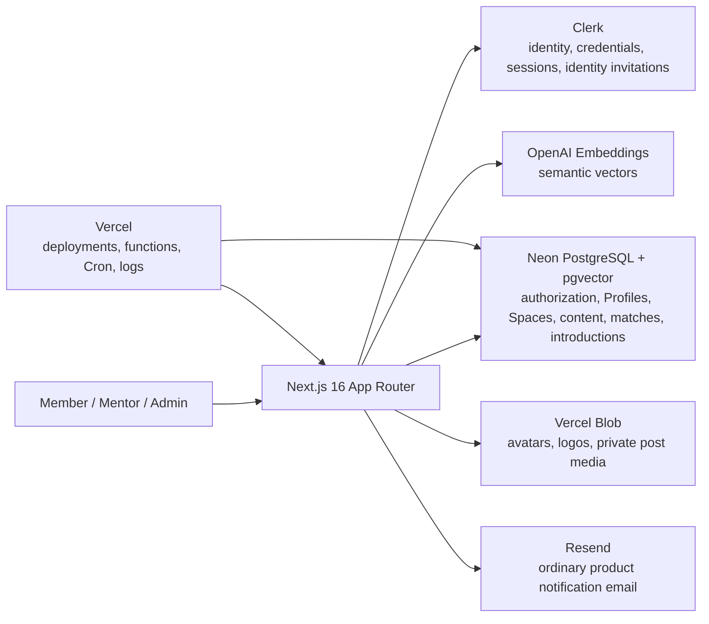

# Wavesparks Community

Wavesparks Community is a private, invitation-only community platform for founders, mentors, and operations teams. It models the long-running Main Community and every standalone Event as a clearly bounded `Space`, then provides content, member discovery, AI-powered matching, introductions, and operations tooling inside each Space.

> [!IMPORTANT]
> The current codebase must not yet be treated as production-safe. The first-production-environment bootstrap has a P0 issue that prevents the initial administrator account from completing its Clerk binding, and five routes still authorize administrators by email instead of `clerk_user_id`, which is a P1 risk. See [Release blockers and known risks](#release-blockers-and-known-risks). Do not open the application to production traffic until these issues are fixed and regression-tested.

## Documentation

| Audience | English edition | Simplified Chinese edition |
| --- | --- | --- |
| Member | [Quick-start kit](docs/manuals/member-guide.en.md) / [PDF](output/pdf/wavesparks-member-user-manual-en.pdf) | [Quick-start kit](docs/manuals/member-guide.zh-CN.md) / [PDF](output/pdf/wavesparks-member-user-manual-zh-CN.pdf) |
| Mentor | [Quick-start kit](docs/manuals/mentor-guide.en.md) / [PDF](output/pdf/wavesparks-mentor-user-manual-en.pdf) | [Quick-start kit](docs/manuals/mentor-guide.zh-CN.md) / [PDF](output/pdf/wavesparks-mentor-user-manual-zh-CN.pdf) |
| Admin | [Manager guide](docs/manuals/admin-guide.en.md) / [PDF](output/pdf/wavesparks-admin-user-manual-en.pdf) | [Manager guide](docs/manuals/admin-guide.zh-CN.md) / [PDF](output/pdf/wavesparks-admin-user-manual-zh-CN.pdf) |

The six role manuals are intentionally nontechnical. Member and Mentor editions begin with the invitation email and work forward as action-oriented kick-start kits. The Admin edition is written for a company manager who uses the Admin interface and performs simple configuration. Deployment, credentials, database recovery, vendor consoles, and technical incident response belong in this README and should be handled by the designated technical owner.

Additional technical documentation:

- [User lifecycle guide](docs/user-lifecycle-guide.md)
- [Admin lifecycle guide](docs/admin-lifecycle-guide.md)
- [AI matching engine](docs/ai-matching-engine.md)

The six PDFs are generated from their corresponding Markdown sources. Flowchart PNGs are generated separately so the same visual source can be used in both languages. After changing a manual, screenshot, or flowchart definition, run:

```bash
python3 -m pip install -r requirements-docs.txt
python3 scripts/build-manual-flowcharts.py
python3 scripts/build-manual-pdfs.py
```

Use Python 3.11 or newer. Rendering dependencies are pinned in `requirements-docs.txt`. Before committing, regenerate all manuals with `--strict`, then check page counts, searchable text, tables of contents, page numbers, and every rendered page:

```bash
python3 scripts/build-manual-pdfs.py --strict
```

## Product model

### Core principles

- **Personal invitations only:** there is no public registration, shared invitation code, or anonymous community feed.
- **Identity and authorization are separate:** Clerk manages identity, credentials, and sessions; Wavesparks and Neon manage accounts, roles, invitations, and Space access.
- **The Main Community and Events are independent:** attending an Event does not grant Main Community access, and joining Main does not grant access to any Event.
- **One global profile, many Space-specific intents:** the core Profile is reused across Spaces, while goals, needs, offers, and matching participation are stored independently for each Space.
- **Data is Space-scoped by default:** posts, member directories, follows, matches, feedback, and pending introductions belong to an explicit Space.
- **Contact details are disclosed late:** ordinary participants see each other's private contact details only after an introduction is accepted; authorized Admins may inspect member details for operations purposes.

### Three independent permission dimensions

| Dimension | Stored field | States | Controls |
| --- | --- | --- | --- |
| Account role | `memberships.role` | `member` / `org_admin` | Access to the Admin console |
| Mentor qualification | `memberships.mentor_status` | `not_mentor` / `needs_review` / `approved` | Mentor badge, service profile, mentor matching, and the Mentoring workspace |
| Space access | `space_memberships.access_status` | `active` / `waitlist` / `rejected` / `suspended` / `removed` | Access to one specific Main Community or Event |

An `approved` mentor is not an Admin, and an Admin does not automatically become a social participant in any Space. An administrator who needs to appear in the member directory, publish posts, or join matching must be explicitly added to that Space.

Valid Space access follows one consistent rule:

```text
Clerk identity bound through the invitation flow
+ account_status = connected
+ account is not suspended or deprovisioned
+ current Space entitlement = active
+ current Space lifecycle permits member access
= valid access
```

The legacy `memberships.status` field and old Cohort records exist only for migration compatibility. They are not the final authority for Main Community or Event access.

## Roles and complete feature set

### Member

The complete Member journey is: receive a personal invitation, create or sign in to Clerk with the invited email, complete the local account binding, enter an authorized Space from My Spaces, complete the global Profile, participate in content and connections, configure matching intent for each Space, and manage introductions and notifications.

Implemented capabilities:

- View My Spaces at `/org/:slug`, including the Main Community, current and upcoming Events, and Past Events.
- Browse a Space Feed and filter it by content type, tags, and other criteria.
- Publish seven post types: General update, Question, Opportunity, Looking for co-founder, Looking for mentor, Resource, and Announcement.
- Add comments, follow or unfollow members, and save or unsave posts.
- Browse the People directory and member profiles in the current Space.
- Request a standard introduction from a member profile, post, or match result.
- Browse corresponding content in the Knowledge and Opportunities views.
- Maintain one core Profile shared across Spaces; changes to the avatar, experience, skills, and preferences apply everywhere.
- Record current goals, needs, offers, and matching participation separately for each Space.
- Review AI recommendations in each Space and submit Helpful or Not relevant feedback with a reason.
- Process current-Space requests under Space Introductions, and review cross-Space introduction history and notifications in the account-level Inbox.
- Unlock email, WhatsApp, or other private contact details for both participants only after an introduction is accepted.

The Profile requires seven items before interaction restrictions are lifted: preferred name, headline, bio, current focus, at least one seeking match type, at least one skill tag, and an introduction email address. A bound account with valid Space access may read before completing the Profile; posting, commenting, People, following, requesting introductions, and matching require a complete Profile.

### Mentor

Mentor is an account-level qualification represented by `mentor_status = approved`. It can be combined with either a Member or Admin role, but it grants no extra Admin rights and no cross-Space access.

Implemented capabilities:

- Display the Approved mentor marker and a mentor service profile.
- Configure a mentor introduction, support formats, areas of expertise, availability, and preferred mentee capacity.
- Appear in mentor discovery and mentor-type matching within authorized Spaces.
- Publish Mentor-sourced Opportunities.
- Receive mentoring requests created from either a standard mentor match or the Request mentoring action on a member profile.
- Manage requests in the account-level `/org/:slug/mentoring` workspace using All, Needs response, Accepted, Declined, and Expired queues.
- Accept or decline a mentoring request; contact details become visible to both parties only after acceptance.
- Turn off the mentor matching offering to pause new mentor recommendations and direct mentoring requests.

Availability and capacity are currently descriptive and ranking signals; they do not automatically reject excess requests. A mentor must still have an active entitlement to the source Space and remains subject to the same Profile, privacy, and lifecycle rules as every other member.

### Admin

The Admin console lives at `/org/:slug/admin` and covers accounts, invitations, Spaces, content, connections, matching, and community settings.

| Workspace | Primary capabilities |
| --- | --- |
| Overview | Review summary metrics for members, content, introductions, and recent activity |
| Members | Search and filter accounts; invite one person; import CSV, XLSX, or pasted rows in bulk; inspect row-level results; retry or revoke invitations; and change roles, mentor qualifications, account states, and Space access |
| Community & Events | Manage the permanent Main Community; create, update, end, archive, or restore Events; maintain participant lists; explicitly run Add to Main Community; and inspect Space-level activity and matching audits |
| Profiles | Inspect complete member Profiles and private contact details, flag Profile status, and export CSV |
| Posts | Moderate posts and comments across Spaces; archive or restore posts; and remove or restore comments, images, and link previews |
| Requests | Inspect introductions by Space and source, and create manual introductions for eligible members |
| Matches | Inspect recommendations; manually refresh at organization level while relevant Profile changes trigger smaller recomputations; configure match categories, direction, minimum score, and weights; and review anonymized feedback and run history |
| Analytics | Review community metrics for connected accounts, complete Profiles, introductions, teams, and related activity |
| Settings | Update the community name, description, brand images, and invitation guidance |

The UI requires explicit confirmation for high-impact operations such as granting Admin access, globally suspending or closing an account, and rejecting or removing Space access. Removing access from one Space does not rewrite membership in any other Space.

## Explicitly unsupported product capabilities

The following capabilities are not implemented, and neither product nor operations documentation should imply otherwise:

- Points, reputation, leaderboards, earnable badges, or certificates. Approved mentor is a qualification marker, not a gamification badge.
- Event RSVP, check-in, or ticketing.
- Direct messages, post likes, user reporting, or blocking.
- Member self-service for leaving a Space, deleting an account, or exporting personal data.
- Author self-service for editing or deleting published posts or comments; Admins currently archive, remove, or restore them.
- Automatic copying of posts, follows, matches, feedback, or introductions between Events and the Main Community.
- Automatic rejection of mentoring requests based on mentor capacity.
- Resend webhook ingestion, delivery-state synchronization, or in-product email alerts.

## Space lifecycle and isolation

Every organization has exactly one permanent Main Community. It remains `active` and cannot be ended or archived. Events use the following lifecycle:

| State | Member visibility | Content and interaction | Matching |
| --- | --- | --- | --- |
| `draft` | Not available to members | Disabled | Skipped |
| `upcoming` | Available to members with an active entitlement | Enabled | Available |
| `active` | Available to members with an active entitlement | Enabled | Available |
| `ended` | Listed as a Past Event | Still readable and interactive | Still available |
| `archived` | Hidden from members | Member access disabled; data retained for Admin audit | Skipped, and visible results for the Space are cleared |

Ending an Event does not close it. Only archiving disables member access. Every post belongs to one Space, comments inherit the post boundary, and saved-post and notification links revalidate access when opened.

## Invitations, sign-in, and the account lifecycle

### Invitation flow

1. An Admin selects the account role, mentor qualification, destination Space, and initial Space access in Wavesparks.
2. Wavesparks creates or updates the local user, membership, Space entitlement, and one-time invitation in Neon.
3. The raw local token appears only in the invitation URL. The database stores only its SHA-256 hash, and the invitation expires after seven days.
4. Wavesparks creates a Clerk application invitation. Clerk sends the invitation email; this path does not depend on Resend.
5. Opening the link exchanges the URL token for a 15-minute, `HttpOnly` invitation handoff cookie.
6. The invitee creates or signs in to a Clerk account. The server fetches the Clerk user again and requires an exact match between a verified Clerk email address and the invited email.
7. The acceptance transaction atomically writes `users.clerk_user_id`, changes `account_status` to `connected`, and consumes the invitation.
8. Production requests subsequently find the local account by `clerk_user_id`. Ordinary Clerk webhooks are not allowed to claim an account by email.

Invitation states are `pending`, `accepted`, `revoked`, and `expired`. A delivery failure retains an auditable error so an Admin can retry it. A success message means Clerk accepted the send request; it does not guarantee delivery to the inbox.

### Account states

| `account_status` | Meaning | Effect |
| --- | --- | --- |
| `invited` | A local account exists, but identity binding is incomplete | No Space can be accessed |
| `connected` | A Clerk user was bound by the invitation transaction | Active Space entitlements can be used |
| `suspended` | Reversible global security suspension | Overrides access to every Space |
| `deprovisioned` | The organization account is closed | Overrides access to every Space until explicitly restored by an Admin |

Clerk Organizations are intentionally not used in this project. The Clerk webhook only synchronizes identity fields for already-bound users and triggers anonymization on `user.deleted`; it never creates memberships, roles, or Space access.

## Route map

The examples below use `wavesparks` as `:slug`.

### Account-level routes

| Route | Purpose |
| --- | --- |
| `/org/wavesparks` | My Spaces home |
| `/org/wavesparks/accept-invitation` | Personal invitation landing page |
| `/org/wavesparks/signin` | Clerk sign-in |
| `/org/wavesparks/sign-up` | Invitation-only Clerk sign-up |
| `/org/wavesparks/auth/complete` | Account completion after sign-in or invitation acceptance |
| `/org/wavesparks/pending` | Explanation for an unconnected or suspended account |
| `/org/wavesparks/onboarding` | Core Profile onboarding |
| `/org/wavesparks/profile` | Global Profile settings |
| `/org/wavesparks/requests` | Cross-Space introduction history and notification Inbox |
| `/org/wavesparks/mentoring` | Account-level workspace for an Approved mentor |

### Canonical Space-level routes

```text
/org/:slug/s/:spaceSlug/feed
/org/:slug/s/:spaceSlug/people
/org/:slug/s/:spaceSlug/people/:membershipId
/org/:slug/s/:spaceSlug/matches
/org/:slug/s/:spaceSlug/knowledge
/org/:slug/s/:spaceSlug/opportunities
/org/:slug/s/:spaceSlug/requests
/org/:slug/s/:spaceSlug/compose
/org/:slug/s/:spaceSlug/posts/:postId
```

Legacy organization-level Feed, People, Matches, Knowledge, Opportunities, and Compose routes only redirect to an explicit Space or My Spaces. Legacy Admin Cohorts routes redirect to Community & Events. A legacy post deep link first reauthorizes the post's Space, then decides whether to redirect.

### Admin routes

```text
/org/:slug/admin
/org/:slug/admin/members
/org/:slug/admin/spaces
/org/:slug/admin/spaces/:spaceId
/org/:slug/admin/profiles
/org/:slug/admin/profiles/export
/org/:slug/admin/posts
/org/:slug/admin/requests
/org/:slug/admin/matches
/org/:slug/admin/analytics
/org/:slug/admin/settings
```

## System architecture



### Technology stack

- Next.js `16.2.4` with the App Router and React `19.2.4`
- TypeScript 5 and Tailwind CSS 4
- Clerk `@clerk/nextjs` 7
- Neon PostgreSQL, Drizzle ORM and Kit, and `pgvector`
- OpenAI `text-embedding-3-large`
- Vercel Blob and Resend
- Vitest, Testing Library, and Playwright
- pnpm `10.19.0`

> This project's Next.js version contains breaking API and convention changes. Before changing Next.js-related code, read the relevant guide under `node_modules/next/dist/docs/`.

### Repository structure

```text
src/app/                 App Router pages and API Route Handlers
src/actions/             Member and Admin Server Actions
src/components/          Community, Admin, layout, and UI components
src/db/                  Drizzle client and schema
src/lib/                 Authentication, authorization, Profile, Space, and configuration logic
src/server/              Stores, matching, invitations, notifications, media, and view models
drizzle/                 SQL migrations and metadata
scripts/                 Migration, seed, bootstrap, environment audit, readiness, and matching tasks
tests/                   Vitest, component, route, domain, and Playwright E2E tests
docs/                    Lifecycle and technical documentation plus manual sources for all three roles
output/pdf/              Generated English and Simplified Chinese PDF manuals
```

## Local development

### Prerequisites

- A current Node.js LTS release compatible with Next.js 16
- pnpm `10.19.0`
- Optional: local or Neon PostgreSQL with `pgvector`
- Optional: Clerk test instance, OpenAI, Vercel Blob, and Resend credentials

### Start the application

```bash
pnpm install
cp .env.example .env.local
pnpm dev
```

Open `http://localhost:3000/org/wavesparks/signin`.

When `DATABASE_URL` is absent, the application uses in-memory seed data intended for UI work and tests. It is not a persistent development environment. PostgreSQL is required to validate migrations, concurrency, constraints, or production behavior.

### Environment variables

| Variable | Production requirement | Purpose |
| --- | --- | --- |
| `NEXT_PUBLIC_APP_URL` | Required, although a Vercel system URL can be used as a fallback | Community application root URL; it must point to the app domain, not the marketing site |
| `NEXT_PUBLIC_CLERK_PUBLISHABLE_KEY` | Required; use `pk_live_` | Clerk browser identity configuration |
| `CLERK_SECRET_KEY` | Required; use `sk_live_` | Clerk backend API and user verification |
| `CLERK_JWT_KEY` | Optional but recommended | Local JWT verification for preview-domain OAuth handoff; the secret key is used if this is absent |
| `CLERK_WEBHOOK_SIGNING_SECRET` | Required | Verifies Svix signatures at `/api/webhooks/clerk` |
| `NEXT_PUBLIC_CLERK_PROXY_URL` | Optional | Set only when the same proxy domain is enabled in the Clerk Dashboard |
| `NEXT_PUBLIC_CLERK_SIGN_IN_URL` | Optional | Defaults to `/org/wavesparks/signin` |
| `NEXT_PUBLIC_CLERK_SIGN_UP_URL` | Optional | Defaults to `/org/wavesparks/sign-up` |
| `NEXT_PUBLIC_CLERK_SIGN_IN_FALLBACK_REDIRECT_URL` | Optional | Defaults to `/org/wavesparks` |
| `NEXT_PUBLIC_CLERK_SIGN_UP_FALLBACK_REDIRECT_URL` | Optional | Defaults to `/org/wavesparks` |
| `DATABASE_URL` | Required | Neon/PostgreSQL connection string with `pgvector` support |
| `SPACE_SCOPED_READS_ENABLED` | Must explicitly equal `true` | Global switch for Space-scoped reads; production fails closed when it is missing or not true |
| `OPENAI_API_KEY` | Required by readiness checks | Production semantic embeddings; failures degrade to a local deterministic token hash |
| `RESEND_API_KEY` | Optional but expected | Ordinary product notification email; not used for membership invitations |
| `RESEND_FROM_EMAIL` | Configure together with the Resend key | Notification sender |
| `CRON_SECRET` | Required; at least 32 characters recommended | Protects matching recomputation and media-cleanup endpoints |
| `BLOB_READ_WRITE_TOKEN` | Optional but expected | Storage for avatars, logos, post images, and link thumbnails |
| `WAVESPARK_ADMIN_EMAILS` | Required by readiness checks | Bootstrap administrator email list; **does not complete Clerk identity binding** |
| `E2E_CLERK_ADMIN_EMAIL` | Test only | Clerk E2E Admin test account |
| `E2E_CLERK_USER_EMAIL` | Test only | Clerk E2E Member test account |

Scripts load `.env.<environment>.local`, `.env.local`, `.env.<environment>`, and `.env` in that priority order without replacing variables already present in the process. Never commit sensitive values. `NEXT_PUBLIC_*` values are exposed to the browser and must not contain secrets.

## Database, migrations, and seed data

Generate Drizzle SQL:

```bash
pnpm db:generate
```

Dry-run a development migration first, then apply it explicitly:

```bash
pnpm db:migrate -- --environment=development
pnpm db:migrate -- --environment=development --apply
```

Production writes require both `--apply` and `--confirm-production`:

```bash
pnpm db:migrate -- --environment=production
pnpm db:migrate -- --environment=production --apply --confirm-production
```

The Space migration uses an expand, backfill, and compatibility sequence. Preflight checks stop on duplicate memberships, orphaned rows, cross-organization references, or conflicting access states instead of guessing which production record to keep.

Development data and preview accounts:

```bash
pnpm db:seed -- --environment=development
pnpm db:seed -- --environment=development --apply

pnpm db:preview-accounts -- --environment=development
pnpm db:preview-accounts -- --environment=development --apply
```

`db:preview-accounts` creates local records and Main entitlements for Member, Approved Mentor, Admin, and Admin plus Approved Mentor roles. Matching Clerk test users must still be created before they can sign in. A summary is written to `/tmp/wavesparks-preview-accounts.txt`.

### Legacy invitation migration

```bash
pnpm invitations:migrate -- --environment=production
pnpm invitations:migrate -- --environment=production --apply --confirm-production
```

This command defaults to a dry run. It migrates legacy Clerk Organization invitations to Wavesparks one-time invitations plus Clerk application invitations, then revokes the legacy invitations after success. Logs contain only membership IDs and counts, never email addresses or raw tokens.

## AI matching engine

The current algorithm version is `hybrid-v4`:

- Candidates are matched only inside the same Space, and their accounts, Profiles, Space intents, opt-in states, and the Space lifecycle must all be eligible.
- Admin-configured matching supports mutual or seeker-to-provider direction, a minimum quality score, and configurable weights. Default categories cover co-founder, collaborator, and mentor.
- Production embeddings use 1,024-dimensional vectors from `text-embedding-3-large` and are stored in PostgreSQL `pgvector`.
- A global Profile embedding contains no Space-private activity. A Space intent embedding uses only goals, offers, needs, and eligible recent intent posts from that Space.
- Private contact details, comments, saves, follows, interaction counts, moderation history, and introduction content are excluded from embeddings.
- The score is a versioned `1..100` fit index, not a probability of success. Sparse evidence is constrained by coverage caps.
- No more than 12 candidates are stored for each source member, match type, and Space combination.
- If OpenAI is missing or fails, the engine uses a deterministic multilingual token-hash fallback and records degradation counts and errors. Fallback results do not provide production-level semantic quality.
- Helpful and Not relevant feedback is stored per Space. Not relevant hides a stable match; feedback does not automatically retrain or change weights online.

See [AI matching engine](docs/ai-matching-engine.md) for the complete formula, evidence-quality rules, directional comparisons, calibration curve, and recomputation semantics.

Manual maintenance commands:

```bash
pnpm cron:matches -- --environment=development
pnpm cron:matches -- --environment=development --apply

pnpm cron:matches -- --environment=production
pnpm cron:matches -- --environment=production --apply --confirm-production
```

## Media and email

- Avatars and organization logos use public Vercel Blob URLs. Both accept JPG, PNG, or WebP files up to 2 MB.
- Post images use private Vercel Blob storage and are served through application routes that revalidate Space access. Each image may be up to 5 MB, accepts JPG, PNG, or WebP, and is processed with Sharp.
- Link previews limit response size, validate content types, and block local or private-network addresses. Their thumbnails are also served through a private read route.
- Cron removes orphaned or failed post media.
- Clerk sends identity invitations. Resend sends ordinary product notifications only. If Resend is not configured, the application records `email skipped` without affecting the invitation flow.
- There is currently no Resend webhook or delivery-state persistence. Delivery, bounce, and complaint information is available only in the Resend Dashboard.

## Scheduled tasks

Vercel configuration lives in `vercel.json`; all schedules use UTC:

| UTC schedule | Path | Purpose |
| --- | --- | --- |
| Daily at `08:00` | `/api/internal/matches/recompute` | Enumerate organizations and eligible Spaces, then refresh recommendations |
| Daily at `08:30` | `/api/internal/post-media/cleanup` | Remove expired media that was never claimed by a post |

Vercel Cron invokes these routes with `GET` and authorizes them with `Authorization: Bearer <CRON_SECRET>`. The matching endpoint additionally accepts `x-cron-secret`; the media-cleanup endpoint accepts only the Bearer header. A matching `GET` never falls back to a browser session, preventing a cross-site top-level navigation with a Lax cookie from triggering a write.

## Tests and quality gates

```bash
pnpm typecheck
pnpm lint
pnpm test
pnpm test:e2e
pnpm test:e2e:clerk
pnpm build
```

- `pnpm test`: Vitest domain, component, authorization, migration, and Route Handler tests.
- `pnpm test:e2e`: isolated Playwright flows using local signed cookies and in-memory data, email, and media.
- `pnpm test:e2e:clerk`: sign-in and invitation flows against a real Clerk test instance.
- `pnpm test:e2e:preview`: browser verification against a deployed Preview.
- `pnpm qa:prelaunch`: prelaunch matching QA restricted to development. It rejects a production Vercel environment or a database fingerprint matching production.

Production configuration and data preflight:

```bash
pnpm env:audit
pnpm readiness:prod -- --env-only
pnpm readiness:prod
```

`env:audit` verifies that development and production do not share a database, that development Clerk keys are test keys, and that production Clerk keys are live keys. After migrations, the full readiness check performs a read-only Space audit: every organization must have exactly one active Main Community; Space relationships must contain no duplicates or cross-organization references; and posts, follows, matches, feedback, introductions, and content notifications must not have a null `space_id`.

## Production operations and maintenance

This section is the technical runbook. It is intended for the engineer or service owner responsible for GitHub, Vercel, Clerk, Neon, Resend, OpenAI, DNS, and incident response. Company managers should use the Admin Manager Guide instead of vendor consoles or command-line procedures. The runbook reflects the repository and provider documentation reviewed on July 29, 2026; recheck provider documentation before a high-impact production change.

### Ownership and systems of record

| Area | System of record | Repository-specific boundary |
| --- | --- | --- |
| Source code and review | GitHub | Vercel Git integration builds the repository; there is no repository-owned GitHub Actions release gate |
| Deployments, Functions, Cron, logs, and media | Vercel | The application region is fixed to `sin1`; Vercel Blob stores public and private media |
| Identity, credentials, sessions, and identity invitations | Clerk | Clerk Organizations are not used and never grant application authorization |
| Accounts, roles, Spaces, content, matching, and authorization | Neon PostgreSQL | Neon is the sole authority for organization and Space access |
| Ordinary product notification email | Resend | Clerk, not Resend, sends application invitation email |
| Semantic embeddings | OpenAI | Production uses `text-embedding-3-large`; failures use a lower-quality deterministic fallback |

Assign a named primary owner and backup owner for each vendor. Console access, emergency contacts, billing alerts, recovery objectives, and the location of the external incident log should be recorded outside this repository.

### Release and migration runbook

#### 1. Preflight

1. Resolve every active P0 and P1 release blocker in this README.
2. Confirm the source commit, target Vercel Project, Production domain, Clerk Production instance, Neon Production project and branch, and Resend Production domain.
3. Confirm that Development, Preview, and Production do not share Clerk or Neon resources. Preview must never use the Production `DATABASE_URL`.
4. Create or verify a usable Neon recovery point inside the current restore window. Record the branch, timestamp, owner, and rollback decision point.
5. Review Production variables by name and scope. Never paste their values into a ticket, terminal transcript, PDF, pull request, or README.
6. Run the local gates with the locked dependencies:

```bash
pnpm install --frozen-lockfile
pnpm env:audit
pnpm readiness:prod -- --env-only
pnpm typecheck
pnpm lint
pnpm test
pnpm build
```

`env:audit` verifies environment separation and Clerk key classes. The environment-only readiness check validates required configuration without querying Production data.

#### 2. Database migration

Start with the read-only dry run:

```bash
pnpm db:migrate -- --environment=production
```

After confirming the displayed database fingerprint and recovery point, an authorized operator applies the migration and performs the full data audit:

```bash
pnpm db:migrate -- --environment=production --apply --confirm-production
pnpm readiness:prod
```

Production writes require both `--apply` and `--confirm-production`. Use expand, backfill, deploy, and cleanup phases for incompatible schema changes. Each intermediate schema must work with the adjacent application versions. Never rely on a Vercel rollback to reverse a Neon migration.

#### 3. Preview and promotion

1. Build a Vercel Preview from the exact candidate commit.
2. Smoke-test invitation acceptance, Member Profile completion, Main and Event isolation, Mentor approval and request handling, Admin access, media, Resend notification email, both Cron routes, and Match recomputation using isolated Preview data.
3. Confirm that the Preview has no Production secrets, database URL, Clerk instance, or email sender.
4. Promote the verified artifact or deploy the reviewed commit to Production according to the team's release policy.
5. Record the deployment URL, commit SHA, migration version, operator, and verification result.

#### 4. Production verification

Immediately after release:

- verify the public application, a real Clerk sign-in, and a controlled invitation acceptance;
- sample Home, Feed, People, Profile, Introductions, Matching, media upload and read, and the Admin console;
- inspect Vercel Runtime Logs for 4xx, 5xx, timeout, webhook, email, database, and Blob errors;
- confirm the next execution or a controlled invocation of each Cron path;
- check Neon connections, query errors, compute and storage signals;
- check Clerk webhook attempts and invitation delivery;
- check Resend Logs for the controlled notification and for new failures, bounces, complaints, or suppressions.

Do not mark a release complete until the current deployment, database schema, provider configuration, and smoke-test evidence agree.

### Vercel operations

#### Environment scopes and deployments

- Keep Development, Preview, and Production variables separately scoped. Branch-specific Preview overrides are allowed, but they must never point to Production Clerk or Neon resources.
- `NEXT_PUBLIC_*` values are bundled for the browser and are not secrets. All API keys, signing secrets, database credentials, Blob tokens, and Cron secrets must remain server-only.
- A Vercel environment-variable change affects only new Deployments. Redeploy after every change, then verify that the new Deployment is serving traffic.
- `vercel env pull` replaces the destination file. Preserve intentional local-only values separately and never commit the resulting `.env*.local` file.
- The repository fixes the application region to `sin1` in `vercel.json`. Keep the Neon compute near the application unless a documented data-residency requirement takes precedence.
- With Git integration, non-production branches should produce Preview Deployments. If a custom CI pipeline is added, pin the Vercel CLI, build before deploying, and test the exact prebuilt artifact before promotion.

Useful inspection commands for a linked project:

```bash
vercel ls
vercel inspect <deployment-url>
vercel logs --environment production --level error --since 1h
```

The repository does not currently define an external CI release gate. Treat the quality and readiness commands above as mandatory operator gates until an equivalent protected workflow exists.

#### Cron Jobs

`vercel.json` defines two Production schedules in UTC:

| UTC | Singapore time | Path | Responsibility |
| --- | --- | --- | --- |
| `08:00` daily | `16:00` | `/api/internal/matches/recompute` | Refresh eligible recommendations across organizations and Spaces |
| `08:30` daily | `16:30` | `/api/internal/post-media/cleanup` | Remove expired media that was never attached to a post |

Vercel invokes Cron routes with `GET`. Both routes require `Authorization: Bearer <CRON_SECRET>`. Vercel does not retry a failed Cron invocation, and duplicate or overlapping invocations are possible. Review each result in Runtime Logs by `requestPath`, keep handlers idempotent, and investigate before manually retrying a write. A Vercel rollback does not automatically update active Cron configuration; check the Cron settings separately after every rollback.

When rotating `CRON_SECRET`, change the Vercel Production value, redeploy, verify both routes reject the old value and accept the scheduled request path, then record the rotation. Use a random server-only value; the repository recommends at least 32 characters.

#### Runtime Logs, alerts, and retention

- Start investigations in Runtime Logs. Filter by environment, status code, request path, request ID, and time window.
- Review deployments, 5xx rates, Function duration, bandwidth, Blob usage, and Spend Management every operating day.
- Configure appropriate Vercel alerts. Runtime Logs are not a permanent application audit trail.
- If retention or cross-service correlation is required, configure a supported Log Drain or external error-tracking integration and verify its delivery. The repository currently contains no persistent external log-drain configuration.
- Never log raw invitation tokens, secrets, passwords, verification codes, full Profile exports, or unnecessary personal data.

#### Vercel Blob

- Organization logos and avatars use public Blob URLs; do not store sensitive images there.
- Post images and link-preview thumbnails use private Blob storage and are served through application routes that recheck Space access.
- Media upload depends on `BLOB_READ_WRITE_TOKEN`. Text-only features continue if Blob is unavailable.
- Confirm the daily cleanup Cron and Blob usage. Database moderation state and Blob retention are separate concerns and must both satisfy the organization's retention policy.
- Rotate the Blob token in this order: provision the replacement, update the correct Vercel scope, redeploy, test upload and authorized read, revoke the old token, and test again.

#### Rollback

Use `vercel rollback` or promote a known-good eligible Deployment when application code is causing an incident. Before and after rollback:

1. capture the failing deployment, time, symptoms, and relevant logs;
2. verify that the target Deployment's environment-variable snapshot and application code are compatible with the current Neon schema;
3. perform the rollback and check its status;
4. verify sign-in and the affected user path;
5. inspect Production error logs and check Cron Jobs independently;
6. deploy a forward fix and restore the normal promotion path after the incident.

A rollback changes the served application artifact. It does not undo database writes or schema changes, and an older Deployment can contain stale configuration. Use Neon recovery or a forward database repair only after a separate data-impact decision.

#### General secret rotation pattern

For a provider that supports overlapping credentials:

1. create a new narrowly scoped credential and leave the old one valid;
2. update only the correct Vercel environment scope;
3. redeploy;
4. exercise a real server-side request and confirm new-key usage in both Vercel and provider logs;
5. revoke the old credential;
6. test again and update the external credential inventory.

For a credential that cannot overlap, schedule a maintenance window and prepare rollback before revocation. Never expose a secret through a `NEXT_PUBLIC_*` variable.

Official references: [Environment Variables](https://vercel.com/docs/environment-variables), [Deployments](https://vercel.com/docs/deployments), [Runtime Logs](https://vercel.com/docs/logs/runtime), [Cron Jobs](https://vercel.com/docs/cron-jobs/manage-cron-jobs), [Rollback](https://vercel.com/docs/deployments/rollback-production-deployment), and [Vercel Blob](https://vercel.com/docs/vercel-blob).

### Clerk operations

#### Project boundary and production setup

The project uses `@clerk/nextjs` 7. Clerk manages Users, verified email addresses, credentials, Sessions, and Application Invitations. Neon remains the authority for roles, organization membership, account status, and Space access. Clerk Organizations are intentionally unused, and Clerk organization events must never grant permissions.

Production setup requirements:

1. Use a dedicated Clerk Production instance with `pk_live_*` and `sk_live_*` keys. Do not reuse Development or Preview identities.
2. Configure the Production domain, DNS, application home, sign-in, sign-up, allowed redirect URLs, and invitation callback for the community application domain.
3. Enable Restricted sign-up so an uninvited person cannot create an account through the normal sign-up UI.
4. Configure `/api/webhooks/clerk` as a public HTTPS webhook endpoint and subscribe to `user.created`, `user.updated`, and `user.deleted`.
5. Set the Production webhook signing secret in Vercel and redeploy.
6. Test a complete invitation, identity update, deletion/anonymization, webhook failure, and replay before launch.

Normal invitations must originate in Wavesparks Admin. The application creates a one-time local invitation and a Clerk Application Invitation with `expiresInDays: 7`; Clerk sends the email. Creating an invitation directly in Clerk does not create the Neon account, role, or Space entitlement chain.

#### Webhook behavior and recovery

The webhook verifies the Clerk signature, requires `svix-id`, and records that event ID for idempotency. `user.created` and `user.updated` synchronize only identities already bound by the one-time invitation transaction; they never claim an account by email. `user.deleted` triggers local anonymization. Organization events are ignored.

Clerk webhooks are asynchronous and eventually consistent. For a failed delivery:

1. inspect the Clerk endpoint's Message Attempts and the corresponding Vercel Runtime Logs;
2. fix signature, route, deployment, or database errors;
3. replay the failed message from Clerk;
4. confirm a 2xx response and the intended local result;
5. confirm that a duplicate replay does not repeat the mutation.

For invitation trouble, inspect Wavesparks invitation state and Clerk Invitations/Application Logs. A provider send success does not prove inbox delivery. Investigate invitation email in Clerk, not Resend.

For suspected identity compromise, suspend the account in Wavesparks to remove application access immediately, then revoke Clerk Sessions or block the User as required. Removing only one side is incomplete.

#### Credential rotation

Clerk supports multiple active Secret Keys. Create a named replacement, update `CLERK_SECRET_KEY` in the correct Vercel environment, redeploy, test middleware and a backend Clerk request, confirm the replacement's last-used activity, then delete the old key.

Webhook signing secrets are issued per endpoint. Create a replacement endpoint with the same URL and three User events, update `CLERK_WEBHOOK_SIGNING_SECRET`, redeploy, send and verify a test event on the new endpoint, then delete the old endpoint. Expect the old endpoint's deliveries to fail verification during the brief overlap. Do not delete the old endpoint before the new endpoint is live.

The Publishable Key is designed for browser use and is not a secret. Rotate the Secret Key and webhook signing secret after exposure, relevant staff departure, or according to company policy.

Official references: [Production deployment](https://clerk.com/docs/guides/development/deployment/production), [Application invitations](https://clerk.com/docs/guides/users/inviting), [Restricted sign-up](https://clerk.com/docs/guides/secure/restricting-access), [Webhooks](https://clerk.com/docs/guides/development/webhooks/overview), and [API key rotation](https://clerk.com/docs/guides/secure/rotate-api-keys).

### Neon PostgreSQL operations

#### Connection model and least privilege

The application reads one variable, `DATABASE_URL`. Normal Drizzle queries use the Neon HTTP driver. Transactions and migrations use `postgres-js` with a single connection, and migrations require the `vector` extension. The current code does not separate runtime and migration variables or roles, so genuine least-privilege separation requires a code and deployment change.

Use a pooled `-pooler` connection string for Vercel serverless runtime traffic. Use a direct connection for controlled migrations, dumps, and tools that require direct PostgreSQL semantics. Because both paths are named `DATABASE_URL`, the Vercel Production value and the authorized migration shell must be managed separately and verified before every command. Never let Preview point to the Production branch.

Keep the Neon compute geographically close to Vercel `sin1` where organizational requirements allow. Confirm TLS requirements and the database fingerprint before every Production write.

#### Migration, branches, and recovery

- Create an isolated branch from the intended Production point before a material migration and validate the schema diff, migration, readiness audit, and application there.
- Confirm the Production restore window before release. A branch name alone is not proof that the required recovery point remains restorable.
- Record a timestamp and recovery decision owner before each Production migration.
- Test restore procedures on an isolated branch at least quarterly. Record measured recovery time and acceptable data-loss window.
- Delete temporary recovery and test branches when policy allows, after confirming they are no longer needed and considering storage cost and retention.

For a data incident:

1. stop or minimize new writes when safe and record the suspected event time;
2. preserve logs and identify the affected tables, Spaces, and users;
3. use Neon Time Travel or a point-in-time branch to inspect the candidate state without overwriting Production;
4. decide between a targeted forward repair and a branch restore, explicitly accounting for valid writes after the restore point;
5. validate the repaired or restored state and the application on an isolated endpoint;
6. cut over only with database-owner and business-owner approval;
7. run `pnpm readiness:prod`, smoke tests, and reconciliation checks after recovery.

Do not assume that a Vercel application rollback, Neon branch creation, or successful connection proves data correctness.

#### Monitoring and credential rotation

Review CPU, memory, compute active time, database size, storage growth, client and server connections, pooler activity, query latency, cache behavior, deadlocks, and errors. Watch the configured restore window and branch growth. Correlate database latency with the Vercel region and Runtime Logs.

Prefer a new database role over resetting a password in place: create the role, grant only required privileges, update the Vercel Production value and authorized migration environment, redeploy, verify runtime reads plus a controlled transaction and migration dry run, then revoke the old role. The current shared runtime/migration role is a known operational limitation, not a recommended end state.

Official references: [Connection pooling](https://neon.com/docs/connect/connection-pooling), [Branching](https://neon.com/docs/guides/branching-intro), and [Branch restore](https://neon.com/docs/guides/branch-restore).

### Resend operations

#### Current application boundary

Resend sends ordinary product notifications such as Introduction requested, accepted, or declined. Clerk sends identity invitations. Notification email runs asynchronously through Next.js `after()`. If Resend is unconfigured, the application logs `email skipped: provider unconfigured`; in-app notifications continue.

The current implementation has important limits:

- send failures are written to Vercel Runtime Logs only;
- there is no Resend webhook, delivery-state table, outbound audit, or Admin retry interface;
- the low-level sender supports an idempotency key, but current product call sites do not supply one;
- delivery, bounce, complaint, and suppression investigation therefore depends on Resend Logs plus Vercel logs.

Do not describe a missing product email as proof that the in-app action failed. Check the in-app notification and database result first.

#### Domain, sender, and API Key

1. Use a dedicated sending subdomain to isolate reputation.
2. Add and verify the exact SPF and DKIM records supplied by Resend.
3. Set `RESEND_FROM_EMAIL` to an address on the verified domain.
4. Add DMARC with monitoring policy `p=none`, verify every legitimate sender, then tighten to `quarantine` or `reject` according to company policy.
5. Give the application API Key Sending access restricted to the sending domain. Do not use a Full-access key for routine sends.
6. Store `RESEND_API_KEY` only as a server-side secret in the correct Vercel scope, then redeploy and send a controlled notification.

#### Delivery operations

Review failed, bounced, complained, and suppressed messages and recent volume every operating day:

- **Failed:** correlate the Resend entry with Vercel time, route, and error logs; check domain, key, quota, and request validity.
- **Bounced:** correct the recipient only when a valid replacement is known; do not repeatedly retry a hard bounce.
- **Complained:** stop sending to the recipient and investigate consent and message expectations.
- **Suppressed:** find whether a prior hard bounce or complaint caused suppression and resolve the root cause before any manual removal.
- **Invitation missing:** use Clerk and Wavesparks invitation records, not Resend.

If the product later implements Resend webhooks, verify signatures against the raw body, deduplicate events, tolerate at-least-once and out-of-order delivery, retain only necessary data, and add deterministic idempotency keys to retryable sends. Resend retains an idempotency key for 24 hours.

For API Key rotation, create a new domain-scoped Sending key, update the Production Vercel variable, redeploy, send a controlled notification, filter Resend Logs by the new key, delete the old key, and test once more. Resend keys do not expire automatically.

Official references: [Domains](https://resend.com/docs/dashboard/domains/introduction), [DMARC](https://resend.com/docs/dashboard/domains/dmarc), [API Keys](https://resend.com/docs/dashboard/api-keys/introduction), [Key handling](https://resend.com/docs/knowledge-base/how-to-handle-api-keys), [Suppressions](https://resend.com/docs/dashboard/emails/email-suppressions), and [Idempotency](https://resend.com/docs/dashboard/emails/idempotency-keys).

### Technical incidents and offboarding

| Symptom | Primary evidence | First technical action |
| --- | --- | --- |
| Broad sign-in failure | Clerk Application Logs, Vercel Runtime Logs, current Deployment | Confirm Clerk Production keys, domain and Deployment; do not bypass identity binding by email |
| Invitation failure | Wavesparks invitation record, Clerk Invitations and Logs | Confirm seven-day state, callback URL, restricted sign-up and exact email; resend through Admin only |
| Webhook lag or failure | Clerk Message Attempts, `svix-id`, Vercel logs | Fix the endpoint or signing secret, then replay and verify idempotency |
| Database errors or missing data | Neon metrics and logs, Vercel request IDs, migration history | Stop unsafe writes, identify the recovery point, validate on an isolated branch |
| Product email failure | In-app notification, Resend Logs, Vercel email logs | Distinguish application completion from delivery and handle bounce or suppression safely |
| Media failure | Blob usage, token scope, cleanup logs, object visibility | Test authorized upload/read and verify public versus private storage behavior |
| Cron failure | Vercel Cron status and request-path logs | Identify dependency failure; retry only after confirming idempotency and no overlapping run |
| Cross-Space exposure or privacy incident | Exact URLs, membership and Space IDs, logs, data snapshot | Restrict affected access, preserve evidence, stop further exposure, escalate immediately |

For a compromised Member account, suspend it in Wavesparks first, then revoke or block Clerk Sessions, inspect affected content and Introductions, and record the case externally. For an administrator departure, confirm another working Admin, remove Wavesparks Admin permission, revoke Clerk Sessions, remove GitHub and all vendor-console access, rotate any exposed secrets, and review recent deployments and Profile exports. The application does not provide a complete central audit log, so maintain a separate incident and privileged-change record.

### Recurring technical maintenance

#### Daily on operating days

- Verify the expected Vercel Production Deployment and review new 5xx or timeout errors.
- Check both Cron paths, Clerk failed webhook attempts, Resend failures/bounces/complaints/suppressions, and Neon errors or capacity anomalies.
- Review usage and spend anomalies across Vercel Functions and Blob, Neon, Clerk, Resend, and OpenAI.

#### Weekly

- Sample an invited sign-up, Space isolation, media upload/read, and a product notification in a non-Production environment.
- Review Match run degradation, Blob cleanup, stale Preview resources, and vendor-console access lists.
- Reconcile application Admins with privileged GitHub, Vercel, Clerk, Neon, and Resend users.

#### Monthly

- Run `pnpm readiness:prod` and review dependency/security updates, alert delivery, log retention, restore-window coverage, spend controls, unused API Keys, branches, deployments, and exports.
- Test the Production support escalation path without exposing secrets or personal data.
- Review the known limitations in this README and assign owners for unresolved P0/P1 risks.

#### Quarterly

- Perform an isolated Neon restore drill and record actual recovery time and data-loss exposure.
- Rehearse rotation of Clerk, Neon, Resend, Blob, and Cron credentials.
- Run tabletop exercises for account compromise, administrator departure, database recovery, and cross-Space data exposure.
- Reconfirm vendor plan limits, regions, retention, recovery objectives, emergency contacts, and billing alerts.

### Production acceptance checklist

- The first Admin can complete the supported invitation and Clerk binding path; the documented P0 is closed by code and tests.
- All routes authorize the Admin by Clerk User ID and shared viewer context; the documented email-authorization P1 is closed.
- Development, Preview, and Production use isolated Clerk and Neon resources, and Production contains no E2E bypass.
- `SPACE_SCOPED_READS_ENABLED=true`; environment audit, Production readiness, typecheck, lint, tests, and build pass.
- A verified Neon recovery point exists before migration, and the post-migration data audit passes.
- Clerk live keys, Restricted sign-up, redirect URLs, Application Invitations, and all three User webhook events are verified.
- The Resend sending domain passes SPF and DKIM, DMARC is monitored, and the key has domain-scoped Sending access.
- Both Vercel Cron paths, Runtime Logs, alerts, retention strategy, and spend controls are reviewed.
- Event-only, Main-only, multi-Event, Admin, Mentor, Suspended, and Archived scenarios pass without cross-Space leakage.
- Application rollback and Neon restore are rehearsed as separate operations.
- Primary and backup owners, privileged-console users, and emergency contacts are current.

## Security, privacy, and deletion

- Every community read, deep link, saved item, notification, and cached read must revalidate exact Space access.
- Production Clerk sessions bind by `clerk_user_id`. Email is only an invitation-matching attribute verified by Clerk and must not become the routine authorization key.
- The Clerk webhook verifies signatures and stores `svix-id` for idempotency. Organization-related events are ignored.
- Link previews defend against SSRF by blocking loopback and private-network addresses, rejecting unsafe redirects, and limiting HTML and image sizes.
- Post media uses private Blob storage with `private, no-store` responses. Avatars and logos currently use public Blob storage.
- Contact details are not publicly displayed and never enter matching embeddings. Authorized Admins can inspect them in Profile management, and both participants can see them after an accepted introduction.
- When Clerk sends `user.deleted`, Wavesparks anonymizes the identity as Former member, removes authentication binding, Profile, matches, follows, saves, and notifications, and terminates pending introductions. Existing posts and comments remain to preserve community history but are attributed to the anonymized author.
- Admin Profile CSV exports contain sensitive data. Download them with least privilege, store them encrypted, and delete them according to the retention policy.
- Store secrets only in Vercel or uncommitted local environment files. After rotating Clerk, Neon, Resend, Blob, or Cron credentials, redeploy and run smoke tests.

## Release blockers and known risks

### P0: A fresh production bootstrap cannot create a usable first Admin

`pnpm db:bootstrap` currently creates `users` and an `org_admin` membership for addresses in `WAVESPARK_ADMIN_EMAILS`, but every new record remains in this state:

```text
users.clerk_user_id = NULL
memberships.account_status = invited
no membership_invitations record
no Clerk application invitation
```

The shared production authentication path finds accounts only by `clerk_user_id` and explicitly forbids automatic email claiming. The one-time invitation acceptance transaction is the only valid binding point. Consequently, after bootstrapping an empty production database, even a Clerk user with the same email cannot become a valid viewer or enter the Admin UI to invite themselves. The default `letsbuild@wavesparks.co` address and `WAVESPARK_ADMIN_EMAILS` are local data-bootstrap settings, not identity authorization.

Before launch, implement and verify a controlled first-Admin binding flow. For example, bootstrap could generate and send the standard one-time invitation, or an operator-only command could perform a one-time, auditable binding behind strong confirmation. Do not restore automatic account claiming by email on sign-in. This README documents the problem without changing the current implementation.

Running bootstrap again preserves the binding for an existing production Admin whose membership is already `connected`, but that does not solve initial administration in a new environment.

### P1: Five routes still authorize Admins by email

The following routes pass `getCurrentAuthIdentity().email` directly to `getViewerRecordByEmailAndSlug(...)` instead of following the production Clerk ID binding rule:

| Route | Risky operation |
| --- | --- |
| `POST /api/internal/preview-accounts` | Create or update preview-role accounts |
| `POST /api/internal/matches/recompute` in the non-Cron Admin session branch | Trigger matching writes |
| `POST /api/admin/member-import/parse` | Enter the Admin bulk-import flow and parse a member file |
| `GET /org/:slug/admin/profiles/export` | Export a CSV containing private Profile data |
| `POST /api/uploads/org-logo` | Change the organization logo |

This creates an inconsistent authentication model: a session with a Clerk-verified email matching a local Admin address, but without a binding completed by the invitation transaction, may reach these direct routes even though it cannot open normal Admin pages. Bootstrap itself creates exactly such an email-present, Clerk-ID-unbound Admin record, so this P1 risk compounds the P0 bootstrap issue.

Before launch, migrate these routes to `clerk_user_id` and the shared viewer context, retaining explicit email lookup only for the isolated E2E provider. Add route tests proving that an equal email with a different or missing Clerk ID is rejected. `/api/internal/preview-accounts` must also fail closed in production. As requested, the current documentation records these risks without changing application code.

### Additional operating boundaries

- Without Resend configuration, ordinary notifications are logged only. There is no webhook or delivery-state synchronization.
- An OpenAI failure still produces degraded matching. Operations must monitor `degradedEmbeddingCount` and must not treat the fallback as an equal-quality service.
- Admins can inspect audit data for every Space, but still need an explicit entitlement to participate socially.
- An `ended` Event remains fully interactive. Archive it if operations intend to close access.
- An application rollback is not a database rollback. Production migrations must remain compatible with both adjacent application versions, and recovery must be rehearsed first.

## Command reference

```bash
# Development
pnpm dev
pnpm build

# Quality
pnpm typecheck
pnpm lint
pnpm test
pnpm test:e2e
pnpm test:e2e:clerk

# Database
pnpm db:generate
pnpm db:migrate -- --environment=development
pnpm db:seed -- --environment=development
pnpm db:bootstrap -- --environment=production

# Operations
pnpm env:audit
pnpm readiness:prod -- --env-only
pnpm readiness:prod
pnpm cron:matches -- --environment=production
pnpm invitations:migrate -- --environment=production
```

All mutating scripts default to dry-run mode. Add `--apply` for development writes. Production writes require both `--apply` and `--confirm-production`. Until the P0 bootstrap blocker is resolved, never interpret a successful `db:bootstrap` log as proof that the first Admin can sign in.
