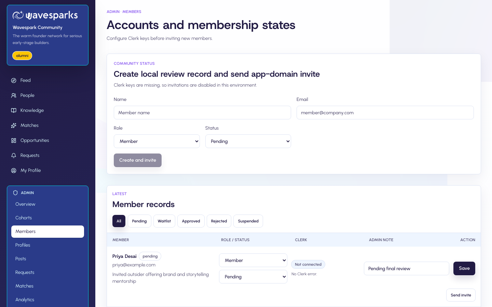
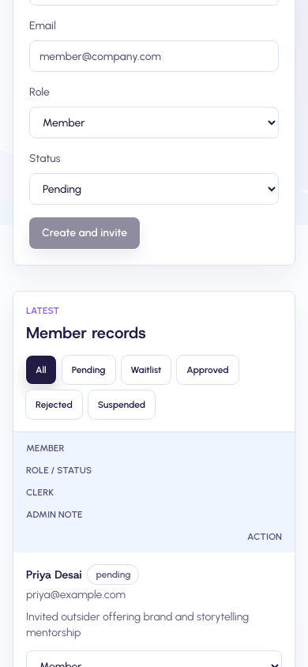
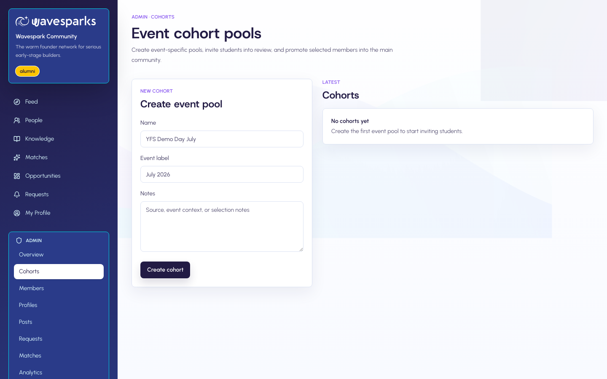
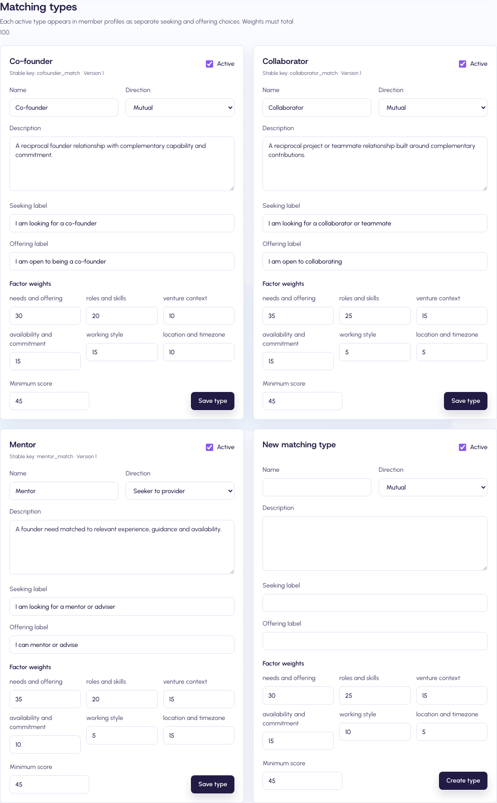
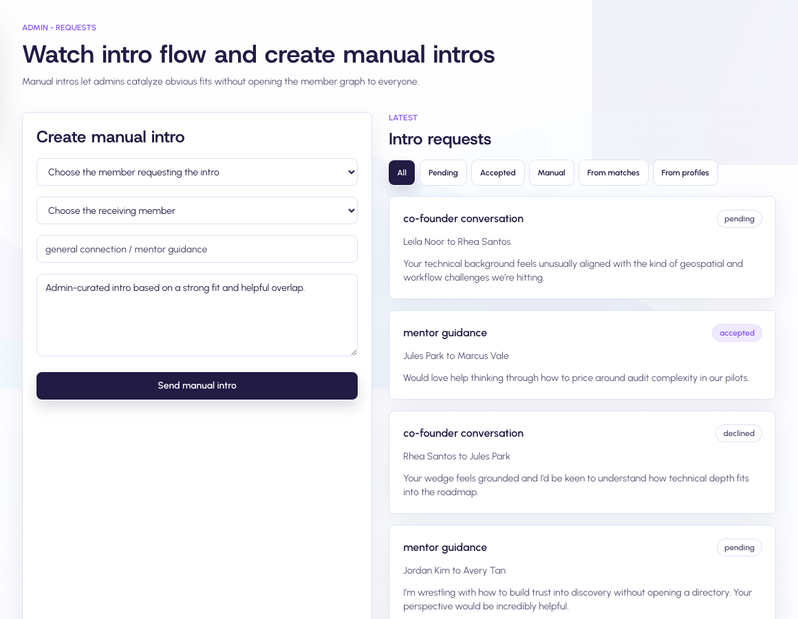

# Wavespark Admin Lifecycle Guide

This guide covers the operational lifecycle for identity, invitations, approvals, cohorts, roles, introductions, moderation, suspension, restoration, deletion, and Clerk reconciliation.

All screenshots use synthetic accounts and local test data.

## Operating model

The Wavespark Admin console is the daily management surface. Do not use Clerk Dashboard as the normal invitation or membership-management interface.

| Area | Authority |
| --- | --- |
| Identity, primary email, credentials, sessions | Clerk |
| Organization role and member relationship | Wavespark Admin action, written to Clerk immediately |
| Invitation delivery and acceptance | Clerk, initiated and tracked by Wavespark |
| Approval state, profile, content, matches, moderation | Wavespark |
| Drift recovery | Clerk webhooks, then reconciliation tooling |

The local role is authoritative. A role from the member's currently active Clerk organization must never overwrite the Wavespark role.

## Lifecycle at a glance

```mermaid
flowchart LR
  A["Admin creates local review record"] --> B["Wavespark confirms Clerk invite or membership"]
  B --> C["Member accepts"]
  C --> D["Pending or waitlist"]
  D --> E["Admin approves, rejects, or keeps waitlisted"]
  E --> F["Approved and profile-ready"]
  F --> G["Community participation"]
  G --> H["Suspend or restore when needed"]
  H --> I["Delete and anonymize on account deletion"]
```



## 1. Use the Members workspace

Open `/org/wavespark/admin/members`. Each record brings together:

- Name and primary email
- Local role and community status
- Clerk membership connection
- Clerk invitation status and last error
- Admin decision note
- Available invitation and status actions



The mobile layout keeps the same fields in a stacked record rather than compressing the desktop table.



## 2. Invite one member

1. Enter the member's name and exact email address.
2. Select `Member` or `Admin`.
3. Select the initial state. New regular members normally start as `pending`.
4. Choose **Create and invite**.
5. Treat the invitation as sent only after the success banner confirms Clerk accepted it.

What happens next:

- Existing Clerk user: Wavespark adds the user directly to the Wavespark Clerk organization.
- No Clerk user: Clerk creates a targeted email invitation with the Wavespark acceptance URL.
- Wavespark stores the Clerk membership or invitation identifiers and status.
- A Clerk failure is saved on the member record and the UI reports failure rather than success.

Never send a generic Clerk Dashboard invitation. It may not contain the app-specific redirect and cannot establish the intended local review workflow.

## 3. Read invitation states

| State | Meaning | Admin action |
| --- | --- | --- |
| Empty | No current invitation is tracked. | Send an invitation if the member is active. |
| `pending` | Clerk confirmed a usable invitation. | Wait, resend, or revoke. |
| `accepted` | The invitation was accepted or Clerk membership is connected. | Continue application review. |
| `revoked` | The invitation can no longer be used. | Send a new invitation when appropriate. |
| `expired` | The Clerk ticket expired. | Resend to create a fresh ticket. |
| `failed` | Clerk did not confirm the operation. | Review the stored error and retry. |

Use **Resend invite** to revoke the active ticket and create a new one. Use **Revoke invite** when the member should not be able to complete account creation.

## 4. Manage roles and states

| Change | Local result | Clerk result |
| --- | --- | --- |
| Role to `Member` | Member permissions | Clerk role becomes `org:member` |
| Role to `Admin` | Admin permissions and approved status | Clerk role becomes `org:admin` |
| `pending`, `waitlist`, or `approved` | Active local membership | Existing Clerk user is added, or a missing user is invited |
| `rejected` or `suspended` | Interaction is disabled | Pending invitation is revoked and Clerk membership is removed |
| Restore inactive member | Active local state returns | Existing Clerk user is re-added; otherwise a new invite is sent |

An Admin cannot demote or suspend their own active Admin membership from the same session.

## 5. Approve without duplicate notifications

Approval email and in-app notification delivery occurs only when the status actually changes from a non-approved state to `approved`.

Saving an already-approved record again does not send another approval notification or reset the original `approvedAt` timestamp. It may still synchronize role or repair Clerk drift.

Approval does not bypass profile readiness. An approved member with incomplete required fields is sent to onboarding before interaction unlocks.

## 6. Run cohort imports

Open `/org/wavespark/admin/cohorts` to create an event-specific pool.



Import rules:

- Maximum 100 unique email addresses per import.
- Input is one member per line as `email,name`; name is optional.
- Clerk operations run in batches of 10.
- Every member receives an individual success or failure result.
- Local records remain when Clerk fails so only failed rows need retrying.
- The page reports partial success instead of claiming the entire import succeeded.

Imported cohort members begin on the waitlist. Select intended members and use **Promote selected** to approve them. Notifications are sent only for real state transitions.

## 7. Configure and review AI matching

Open `/org/wavespark/admin/matches` to review recommendations, matching runs, embedding health, and aggregate member feedback.



Each matching type has a stable key and Admin-controlled name, description, direction, member-facing seeking and offering labels, six factor weights, minimum score, and active state. The six weights must total 100. Up to 12 types may be active at once.

- **Mutual** requires both members to select the type under both **I am looking for** and **I can offer**.
- **Seeker to provider** requires the source to seek the type and the target to offer it.
- Archiving a type removes it from member choices and future rankings without deleting historical configuration.
- Saving a type increments its version and starts a full organization recompute.

Run health shows how many embeddings were refreshed or degraded. A degraded run uses the deterministic local fallback and displays the provider error; it must not be treated as a normal AI-quality run.

Member feedback is private. Admins see aggregate Helpful, Not relevant, matching-type, and reason counts. A Not relevant response suppresses that recommendation for the source member across later recomputations. Feedback does not silently rewrite factor weights.

See [AI matching engine](ai-matching-engine.md) for the scoring, post policy, embedding model, storage choice, and operating thresholds.

## 8. Create a manual introduction

Open `/org/wavespark/admin/requests`.



A valid manual introduction requires two different members, both `approved`, both profile-ready, and both opted into introductions.

Select the requesting and receiving member separately, then add a concrete purpose and context. The receiving member must accept before either side sees private contact details.

## 9. Moderate content and profiles

Use the Admin Posts and Profiles workspaces to hide or restore posts, lock comments, remove comments, feature profiles, mark stale profiles, and recompute matches after material changes.

Public Feed and public post reading remain available to visitors and every membership state. Treat moderation as a public-reading decision, not only a member-area decision.

## 10. Suspend, restore, reject, and delete

### Suspend

Use `suspended` for a reversible access pause. Wavespark removes the Clerk organization membership and revokes pending invitations. The member can still read public content and sees a clear note and sign-out action.

### Reject

Use `rejected` to close the current application. Pending Clerk access is revoked or removed in the same way as suspension.

### Restore

Change the member back to an active state. An existing Clerk user is re-added directly; otherwise a fresh personal invitation is sent.

### Delete

Clerk `user.deleted` triggers anonymization rather than destructive content deletion:

- Name becomes `Former member`.
- Email becomes a unique address under `deleted.invalid`.
- Clerk IDs, contacts, credentials, follows, saves, notifications, matching data, and pending intros are removed or terminated.
- Posts and comments remain with the anonymized author.

## 11. Understand webhook recovery

The Clerk webhook records an event as processed only after business handling succeeds. A failed handler returns an error so Clerk can retry the same event.

Handled events include user creation/update/deletion, primary-email changes, invitation creation/acceptance/revocation/expiry, membership creation/update/removal, and organization creation/update/deletion.

Important drift rules:

- An out-of-band Clerk invitation does not create a local member.
- Clerk membership removal suspends an otherwise-active local member.
- Clerk organization deletion only unlinks the local organization; it does not delete community data.
- A suspended or rejected member is never silently re-added during login.

## 12. Reconcile Clerk and Wavespark

Reconciliation is dry-run by default and requires an explicit environment.

```bash
pnpm clerk:reconcile -- --environment=development
pnpm clerk:reconcile -- --environment=development --apply
pnpm clerk:reconcile -- --environment=production
```

Production apply is intentionally blocked. The production command writes only:

```text
/tmp/wavespark-clerk-reconcile-production.json
```

Review organization-setting changes, extra organizations, member additions/removals, invitations, role differences, stale invitations, and untracked Clerk memberships. Do not execute production changes until the report is reviewed and write approval is explicit.

## 12. Run environment-safe commands

Database writes are dry-run by default. Always specify the environment.

```bash
pnpm db:migrate -- --environment=development
pnpm db:migrate -- --environment=development --apply
pnpm db:seed -- --environment=development --apply
pnpm db:bootstrap -- --environment=development --apply
pnpm db:preview-accounts -- --environment=development --apply
```

Production writes additionally require `--confirm-production`:

```bash
pnpm db:migrate -- --environment=production --apply --confirm-production
```

Run `pnpm env:audit` before operational changes. Development and Preview should use `wavespark_dev` with Clerk test keys; Production should use the production database with Clerk live keys.

## Troubleshooting

| Symptom | Check |
| --- | --- |
| UI says invite sent but email is missing | Confirm status is `pending`, not `failed`; then resend. |
| Member signs in but gets 403 | Confirm an active local record exists for the same primary email or Clerk user ID. |
| Member is active in another organization | Send them through `/org/wavespark/auth/complete`. |
| Role differs between systems | Save the local role or reconcile; Wavespark is authoritative. |
| Suspended member was re-added | Verify local state, then inspect webhook and auth-complete logs. |
| Invitation operation failed | Read `clerkInvitationError`, fix the cause, and retry that member. |
| Cohort partially failed | Retry failed rows only. |
| Approval email repeated | Confirm there was a real non-approved to approved transition. |
| Profile looks complete but access is locked | Review readiness and validation errors. |
| Webhook appears lost | Confirm the event was not marked processed before handling succeeded. |
| Production drift needs changes | Review the production JSON report; do not use `--apply`. |

## Release verification checklist

- [ ] `pnpm env:audit`
- [ ] `pnpm typecheck`
- [ ] `pnpm lint`
- [ ] `pnpm test`
- [ ] `pnpm test:e2e`
- [ ] `pnpm test:e2e:clerk`
- [ ] `pnpm build`
- [ ] Development reconciliation has no unexpected changes.
- [ ] Production reconciliation report is generated without writes.
- [ ] Browser console and page errors are clear on desktop and mobile.
- [ ] Invitation, approval, onboarding, interaction, intro, suspension, restoration, and anonymization paths are verified.
