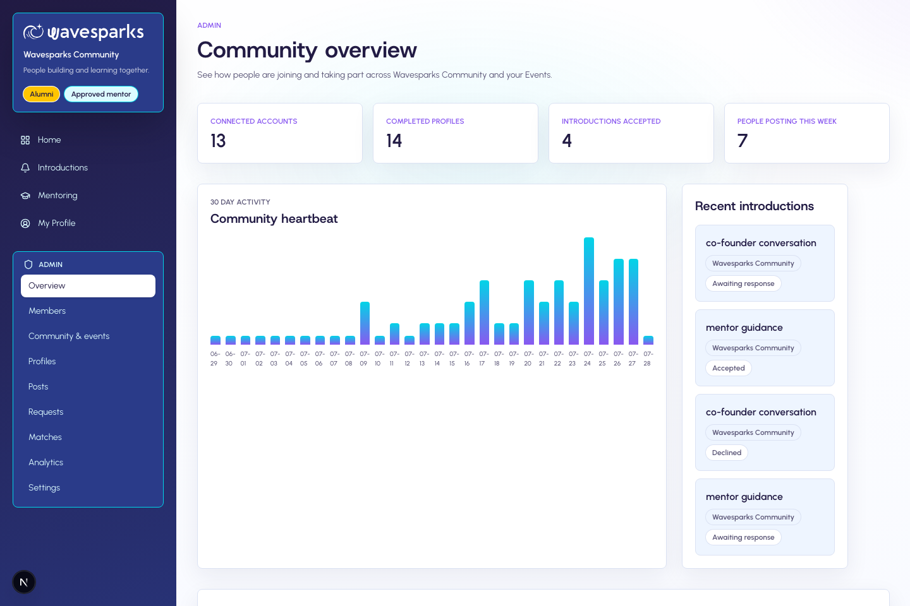
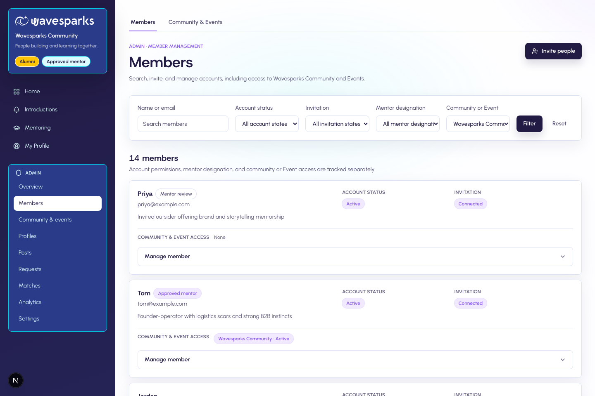
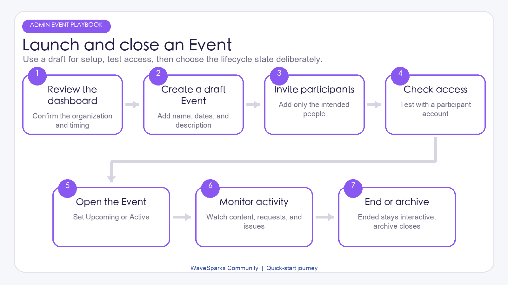
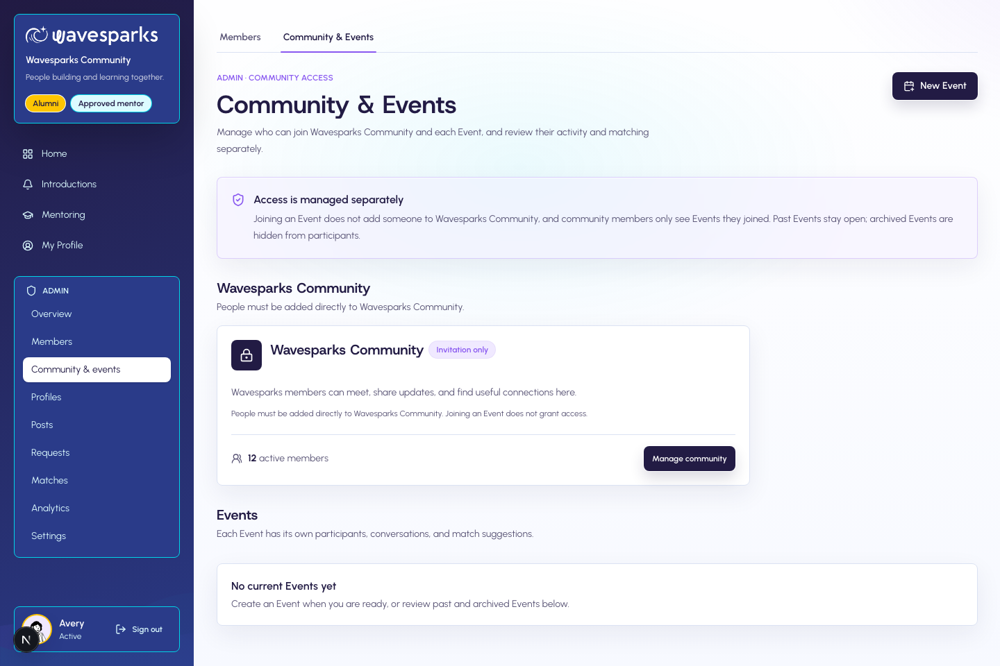
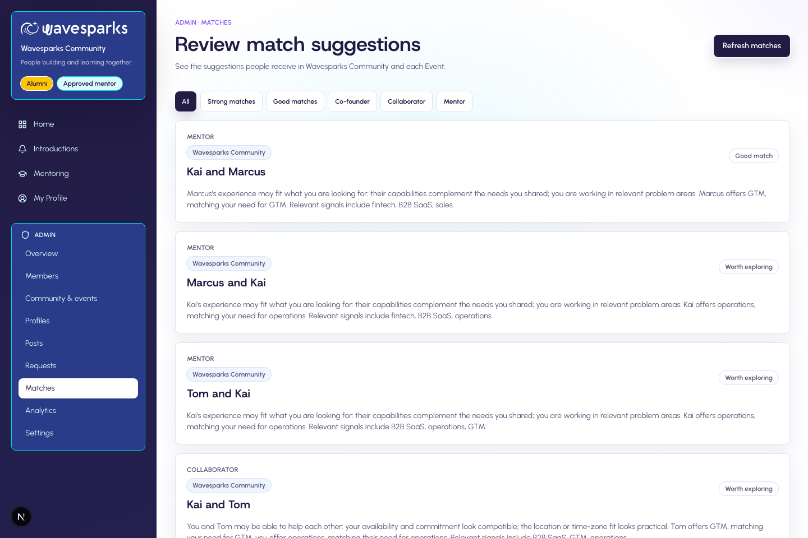
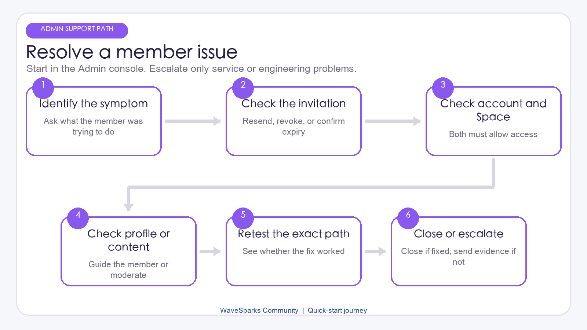

# WaveSparks Community Admin Manager Quick-Start Guide

Version: 1.1

Intended audience: company managers who operate a WaveSparks Community organization through the Admin interface.

This is a product operations guide. It explains routine setup, member administration, Event operations, moderation, and reporting in plain language. Technical deployment, identity, database, email, recovery, and service maintenance belong in the project `README.md` and should be handled by the designated technical owner.

## 1. Your role at a glance

As an Admin, you are responsible for a healthy member experience from invitation through ongoing participation. Your main jobs are to:

- keep organization details and invitation guidance current;
- invite the right people and give them the right Space access;
- create, launch, monitor, and close Events;
- approve or remove Mentor designation when your organization has verified it;
- moderate Profiles and community content;
- oversee Introduction requests and Matching quality;
- review activity trends and follow up on operational issues.

You do not need to maintain hosting, sign-in infrastructure, the database, or email-delivery services. When a problem cannot be solved in the Admin interface, collect the affected person's email, Space, time, and a screenshot, then contact the technical owner.

### The four controls to check separately

A person's access is controlled by four separate choices:

| Control | Typical values | What it decides |
| --- | --- | --- |
| Account permission | Member or Administrator | Whether the person can open the Admin interface |
| Mentor designation | Not a mentor, Needs review, or Approved | Whether the person can be discovered and matched as a Mentor |
| Account state | Invited, Connected, Suspended, or Deprovisioned | Whether the account can use the organization at all |
| Space access | Active, Waitlist, Rejected, Suspended, or Removed | Whether the person can enter one specific Community or Event |

Changing one control does not automatically change the others. For example, approving a Mentor does not make that person an Admin, and adding someone to an Event does not add them to the Main Community.

## 2. Your first 30 minutes

Before inviting a full cohort, complete this short setup:

1. Open the invitation email and sign in with the exact email address that was invited.
2. Confirm that **Admin** appears in the main navigation.
3. Open **Admin -> Overview** and note the current account, Profile, Introduction, and activity totals.
4. Open **Admin -> Settings** and confirm the organization name, logo, tagline, description, and invitation guidance.
5. Open **Admin -> Community & events** and review the Main Community and any existing Events.
6. Invite one test Member, add that person to a test or draft Event, and confirm that the intended access works.
7. Save the name and contact method of the technical owner who supports this project.

### Know the Admin navigation

| Page | Use it for |
| --- | --- |
| Overview | A quick operating snapshot and recent activity |
| Members | Invitations, imports, permissions, Mentor designation, account state, and Space access |
| Community & events | Main Community and Event setup, Participants, Content, and Matching |
| Profiles | Profile review, Featured or Needs review controls, and CSV export |
| Posts | Content moderation and featured content |
| Requests | Introduction oversight and manual Introductions |
| Matches | Match review, feedback, configuration, and refreshes |
| Analytics | High-level member and engagement trends |
| Settings | Organization identity and invitation guidance |

## 3. Complete the organization setup

Open **Admin -> Settings** and review each field as a Member would see it.

### Name and tagline

Use the official organization or program name. Keep the tagline short enough to explain the community's purpose at a glance.

### Logo

Upload a current, approved logo. After saving, open a member-facing page and confirm that it is readable on both light and dark areas of the interface.

### About or community description

Explain:

- who the community is for;
- what Members can do here;
- what behavior is expected;
- where to ask for help.

### Invitation guidance

Write a short note that prepares recipients for the first login. Tell them to use the exact invited email address, accept the invitation within seven days, and complete their Profile before trying to interact.

After any change, save it and check the result from a member-facing page. If the setting saves but does not appear, record what you changed and contact the technical owner.

## 4. Invite and onboard Members

### Invite one person

1. Open **Admin -> Members -> Invite people -> One person**.
2. Enter the person's exact email address and, if available, their name.
3. Choose **Member** or **Administrator**.
4. Choose **Not a mentor** or **Approved mentor** independently.
5. For a Member, select the Main Community or Event and the initial Space access state.
6. Review the choices, then send the invitation.
7. Confirm the row-level invitation status in Members.

The recipient must accept within seven days and use the exact invited, verified email address. If the invitation expires, send a new one. Resending creates a new valid invitation; revoking makes the old link unusable.

Invite Administrators individually. An Administrator can exist without Space access, but they must be explicitly added to a Space if they need to appear in People, post, participate in Matching, or create a manual Introduction there.

### Import a cohort

Use bulk import for a list of Members who should receive the same initial Space access.

1. Open **Admin -> Members -> Invite people -> Import**.
2. Upload a CSV or XLSX file, or paste CSV data.
3. Map the required **Email** field and the optional **Name** field.
4. Select one target Space and one initial access state.
5. Review the preview and correct or remove invalid rows.
6. Confirm **Invite N people**.
7. Review each result and retry only failed rows.

Import limits:

- maximum file size: 2 MB;
- first worksheet only for XLSX;
- maximum 20 columns;
- maximum 100 non-empty data rows;
- the first occurrence of a duplicate email wins.

Selecting a file does not send invitations; nothing is sent until confirmation. Bulk import always creates **Member + Not a mentor**. It cannot grant Admin permission or Mentor approval in bulk. Existing Profiles and global permissions are not overwritten.

### Follow onboarding progress

Use the Members list to distinguish:

- **Invited**: invitation sent, but account connection is not complete;
- **Connected**: the person signed in and connected successfully;
- **Suspended**: a reversible organization-wide block;
- **Deprovisioned**: the organization no longer provides access.

If a connected Member can open the organization but not a specific Space, check that Space's access separately. If the Member can read but cannot post, comment, follow, save, browse People, use Matches, or manage requests, ask them to complete all seven required Profile items.

## 5. Manage roles, Mentors, and access safely

### Account permission

Grant Administrator permission only to people who need the full Admin interface. There are no limited Admin roles such as invitation-only or moderation-only. An Admin cannot remove their own effective Admin permission.

Before changing another Admin:

1. confirm the person's identity;
2. confirm the requested permission with an authorized manager;
3. make sure at least one other active Admin will remain;
4. record the reason in your organization's change log.

### Mentor designation

Mentor designation is a service qualification, not an administrative role.

- **Not a mentor**: not offered as a Mentor.
- **Needs review**: requires an organization decision.
- **Approved**: eligible for Mentor discovery and matching when the person's Mentor settings and Space access are also ready.

Removing approval stops new Mentor discovery and matching and expires pending Mentoring requests. It does not erase accepted or declined history.

### Account state versus Space access

Use an account-wide state when the decision applies everywhere:

- **Suspended** for a reversible organization-wide block;
- **Deprovisioned** when the organization no longer provides the account.

Use Space access when the decision applies to only one Community or Event:

- **Active** allows participation while the Space lifecycle also permits it;
- **Waitlist** and **Rejected** do not grant access;
- **Suspended** temporarily blocks that Space;
- **Removed** ends that Space entitlement.

For a suspected account-security issue, suspend the account in WaveSparks immediately, then contact the technical owner so sign-in sessions can also be handled.

## 6. Create and run an Event

Each organization has one permanent Main Community and can have multiple Events. Event access is invitation-only and independent from Main Community access.

### Event lifecycle

| State | Member experience | Manager use |
| --- | --- | --- |
| Draft | Participants cannot enter | Build and review privately |
| Upcoming | Active participants can enter | Open before the scheduled start |
| Active | Normal participation | Run the live program |
| Ended | Still readable, writable, and matchable | Keep post-event interaction open |
| Archived | Hidden and inaccessible to participants | Close access while retaining data |

Important: **Ended does not close interaction.** Use **Archived** when access and Matching must stop.

### Create and launch

1. Open **Admin -> Community & events** and create an Event.
2. Enter the name, slug, description, tags, and schedule.
3. Keep the Event in **Draft** while preparing it.
4. Decide whether Matching will be available and review its settings.
5. Add participants through individual invitations, bulk import, or the Event's Participants area.
6. Add an Admin as a participant if that Admin needs to participate socially or create manual Introductions in the Event.
7. Review content, participant access, dates, and invitation guidance.
8. Change the Event to **Upcoming** or **Active**.
9. Test with a real Member account before announcing the launch.

### Monitor the live Event

During the Event:

- check participant access and invitation failures;
- review Profile completion and help Members who cannot interact;
- review Posts and moderation needs;
- watch pending Introduction requests;
- sample Matches and anonymous Helpful or Not relevant feedback;
- use Analytics as a directional snapshot, not as a complete reporting system.

### Close or continue

Choose **Ended** when the formal program has finished but you want Members to continue reading, posting, and matching. Choose **Archived** when participant access must stop.

To move selected Event participants into the ongoing Main Community, use **Add N to Main Community**. This creates active Main access and preserves Event access. It does not copy Posts, follows, Matches, feedback, or Introductions.

Adding someone to an Event never grants Main access automatically.

<!-- pagebreak -->

## 7. Review Profiles and protect personal information

Use **Admin -> Profiles** to review complete Profiles, contact details, Featured items, and Profiles that need attention.

Good manager practice:

1. open a Profile only for a clear operational purpose;
2. correct designation or review status through the available controls;
3. feature Profiles using a consistent, documented rule;
4. avoid copying contact details into informal messages;
5. export CSV data only when necessary and store it in an approved location;
6. delete working copies according to company retention policy.

Admins can see sensitive Profile and contact information. This permission is for community operations, not for sharing details without the person's consent.

## 8. Moderate community content

Open **Admin -> Posts** to:

- hide or unhide a Post;
- feature or unfeature it;
- lock or unlock comments;
- archive or reopen it;
- remove or restore an image, link preview, or comment.

Before a material moderation action, record the Post or Comment ID, Space, reason, and decision maker in your normal company ticket or case log. The current product does not provide a member report queue or a complete central Admin audit log.

Suggested response order:

1. preserve enough evidence to review the situation;
2. hide or lock the content if immediate harm may continue;
3. confirm the applicable community rule;
4. decide whether to restore, archive, or keep it hidden;
5. communicate the outcome through your organization's approved channel;
6. suspend the account only when the issue applies across the organization.

## 9. Oversee Introduction requests

Use **Admin -> Requests** to filter Introductions by status, source, and Space.

For a manual Introduction:

1. make sure you personally have access to the source Space;
2. confirm that both people are current participants with complete Profiles;
3. choose who is asking and who they should meet;
4. enter the purpose, a clear note, and a suggested first message;
5. review the request before sending.

An Introduction does not grant access to another Space. Contact details are revealed only to the two participants after acceptance. Do not disclose either person's contact details to someone else or bypass their consent.

Pending requests can become accepted, declined, or expired. WaveSparks does not provide in-product chat, calendar booking, or meeting management after acceptance.

<!-- pagebreak -->

## 10. Oversee Matching without over-tuning it

Matching runs separately inside each Space. Eligible candidates need a connected account, active Space access, a complete Profile, a complete Space intent, and Matching opt-in.

In **Admin -> Matches**, you can:

- review Strong and Good matches by Match type;
- review anonymous Helpful or Not relevant feedback;
- review recent Matching runs;
- create or adjust Match types;
- change direction, minimum score, and weighting;
- start a full refresh.

Treat the fit index as a relevance signal, not a success probability, ranking of personal value, or reputation score.

Before changing settings:

1. write down the current configuration;
2. define the problem you are trying to solve;
3. change as little as possible;
4. run the refresh at a low-activity time;
5. sample results across different Member types and Spaces;
6. watch feedback before making another change.

No more than 12 Match types can be enabled. The six weights for a Match type must total 100. An Ended Event continues matching; an Archived Event does not.

## 11. Use Overview and Analytics for decisions

Overview provides a quick view of connected accounts, complete Profiles, accepted Introductions, weekly posters, and recent activity. Analytics provides basic account, Profile, Introduction, teams-formed, and engagement trends.

Use these pages to answer practical questions:

- Are invitees connecting successfully?
- Are Members completing Profiles?
- Are Introductions being accepted?
- Is activity concentrated in one Space?
- Did participation change after an Event or communication?

These numbers are operational snapshots. They are not a complete business-intelligence system and should not be used alone for performance evaluation.

## 12. A simple operating rhythm

### Daily during an active Event

- Review new invitations and failed rows.
- Check access questions and Profile-completion blockers.
- Review urgent moderation needs.
- Check pending Introduction requests.
- Note any repeated issue that may require technical support.

### Weekly

- Review Member, Mentor, and Admin permissions.
- Review Event participant lists and lifecycle states.
- Sample Posts, Matches, and feedback.
- Review Profiles needing attention.
- Check Overview and Analytics trends.
- Follow up on outstanding support cases.

### Monthly

- Confirm organization details and invitation guidance are current.
- Review inactive or departed accounts and remove unnecessary access.
- Review who still needs Administrator permission.
- Review Featured Profiles and content.
- Delete unneeded local exports according to policy.
- Meet the technical owner to review recurring service issues.

### Before and after every Event

Before launch, confirm content, participants, lifecycle, Matching, dates, and test access. After the Event, decide whether it should remain Ended or become Archived, then decide which participants should be added to Main.

## 13. Troubleshooting for managers

| Symptom | What you can check in the Admin interface |
| --- | --- |
| Invitation was not received | Confirm the email, check invitation status, then resend once; ask the recipient to check spam |
| Invitation expired | Send a new invitation; the old link cannot be reused |
| Connected person sees only My Spaces | Confirm Active access for the intended Space |
| Event participant cannot see Main | This is expected; explicitly use Add to Main Community |
| Person can read but cannot interact | Ask them to complete all seven required Profile items |
| Admin is absent from People or Matches | Add that Admin as a participant in the Space |
| Approved Mentor is not discoverable | Check account connection, Approved status, active Space access, Mentor opt-in, and the `mentor_match` offer |
| No Matches appear | Check Profile, Space intent, opt-in, candidate count, Match settings, and Event lifecycle |
| Members can still post in an Ended Event | This is expected; Archive the Event to stop access |
| Content should stop receiving replies | Lock comments, hide it, or archive it as appropriate |
| A metric looks wrong | Confirm filters and timing; compare with the underlying Members, Requests, or Posts list |

### When to contact the technical owner

| Situation | Information to provide |
| --- | --- |
| No one can sign in, or sign-in repeatedly fails | Affected emails, time, browser, screenshot, and whether all users are affected |
| Invitations repeatedly fail after a correct resend | Recipient email, invitation status, time, and screenshot |
| A saved setting or access change does not take effect | Admin action, person or Space, expected result, actual result, and time |
| Pages show errors, fail to load, or time out | Page address, action just performed, time, screenshot, and number of affected users |
| Product notifications repeatedly do not arrive | Recipient, notification type, Space, approximate time, and whether the in-app notification exists |
| Data appears missing, duplicated, or visible in the wrong Space | Exact record, affected users, Space, screenshot, and when it was first noticed |
| A security or privacy incident is suspected | Suspend access if safe, preserve evidence, record time and scope, and escalate immediately |

Do not share passwords, invitation links, exports, or service credentials in a support message. Do not attempt command-line, database, deployment, or service-console changes unless the technical owner has explicitly assigned and trained you for that work.

## 14. Manager checklists

### New Member

- Correct email and name entered.
- Correct Member or Administrator permission selected.
- Mentor designation reviewed independently.
- Correct initial Space and access state selected.
- Invitation status checked.
- Profile-completion guidance sent.

### Event launch

- Event name, description, tags, and dates reviewed.
- Event remains Draft until setup is complete.
- Participant list and access reviewed.
- Admin participants added where needed.
- Matching choice and settings reviewed.
- Real Member access tested.
- Event changed to Upcoming or Active.
- Support contact communicated.

### Event close

- Decision made between Ended and Archived.
- Members understand whether interaction remains available.
- Selected participants added to Main explicitly.
- Outstanding Introductions and moderation cases reviewed.
- Analytics snapshot recorded if required.

### Admin handover

- Another authorized Admin is active.
- Organization and Event status explained.
- Open invitations, requests, moderation cases, and support issues handed over.
- Local exports transferred or deleted according to policy.
- Technical owner informed of the handover.

WaveSparks works best when access decisions are deliberate, Events are tested before launch, and Members receive clear next-step guidance. For technical operation and maintenance, use the project `README.md` with the technical owner.
