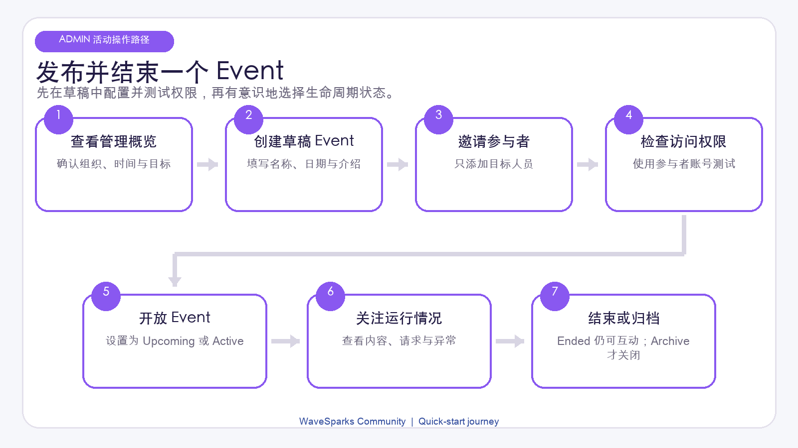
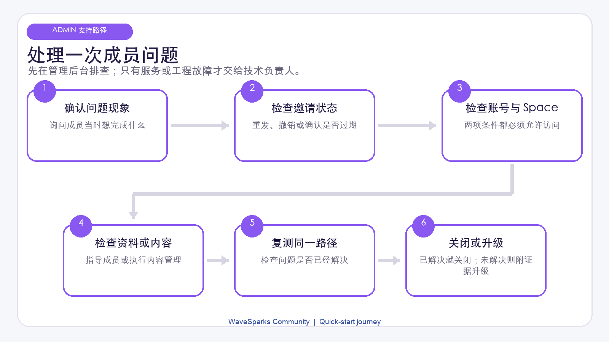

# WaveSparks Community 管理者快速上手指南

版本：1.1

适用对象：通过 Admin 后台运营 WaveSparks Community 的公司经理和项目负责人。

这是一份产品运营指南，重点说明日常设置、成员管理、Event 运营、内容治理和数据查看。部署、登录系统、数据库、邮件服务、恢复和服务维护等技术内容统一放在项目 `README.md` 中，并由指定的技术负责人处理。

## 1. 你的职责是什么

作为 Admin，你负责从邀请到持续参与的完整成员体验。主要工作包括：

- 保持组织信息和邀请说明准确；
- 邀请正确的人，并分配正确的 Space 访问权限；
- 创建、发布、运营和关闭 Event；
- 根据公司审核结果批准或取消 Mentor 资格；
- 管理 Profile 和社区内容；
- 查看 Introduction 请求和 Matching 质量；
- 查看活跃趋势，并跟进日常运营问题。

你不需要维护网站托管、登录基础设施、数据库或邮件投递服务。如果问题无法在 Admin 后台解决，请记录受影响人员的邮箱、Space、发生时间和截图，然后联系技术负责人。

### 四类控制需要分别检查

一个人的访问能力由四类独立设置共同决定：

| 控制项 | 常见状态 | 决定什么 |
| --- | --- | --- |
| 账号权限 | Member 或 Administrator | 是否可以进入 Admin 后台 |
| Mentor 资格 | Not a mentor、Needs review 或 Approved | 是否可以作为 Mentor 被发现和匹配 |
| 账号状态 | Invited、Connected、Suspended 或 Deprovisioned | 是否可以使用整个组织 |
| Space 权限 | Active、Waitlist、Rejected、Suspended 或 Removed | 是否可以进入某个 Community 或 Event |

修改其中一项不会自动修改其他项。例如，批准 Mentor 不会让对方成为 Admin；加入 Event 也不会自动加入 Main Community。

## 2. 登录后的前 30 分钟

在邀请大批成员之前，先完成以下快速设置：

1. 打开邀请邮件，使用被邀请的同一个邮箱登录。
2. 确认主导航中出现 **Admin**。
3. 打开 **Admin -> Overview**，查看当前账号数、完整 Profile 数、Introduction 和近期活动。
4. 打开 **Admin -> Settings**，确认组织名称、Logo、Tagline、介绍和邀请说明。
5. 打开 **Admin -> Community & events**，了解 Main Community 和已有 Event。
6. 邀请一个测试 Member，把对方加入测试或 Draft Event，确认预期权限有效。
7. 保存负责本项目的技术负责人的姓名和联系方式。

### 认识 Admin 导航

| 页面 | 主要用途 |
| --- | --- |
| Overview | 快速查看运营概况和近期活动 |
| Members | 邀请、导入、权限、Mentor 资格、账号状态和 Space 权限 |
| Community & events | Main Community 和 Event 设置、Participants、Content 与 Matching |
| Profiles | Profile 审核、Featured 或 Needs review，以及 CSV 导出 |
| Posts | 内容治理和精选内容 |
| Requests | 查看 Introduction，以及创建人工 Introduction |
| Matches | 查看匹配、反馈、配置和刷新结果 |
| Analytics | 查看成员与参与度趋势 |
| Settings | 设置组织信息和邀请说明 |

## 3. 完成组织基础设置

打开 **Admin -> Settings**，从 Member 的视角检查每个字段。

### 名称和 Tagline

使用正式的组织或项目名称。Tagline 应简短，让新成员一眼知道社区的目的。

### Logo

上传当前批准使用的 Logo。保存后打开成员页面，确认它在页面的明暗区域都清晰可见。

### About 或社区介绍

建议说明：

- 社区面向谁；
- 成员可以在这里做什么；
- 期望遵守哪些行为规范；
- 遇到问题去哪里求助。

### 邀请说明

用一段简短文字告诉收件人：必须使用被邀请的同一个邮箱，在七天内接受邀请，并在互动前先完成 Profile。

每次修改后都要保存，并从成员页面检查结果。如果显示已保存但成员端没有变化，请记录修改内容并联系技术负责人。

## 4. 邀请和引导 Member

### 单人邀请

1. 打开 **Admin -> Members -> Invite people -> One person**。
2. 输入准确邮箱，并尽量填写姓名。
3. 选择 **Member** 或 **Administrator**。
4. 单独选择 **Not a mentor** 或 **Approved mentor**。
5. 如果邀请 Member，选择 Main Community 或 Event，以及初始 Space 权限。
6. 复核选择后发送邀请。
7. 在 Members 中确认这一行的邀请状态。

收件人必须在七天内接受邀请，并使用完全一致且已验证的邮箱。如果邀请过期，请重新发送。重新发送会生成新的有效邀请；撤销后旧链接不能再使用。

Administrator 应逐个邀请。Administrator 可以不属于任何 Space，但如果需要出现在 People、发布内容、参与 Matching，或在某个 Space 创建人工 Introduction，就必须明确加入该 Space。

### 批量导入成员

当一批 Member 需要相同的初始 Space 权限时，可以使用批量导入。

1. 打开 **Admin -> Members -> Invite people -> Import**。
2. 上传 CSV 或 XLSX 文件，或粘贴 CSV 数据。
3. 映射必填的 **Email** 字段和可选的 **Name** 字段。
4. 选择一个目标 Space 和一种初始权限。
5. 在 Preview 中检查并修正或移除无效行。
6. 确认 **Invite N people**。
7. 查看每一行结果，只重试失败的行。

导入限制：

- 文件最大 2 MB；
- XLSX 只读取第一个工作表；
- 最多 20 列；
- 最多 100 行非空数据；
- 重复邮箱以第一次出现为准。

选择文件不会立即发送邀请，只有最终确认后才会发送。批量导入固定创建 **Member + Not a mentor**，不能批量授予 Admin 权限或批准 Mentor。已有 Profile 和全局账号权限不会被覆盖。

### 跟进新成员进度

在 Members 列表中区分：

- **Invited**：邀请已发出，但账号连接尚未完成；
- **Connected**：对方已经成功登录并连接；
- **Suspended**：整个组织范围内的可恢复暂停；
- **Deprovisioned**：组织不再为此账号提供访问。

如果 Connected Member 能打开组织却看不到某个 Space，请单独检查该 Space 权限。如果能阅读但不能发帖、评论、关注、收藏、查看 People、使用 Matches 或处理请求，请让对方先完成七项必填 Profile 内容。

## 5. 安全管理角色、Mentor 和访问权限

### 账号权限

只有确实需要完整 Admin 后台的人才应获得 Administrator 权限。目前没有“只管邀请”或“只管内容”等受限 Admin 角色。Admin 不能取消自己的有效 Admin 权限。

修改另一位 Admin 前：

1. 确认对方身份；
2. 向有权限的经理确认变更要求；
3. 确保至少还有另一位可用 Admin；
4. 在公司的变更记录中写明原因。

### Mentor 资格

Mentor 资格是一种服务身份，不是管理权限。

- **Not a mentor**：不会作为 Mentor 提供给成员；
- **Needs review**：等待组织审核；
- **Approved**：当 Mentor 设置和 Space 权限也符合要求时，可以进入 Mentor 发现和匹配。

取消 Approved 会停止新的 Mentor 发现与匹配，并让待处理的 Mentoring 请求过期，但不会删除已经接受或拒绝的历史记录。

### 账号状态与 Space 权限

当决定适用于整个组织时，使用账号状态：

- **Suspended**：可恢复的全局暂停；
- **Deprovisioned**：组织不再提供该账号。

当决定只影响某个 Community 或 Event 时，使用 Space 权限：

- **Active**：在 Space 生命周期允许时可以参与；
- **Waitlist** 和 **Rejected**：不能进入；
- **Suspended**：暂时阻止进入该 Space；
- **Removed**：结束该 Space 权限。

如果怀疑账号安全问题，请立即在 WaveSparks 中暂停账号，然后联系技术负责人进一步处理登录会话。

## 6. 创建和运营 Event

每个组织有一个长期存在的 Main Community，也可以建立多个 Event。Event 采用邀请制，且权限与 Main Community 相互独立。

### Event 生命周期

| 状态 | Member 看到什么 | 管理者应在何时使用 |
| --- | --- | --- |
| Draft | Participants 无法进入 | 私下搭建和检查 |
| Upcoming | Active participants 可以进入 | 在正式开始前开放 |
| Active | 正常参与 | 项目或活动进行中 |
| Ended | 仍可阅读、发帖和匹配 | 活动结束但继续交流 |
| Archived | 对参与者隐藏且不可进入 | 停止访问但保留数据 |

重要：**Ended 不会停止互动。** 只有在需要停止访问和 Matching 时才使用 **Archived**。

### 创建并发布

1. 打开 **Admin -> Community & events**，创建 Event。
2. 填写名称、Slug、介绍、Tags 和时间。
3. 准备期间保持 **Draft**。
4. 决定是否启用 Matching，并检查相关设置。
5. 通过单人邀请、批量导入或 Event 的 Participants 区域添加参与者。
6. 如果某位 Admin 需要参与互动或创建人工 Introduction，也要把其作为参与者加入 Event。
7. 复核内容、参与者权限、日期和邀请说明。
8. 将 Event 改为 **Upcoming** 或 **Active**。
9. 正式通知成员前，用真实 Member 账号测试访问。

### 运营进行中的 Event

Event 期间：

- 检查参与者权限和邀请失败；
- 查看 Profile 完成情况，帮助无法互动的 Member；
- 查看 Posts 和需要处理的内容；
- 留意待处理 Introduction；
- 抽样查看 Matches，以及匿名的 Helpful 或 Not relevant 反馈；
- 把 Analytics 当作方向性概览，而不是完整的报表系统。

### 结束、保留或关闭

正式活动已经结束，但希望 Member 继续阅读、发帖和匹配时，选择 **Ended**。需要停止参与者访问时，选择 **Archived**。

如果希望部分 Event 参与者进入长期 Main Community，使用 **Add N to Main Community**。这会创建 Active Main 权限并保留原 Event 权限，但不会复制 Posts、关注、Matches、反馈或 Introductions。

加入 Event 永远不会自动获得 Main 权限。

<!-- pagebreak -->

## 7. 审核 Profile 并保护个人信息

在 **Admin -> Profiles** 中可以查看完整 Profile、联系方式、Featured 内容和需要关注的 Profile。

良好的管理习惯：

1. 只有明确的运营目的才打开 Profile；
2. 使用现有控制项处理资格或审核状态；
3. 用一致且有记录的规则选择 Featured Profile；
4. 不要把联系方式复制到非正式消息中；
5. 只在必要时导出 CSV，并存放在公司批准的位置；
6. 按公司保留政策删除临时副本。

Admin 可以看到敏感 Profile 和联系方式，这项权限只用于社区运营，不代表可以在未经同意时向他人披露。

## 8. 管理社区内容

打开 **Admin -> Posts**，可以：

- 编辑 Post 的标题、正文、类型、来源、Tag、关联 Startup 和所需角色；
- Hide 或 Unhide Post；
- Feature 或 Unfeature；
- Lock 或 Unlock comments；
- Archive 或 Reopen；
- Remove 或 Restore 图片、链接预览或 Comment。

Admin 编辑会保留已有图片及其审核状态。正文发生变化时，已有 `@` mention 会转为普通文本；只有首个外部链接保持不变时，链接预览才会保留。当前产品没有 Post 修订历史，因此重要修改前应先记录原文。

执行重要治理动作前，请在公司的工单或事件记录中保存 Post 或 Comment ID、Space、原因和决策人。当前产品没有成员举报队列，也没有完整的中央 Admin 操作日志。

建议处理顺序：

1. 保留足够证据；
2. 如果可能继续造成影响，先 Hide 或 Lock；
3. 确认适用的社区规范；
4. 决定 Restore、Archive 或继续 Hide；
5. 通过公司认可的渠道说明结果；
6. 只有问题影响整个组织时才暂停账号。

## 9. 查看 Introduction 请求

在 **Admin -> Requests** 中可按状态、来源和 Space 筛选 Introduction。

创建人工 Introduction 时：

1. 确认你自己拥有来源 Space 的权限；
2. 确认双方都是当前参与者，并完成 Profile；
3. 选择谁提出请求，以及希望认识谁；
4. 填写目的、清晰说明和建议的第一条消息；
5. 发送前再次复核。

Introduction 不会赋予另一个 Space 的访问权限。只有请求被接受后，联系方式才会向双方显示。不要向第三方披露任一方联系方式，也不要绕过双方同意。

Pending 请求可能变为 Accepted、Declined 或 Expired。接受后，WaveSparks 不提供站内聊天、日程预约或会面管理。

<!-- pagebreak -->

## 10. 监督 Matching，但不要频繁调整

Matching 在每个 Space 内独立运行。候选人必须满足：账号 Connected、Space 权限 Active、Profile 完整、Space intent 完整，并主动开启 Matching。

在 **Admin -> Matches** 中可以：

- 按 Match type 查看 Strong 和 Good matches；
- 查看匿名 Helpful 或 Not relevant 反馈；
- 查看近期 Matching runs；
- 创建或调整 Match types；
- 修改方向、最低分和权重；
- 启动完整刷新。

Fit index 只是相关性信号，不是成功概率、个人价值排名或信誉分。

修改设置前：

1. 记录当前配置；
2. 明确要解决的问题；
3. 尽量只做最小修改；
4. 在活跃度较低的时间刷新；
5. 抽样检查不同 Member 类型和 Space；
6. 观察反馈后再决定是否继续调整。

最多可启用 12 个 Match types。每个 Match type 的六项权重合计必须为 100。Ended Event 仍继续 Matching，Archived Event 则停止。

## 11. 用 Overview 和 Analytics 辅助决策

Overview 快速展示 Connected 账号、完整 Profile、已接受 Introduction、每周发帖人数和近期活动。Analytics 提供账号、Profile、Introduction、Teams formed 和活跃度趋势。

可以用这些页面回答：

- 被邀请者是否顺利完成连接？
- Member 是否在完成 Profile？
- Introduction 是否被接受？
- 活动是否集中在某个 Space？
- Event 或一次通知后，参与度是否变化？

这些数字是运营概览，不是完整的商业分析系统，也不应单独用于人员绩效评价。

## 12. 简单的运营节奏

### Active Event 期间每天

- 查看新邀请和失败行；
- 处理权限问题和 Profile 未完成问题；
- 查看紧急内容治理事项；
- 检查待处理 Introduction；
- 记录需要技术支持的重复问题。

### 每周

- 检查 Member、Mentor 和 Admin 权限；
- 检查 Event 参与者和生命周期状态；
- 抽样查看 Posts、Matches 和反馈；
- 查看需要关注的 Profiles；
- 查看 Overview 和 Analytics 趋势；
- 跟进未解决的支持事项。

### 每月

- 确认组织信息和邀请说明仍然准确；
- 查看不活跃或已离开的账号，移除不再需要的权限；
- 检查谁仍需要 Administrator 权限；
- 复核 Featured Profiles 和内容；
- 按政策删除不再需要的本地导出；
- 与技术负责人回顾重复出现的服务问题。

### 每次 Event 前后

发布前确认内容、参与者、生命周期、Matching、日期和测试账号访问。结束后决定保留 Ended 还是改为 Archived，并决定哪些参与者需要明确加入 Main。

## 13. 管理者故障排查

| 现象 | 可先在 Admin 后台检查什么 |
| --- | --- |
| 没有收到邀请 | 核对邮箱和邀请状态，只重发一次，并让对方检查垃圾邮件 |
| 邀请已过期 | 发送新邀请，旧链接不能复用 |
| Connected 用户只看到 My Spaces | 确认目标 Space 权限为 Active |
| Event 参与者看不到 Main | 这是正常行为，需要明确使用 Add to Main Community |
| 用户可以阅读但无法互动 | 让对方完成全部七项必填 Profile 内容 |
| Admin 没出现在 People 或 Matches | 把 Admin 作为参与者加入该 Space |
| Approved Mentor 无法被发现 | 检查 Connected、Approved、Active Space、Mentor opt-in 和 `mentor_match` offer |
| 没有 Matches | 检查 Profile、Space intent、opt-in、候选人数、Match 设置和 Event 生命周期 |
| Ended Event 仍能发帖 | 这是正常行为；需要停止访问时改为 Archived |
| 某条内容不应继续收到回复 | 根据情况 Lock comments、Hide 或 Archive |
| 某个指标看起来不对 | 检查筛选条件和时间，并与 Members、Requests 或 Posts 列表对照 |

### 何时联系技术负责人

| 情况 | 需要提供的信息 |
| --- | --- |
| 所有人都无法登录，或登录反复失败 | 受影响邮箱、时间、浏览器、截图，以及是否影响所有用户 |
| 确认邮箱后重发仍持续失败 | 收件人邮箱、邀请状态、时间和截图 |
| 设置或权限已保存但没有生效 | 执行的动作、人员或 Space、预期结果、实际结果和时间 |
| 页面报错、无法加载或超时 | 页面地址、刚刚执行的动作、时间、截图和受影响人数 |
| 产品通知反复收不到 | 收件人、通知类型、Space、大致时间，以及站内通知是否存在 |
| 数据疑似丢失、重复或出现在错误 Space | 具体记录、受影响人员、Space、截图和首次发现时间 |
| 怀疑安全或隐私事件 | 在安全的情况下先暂停权限，保留证据，记录时间和范围，立即升级 |

不要在支持消息中分享密码、邀请链接、数据导出或服务密钥。除非技术负责人明确授权并完成培训，否则不要尝试命令行、数据库、部署或服务后台操作。

## 14. 管理者检查清单

### 新 Member

- 邮箱和姓名正确；
- Member 或 Administrator 权限正确；
- Mentor 资格已单独确认；
- 初始 Space 和权限正确；
- 已检查邀请状态；
- 已发送 Profile 完成说明。

### Event 发布

- Event 名称、介绍、Tags 和日期已复核；
- 完成设置前一直保持 Draft；
- 参与者和权限已检查；
- 需要参与的 Admin 已加入；
- Matching 选择和设置已检查；
- 已用真实 Member 测试访问；
- 已改为 Upcoming 或 Active；
- 已告知成员支持联系方式。

### Event 结束

- 已决定使用 Ended 还是 Archived；
- Member 清楚是否还能继续互动；
- 需要的参与者已明确加入 Main；
- 已检查未完成 Introduction 和内容治理事项；
- 如公司需要，已保存 Analytics 概览。

### Admin 交接

- 另一位经授权的 Admin 已经可用；
- 已说明组织和 Event 当前状态；
- 已交接未完成邀请、请求、内容事件和支持问题；
- 本地导出已按政策移交或删除；
- 已通知技术负责人。

当权限分配清晰、Event 发布前完成真实测试，并且 Member 收到明确的下一步说明时，WaveSparks 的运营效果最好。技术运行与维护请由技术负责人参考项目 `README.md`。
