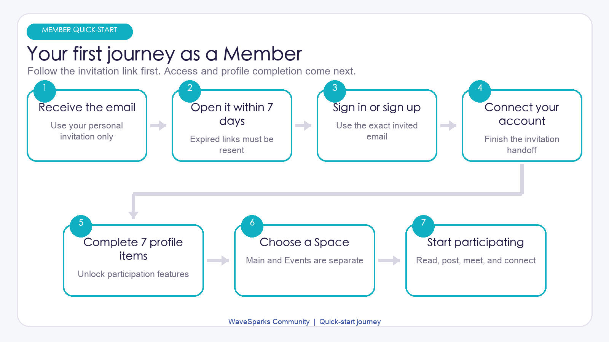
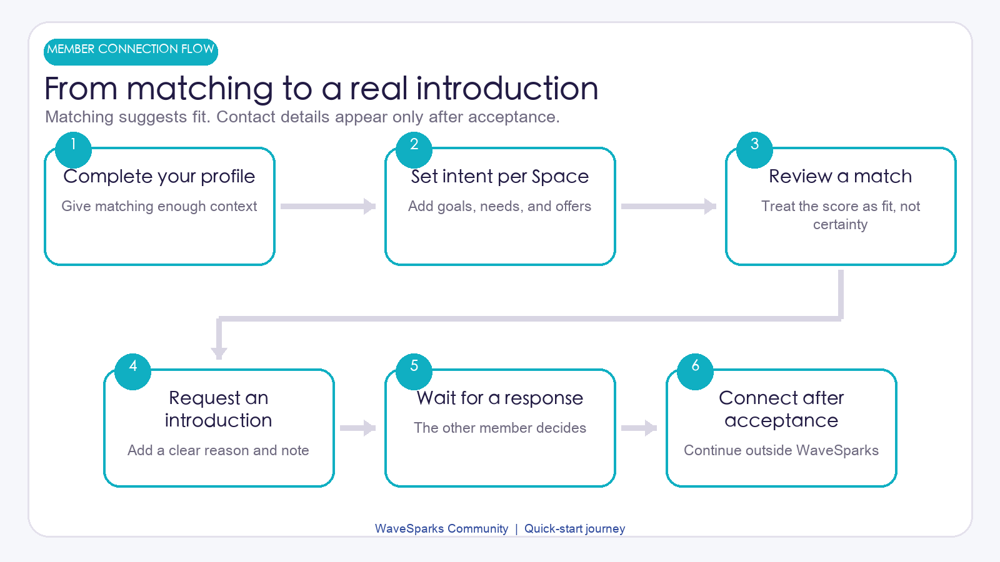

# WaveSparks Community Member Kick-start Kit

Version: 1.1

Audit baseline: Code and current interface as of July 29, 2026

For: Members invited to a WaveSparks community

> Start with the invitation email and follow the numbered steps. Organization names, events, and content differ between communities, so use the labels shown in your deployed site if they vary slightly.

## Your first 15 minutes

By the end of your first visit, aim to complete these five actions:

- Open the invitation before it expires.
- Sign up or sign in with the exact invited email address.
- Complete the seven required Profile items.
- Open the correct Main Space or Event Space.
- Read the Feed and, if useful, set your Matching intent for that Space.

## Step 1: Open your invitation email

1. Find the invitation sent by the organization.
2. Open the invitation link within 7 days.
3. Keep the email available until you have reached the community home page.

The link is personal and single use. Do not forward it. If it has expired, ask your organization Admin to resend the invitation.

If you see an error:

- **Invalid:** Return to the original email and open the full link again.
- **Expired:** Ask an Admin for a new invitation.
- **Inactive:** The invitation was already accepted or revoked. Try normal sign-in, then contact an Admin if needed.

## Step 2: Sign up, verify your email, and connect

1. Choose sign-up if you are new, or sign-in if you already have an account.
2. Use the exact email address named in the invitation.
3. Complete email verification when prompted.
4. Continue until WaveSparks shows your organization home or Profile setup.

The invited email must be verified. A similar address or a newly created second account will not claim the invitation.

If another account is already signed in, sign out and repeat the link with the invited account. If you reach a **Pending** page, stop retrying and ask an Admin to check whether the invitation connected successfully and whether your community account is active.

## Step 3: Complete your Profile

Your Profile is shared across all Spaces in the organization. You can save it step by step, but most participation features remain locked until it is complete.

The Profile form covers:

1. **About you:** name, location, headline, bio, affiliation, and optional public links.
2. **Interests and experience:** current focus, skills, industries, experience, and project details.
3. **Connections:** what you seek, what you can offer, and collaboration preferences.
4. **Contact and preferences:** introduction email, optional WhatsApp, communication style, and whether you accept introductions.

### The seven items required for completion

- Preferred name
- Headline
- Bio
- Current focus
- At least one Looking for type
- At least one Skill tag
- A valid Introduction email

The Looking for field is required even if you do not plan to use Matching.

Before completion, you can still view Home and some Feed, Knowledge, Opportunities, and existing Introduction content. You cannot yet open People or Matches, publish, comment, follow, save, or request or answer an Introduction.

### Share only what you intend others to see

- Profile links are visible to members in a shared Space.
- Use only HTTP or HTTPS links.
- An avatar can be a public image URL or a JPG, PNG, or WebP upload up to 2 MB.
- Your Introduction email does not change your sign-in email.
- WhatsApp is shown to the other participant only if you allow sharing and an Introduction is accepted.

## Step 4: Choose the right Space

After setup, My Spaces is your starting point.

- **Main Space:** The ongoing organization community. It requires separate access.
- **Your events:** Event Spaces that are upcoming or active.
- **Past events:** Event Spaces marked ended.

Access to one Event does not automatically include the Main Space or another Event. A locked Main Space card means you have not been granted Main Space access.

An ended Event is still interactive in the current version. You may continue to browse, post, match, and use Introductions until an Admin archives it. Draft and archived Spaces are not visible to Members.

WaveSparks does not provide event tickets, RSVP, check-in, payments, or self-service join and leave controls. Ask an Admin if you believe a Space is missing.

## Step 5: Make your first visit useful

Inside a Space, confirm its name in the Space switcher, then explore:

- **Feed:** Updates, questions, resources, announcements, and requests.
- **People:** Complete profiles of active members in this Space.
- **Matches:** Suggestions based on your Profile and Space-specific intent.
- **Knowledge:** Resources, featured content, discussions, and saved posts.
- **Opportunities:** Opportunity and collaboration posts.
- **Introductions:** Requests and contact exchange after mutual consent.

### Read, follow, save, and contribute

You can search and filter the Feed, follow or unfollow an author, save or unsave a post, comment, or request a General introduction to the author.

When posting, choose one of these types: General update, Question, Resource, Announcement, Opportunity, Looking for cofounder, or Looking for mentor.

Keep these limits in mind:

- Title: up to 160 characters; body: up to 10,000 characters.
- A General update may omit a title; other types require one.
- Include at least a body or an image.
- Add up to 4 JPG, PNG, or WebP images, each up to 5 MB.
- Comments can contain up to 2,000 characters.

Posts and comments cannot currently be edited or deleted by Members. There are also no likes, reports, blocks, mutes, or direct messages. Contact an Admin when content needs moderation.

## Step 6: Turn on Matching in each Space

Matching settings are separate for every Space. Complete these fields on the Matches page:

1. **Current goal**
2. **Looking for**
3. **What I can offer**
4. **Include me in match suggestions**

Your intent is complete when Current goal is filled and at least one Looking for or Offer item is selected. Settings in the Main Space are not copied to Events.

A match card shows a 1 to 100 Fit index, a short explanation, and shared tags. Fit describes compatibility between the two Profiles and intents. It is not a success probability, credit score, reputation score, or quality rating.

Use **Helpful** when a suggestion fits. Use **Not relevant** and choose a reason when it does not. A dismissed result stays hidden after later match refreshes.

<!-- pagebreak -->

## Step 7: Request or answer an Introduction

You can request an Introduction from a People profile, a match card, or a post author.

1. Check that you are in the intended Space.
2. Choose General, or Mentoring when the recipient is an eligible Approved Mentor.
3. Add the purpose, a note, and a suggested opening message.
4. Submit the request and wait for the recipient.

A request from a post author is always General. The same two people can have only one pending request at a time within the organization, and the requester cannot currently withdraw it.

### What each status means

- **Pending:** Waiting for the recipient. No contact details are shared.
- **Accepted:** Both participants can see each other's Introduction email. WhatsApp appears only when its owner allowed sharing.
- **Declined:** The result remains in history, but contact details stay private.
- **Expired:** An account, mentor approval, Space access, or another requirement is no longer valid.

WaveSparks is not a chat or calendar. After acceptance, use an external channel that both people agree to. Admins may view Profile contact details when needed for legitimate community operations.

## Step 8: Check notifications and return to the right Space

Use the account-level Inbox for Introduction requests and outcomes, manual introductions, Admin notes, membership updates, and post or comment mentions.

Each Space keeps its own Feed, follows, saved posts, Matching intent, match results, and Introductions. Your Profile and Inbox are shared across Spaces. Accepted and declined Introduction history can remain in the Inbox after Space access ends, but it does not restore access.

Email is a convenience, not the only record of ongoing activity. If a later notification email is missing, check the in-app Inbox and spam folder before contacting an Admin.

## Step 9: Keep your account and data safe

- Never forward an invitation or publish passwords, access keys, identity documents, or private contact details in a post.
- Add only social links and Profile information you want other members in a shared Space to see.
- Contact an Admin about suspicious content or requests because there is no member reporting button yet.
- Sign out from the account menu on a shared device.

## When your access or account changes

- **Event ended:** It moves to Past events and remains interactive until archived.
- **Event archived or Space access removed:** That Space disappears and its content is no longer available to you.
- **Account suspended or deprovisioned:** You are sent to Pending and must contact an Admin.
- **Leaving or deleting data:** There is no self-service leave, local account deletion, or data export control. Contact the organization Admin.

If your sign-in identity is deleted and the deletion is processed successfully, the local Profile is anonymized. Existing posts and comments remain and show **Former member** as the author; pending Introductions expire and personal Profile details are cleared.

## Fast troubleshooting

### I did not receive or cannot use the invitation

Check spam and confirm that you are using the invited mailbox. Invitations expire after 7 days. Ask an Admin to verify the address and resend instead of registering repeatedly.

### I am signed in but still see Pending

The invitation may not have connected, the email may be unverified, or the account may be inactive. Send the Admin the invited email address and a screenshot of the page, but never send a password or verification code.

### I can read the Feed but cannot interact

Open Profile and confirm all seven completion items. Interactive features unlock only after the Profile is complete.

### A Space is missing

Return to My Spaces, confirm you are in the correct organization, and ask an Admin to check both your account status and access to that specific Space.

### My Matching settings disappeared

Check the Space switcher. Intent, feedback, follows, and saved items are configured separately in every Space.

### I cannot send another Introduction

Check whether the same pair already has a pending request. Also confirm that both members still have complete Profiles and active access to the current Space.

## First-week checklist

- I signed in with the verified email named in the invitation.
- I completed all seven required Profile items.
- I know which Main Space and Events I can access.
- I added only Profile details and public links I am comfortable sharing.
- I set a separate Matching intent in each Space where I want suggestions.
- I understand that Fit is compatibility guidance, not a guarantee.
- I know that accepted Introductions continue outside WaveSparks.
- I know to contact an Admin for access, moderation, departure, or deletion requests.
