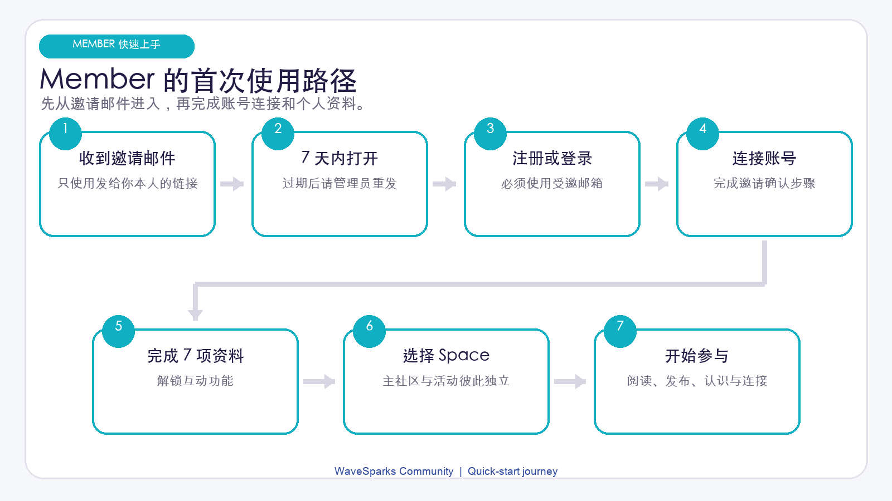
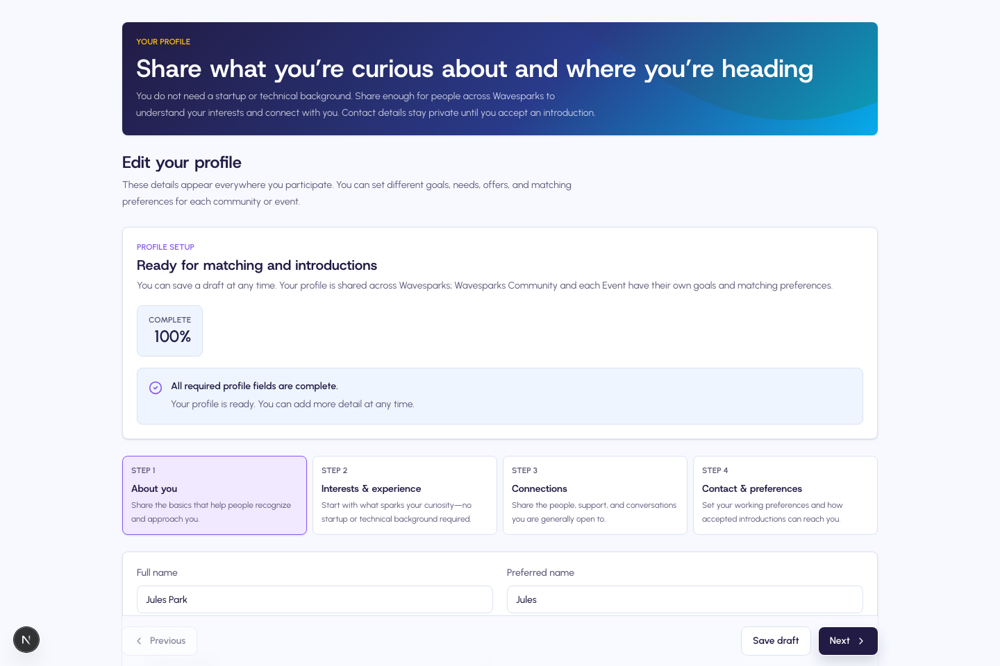
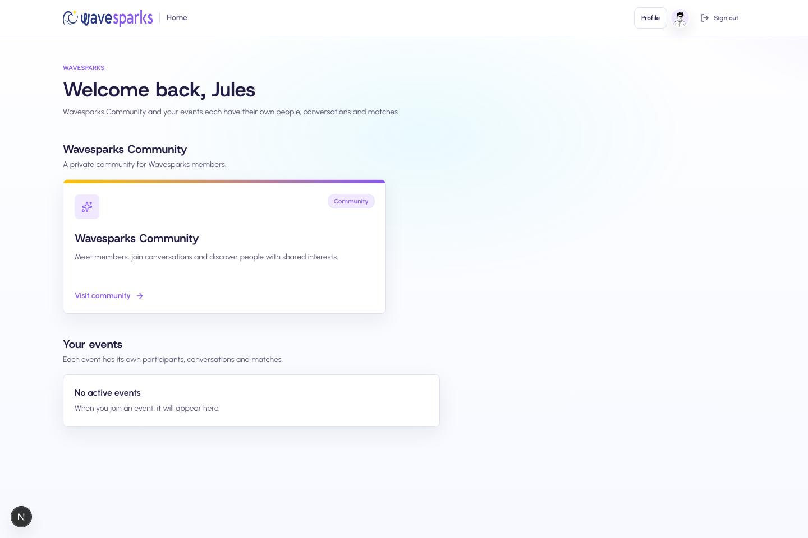
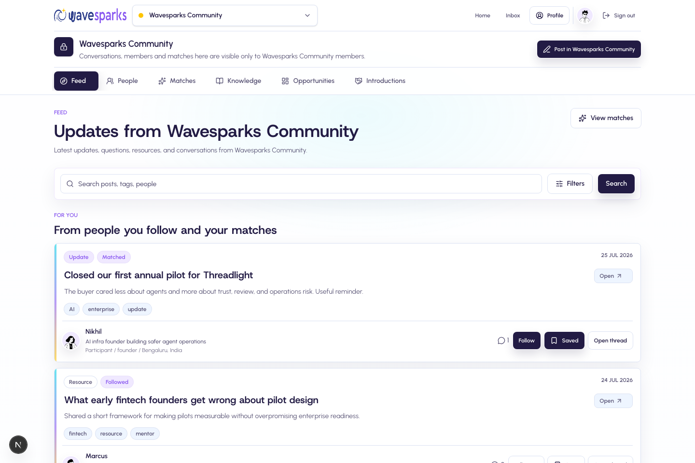
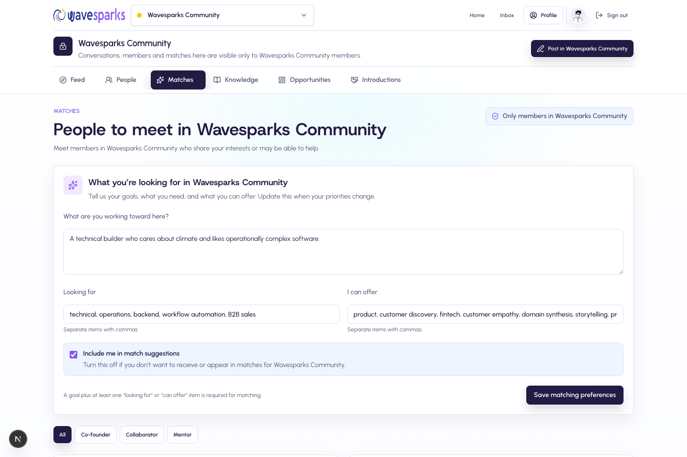
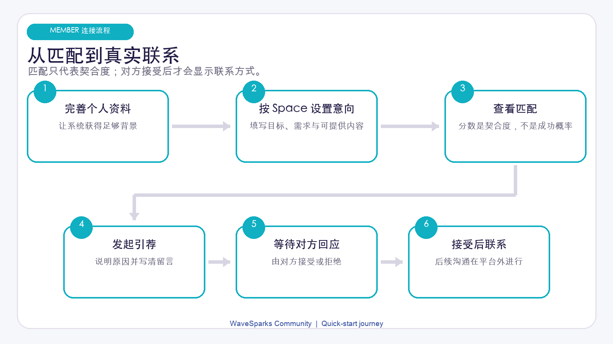

# WaveSparks Community Member 快速上手指南

版本：1.1

审计基线：2026-07-29 代码与当前界面

适用对象：受邀加入 WaveSparks 社区的普通成员

> 请从邀请邮件开始，依次完成下面的步骤。不同组织的名称、活动和内容会不同；如果按钮文字略有差异，请以实际页面为准。

## 入门前 15 分钟

第一次访问时，建议先完成这五件事：

- 在邀请过期前打开邮件链接；
- 使用邀请指定的邮箱注册或登录；
- 补齐 Profile 的七项完成条件；
- 进入正确的 Main Space 或 Event Space；
- 浏览 Feed，并按需为当前 Space 设置 Matching intent。

## 第 1 步：打开邀请邮件

1. 找到组织发给你的邀请邮件。
2. 在 7 天有效期内打开邀请链接。
3. 到达社区首页前，先保留这封邮件。

邀请链接仅供本人使用，而且只能使用一次。不要转发给别人。如果链接已过期，请联系组织 Admin 重发。

如果页面显示错误：

- **Invalid：** 回到原邮件，重新打开完整链接；
- **Expired：** 联系 Admin 获取新邀请；
- **Inactive：** 邀请已接受或已撤销，先尝试正常登录，仍失败再联系 Admin。

## 第 2 步：注册、验证邮箱并连接账号

1. 新用户选择注册，已有账号选择登录。
2. 使用邀请中完全一致的邮箱地址。
3. 按提示完成邮箱验证。
4. 继续操作，直到看到 WaveSparks 的组织首页或 Profile 设置页。

受邀邮箱必须已经验证。相似邮箱或另建的第二个账号不能领取这份邀请。

如果浏览器中已经登录其他账号，请先退出，再用受邀账号重新打开链接。如果进入 **Pending** 页面，请停止重复尝试，让 Admin 检查邀请是否成功连接，以及社区账号是否处于有效状态。

## 第 3 步：完成 Profile

Profile 会在同一组织的所有 Space 中共用。你可以分步保存，但资料完成前，大部分互动功能仍会锁定。

Profile 表单分为四部分：

1. **About you：** 姓名、地点、Headline、Bio、所属机构和可选公开链接；
2. **Interests and experience：** Current focus、技能、行业、经验和项目资料；
3. **Connections：** 正在寻找什么、可以提供什么，以及合作偏好；
4. **Contact and preferences：** Introduction 邮箱、可选 WhatsApp、沟通偏好和是否接受介绍。

### 资料完成所需的七项内容

- Preferred name；
- Headline；
- Bio；
- Current focus；
- 至少一个 Looking for 类型；
- 至少一个 Skill tag；
- 一个有效的 Introduction email。

即使你不准备使用 Matching，Looking for 仍是当前版本的资料完成条件。

资料未完成时，你仍可查看 Home，以及部分 Feed、Knowledge、Opportunities 和已有 Introduction；但还不能进入 People 或 Matches，也不能发帖、评论、关注、收藏、请求或回应 Introduction。

### 只填写愿意分享的信息

- Profile 链接会向与你同一 Space 的成员显示；
- 外部链接必须使用 HTTP 或 HTTPS；
- 头像可使用公开图片链接，或上传不超过 2 MB 的 JPG、PNG、WebP；
- Introduction 邮箱不会改变登录邮箱；
- 只有当你允许分享且 Introduction 已接受后，WhatsApp 才会向另一位参与者显示。

## 第 4 步：选择正确的 Space

完成设置后，My Spaces 是你的起点。

- **Main Space：** 组织长期运营的社区，需要单独授权；
- **Your events：** 状态为 upcoming 或 active 的 Event Space；
- **Past events：** 状态为 ended 的 Event Space。

获得一个 Event 的权限，不代表同时拥有 Main Space 或其他 Event 的权限。Main Space 卡片显示锁定，表示你尚未获得 Main Space 访问权。

当前版本中，ended Event 仍可互动。在 Admin 归档前，你仍可浏览、发帖、匹配和使用 Introduction。draft 与 archived Space 对 Member 不可见。

WaveSparks 不提供活动票务、RSVP、签到、支付或自助加入、退出功能。如果应该出现的 Space 不见了，请联系 Admin。

## 第 5 步：完成第一次有效访问

进入 Space 后，先在 Space switcher 确认名称，再浏览：

- **Feed：** 动态、问题、资源、公告和需求；
- **People：** 当前 Space 中的有效成员；仍在设置 Profile 的成员只显示有限信息，且没有 Profile 操作入口；
- **Matches：** 根据 Profile 与当前 Space intent 生成的建议；
- **Knowledge：** 资源、精选内容、讨论和收藏；
- **Opportunities：** 机会与合作类帖子；
- **Introductions：** 经双方同意后交换联系方式的请求。

### 阅读、关注、收藏和发布

你可以搜索和筛选 Feed，关注或取消关注作者，收藏或取消收藏帖子，发表评论，或向帖子作者发起 General introduction。

发帖时可选择：General update、Question、Resource、Announcement、Opportunity、Looking for cofounder 或 Looking for mentor。

请注意以下限制：

- 标题最多 160 字符，正文最多 10,000 字符；
- General update 可不填标题，其他类型必须有标题；
- 帖子至少需要正文或一张图片；
- 最多添加 4 张 JPG、PNG 或 WebP 图片，每张不超过 5 MB；
- 评论最多 2,000 字符。

Member 当前不能自行编辑或删除帖子与评论，也没有点赞、举报、屏蔽、静音或站内私信。内容需要处理时，请联系 Admin。

## 第 6 步：在每个 Space 开启 Matching

每个 Space 的 Matching 设置彼此独立。在 Matches 页面填写：

1. **Current goal**；
2. **Looking for**；
3. **What I can offer**；
4. **Include me in match suggestions**。

要让 intent 完成，必须填写 Current goal，并且 Looking for 或 Offer 至少选择一项。Main Space 的设置不会自动复制到 Event。

匹配卡会显示 1 到 100 的 Fit index、简短说明和共同标签。Fit 表示双方 Profile 与 intent 的契合程度，不是成功概率、信用分、声望分或质量评价。

建议合适时选择 **Helpful**。不合适时选择 **Not relevant** 并填写原因；隐藏后的结果会在以后刷新匹配时继续保持隐藏。

<!-- pagebreak -->

## 第 7 步：请求或回应 Introduction

你可以从 People 资料页、Matches 匹配卡或帖子作者入口发起 Introduction。

1. 确认当前位于正确的 Space。
2. 选择 General；当对方是符合条件的 Approved Mentor 时，也可选择 Mentoring。
3. 填写 purpose、note 和 suggested opening message。
4. 提交请求，等待对方回应。

从帖子作者入口发起的请求始终是 General。同一组织内，同一对成员同时只能有一个 pending 请求，而且请求方当前不能自行撤回。

### 各状态的含义

- **Pending：** 等待接收方处理，不共享联系方式；
- **Accepted：** 双方可看到彼此的 Introduction email；WhatsApp 仅在本人允许分享时出现；
- **Declined：** 结果保留在历史中，但联系方式不会公开；
- **Expired：** 账号、Mentor 资格、Space 权限或其他前置条件已失效。

WaveSparks 不是聊天或日历工具。接受后，请转到双方同意的外部渠道继续沟通。Admin 在合法的社区运营场景下可以查看 Profile 联系信息。

## 第 8 步：查看通知，并回到正确的 Space

账号级 Inbox 会显示 Introduction 请求与结果、人工介绍、Admin 通知、成员状态更新，以及帖子或评论中的 mention。

每个 Space 都有独立的 Feed、关注、收藏、Matching intent、匹配结果和 Introduction。Profile 与 Inbox 则跨 Space 共用。失去 Space 权限后，accepted 和 declined 的 Introduction 历史可能仍保留在 Inbox，但不能据此恢复访问权。

邮件只是提醒方式，不是持续活动的唯一记录。后续通知邮件未收到时，先检查站内 Inbox 和垃圾邮件，再联系 Admin。

## 第 9 步：保护账号与个人信息

- 不要转发邀请，也不要在帖子中发布密码、访问密钥、身份证件或私人联系方式；
- 只添加愿意向同一 Space 成员展示的社交链接和 Profile 信息；
- 当前没有 Member 举报按钮，遇到异常内容或请求时请联系 Admin；
- 在公用设备上使用后，从账号菜单退出登录。

## 权限或账号发生变化时

- **Event ended：** 活动进入 Past events，在归档前仍可互动；
- **Event archived 或 Space 权限移除：** 该 Space 消失，其中的内容不再可访问；
- **账号 suspended 或 deprovisioned：** 页面会进入 Pending，需要联系 Admin；
- **退出或删除数据：** 当前没有自助退出 Space、本地账号删除或数据导出入口，请联系组织 Admin。

如果登录身份被删除，且删除流程成功处理，本地 Profile 会匿名化。已有帖子和评论会保留，作者显示为 **Former member**；pending Introduction 会过期，个人资料明细会被清除。

## 快速排障

### 没有收到邀请，或邀请无法使用

检查垃圾邮件，并确认正在查看受邀邮箱。邀请 7 天后过期。请让 Admin 核对地址并重发，不要反复注册新账号。

### 已登录，但仍停留在 Pending

邀请可能没有成功连接、邮箱尚未验证，或账号处于非有效状态。向 Admin 提供受邀邮箱和页面截图，但不要发送密码或验证码。

### 可以看 Feed，但不能互动

打开 Profile，确认七项完成条件全部满足。只有资料完成后，互动功能才会解锁。

### 应该出现的 Space 不见了

返回 My Spaces，确认组织无误，再请 Admin 同时检查账号状态和该 Space 的单独权限。

### Matching 设置好像消失了

检查 Space switcher。Intent、反馈、关注和收藏都需要在每个 Space 中单独设置。

### 无法再发起一个 Introduction

先检查同一对成员是否已经有 pending 请求，并确认双方资料完整，且仍有当前 Space 的 active 权限。

## 第一周自检清单

- 我使用邀请指定且已验证的邮箱登录；
- 我完成了 Profile 的七项必填内容；
- 我知道自己可以进入哪些 Main Space 和 Event；
- 我只添加了愿意分享的资料和公开链接；
- 我在需要建议的每个 Space 单独设置了 Matching intent；
- 我理解 Fit 只是契合度参考，不是结果保证；
- 我知道 Introduction 接受后要在 WaveSparks 外继续沟通；
- 我知道权限、内容处理、退出或删除请求都需要联系 Admin。
