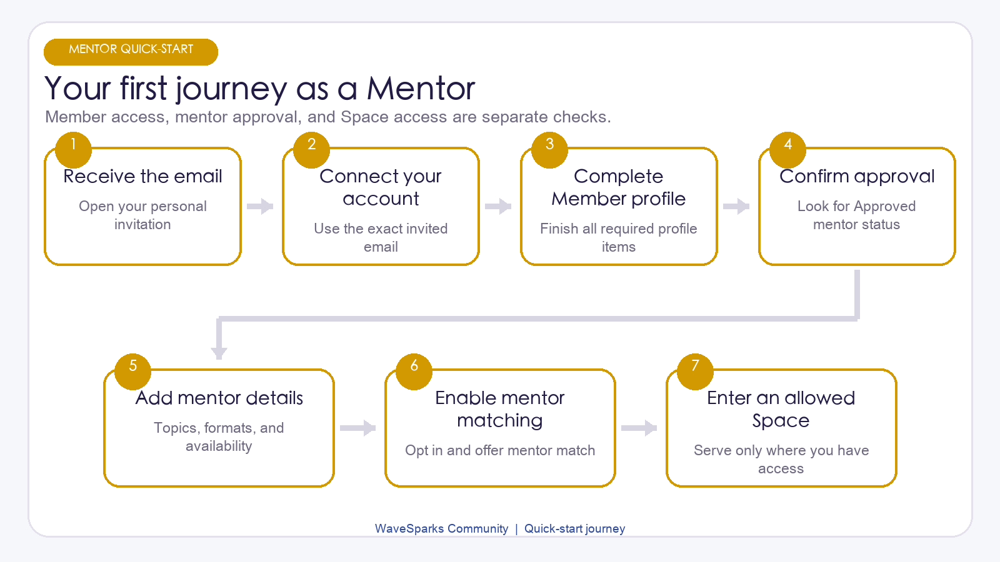
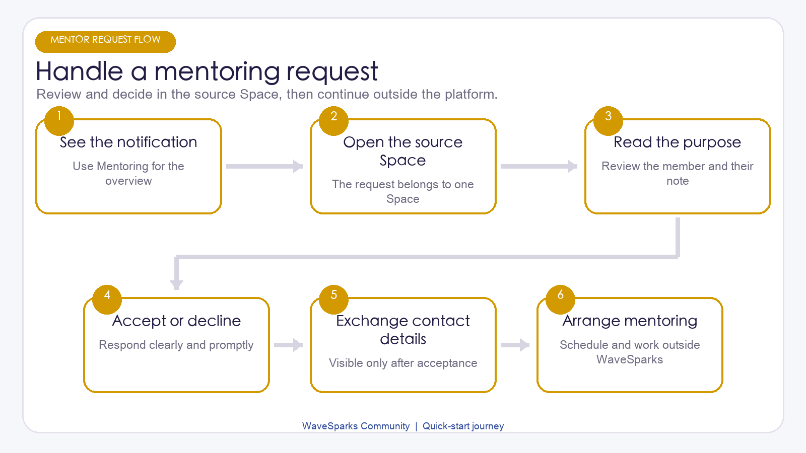

# WaveSparks Community Mentor Kick-start Kit

Version: 1.1 | Updated: July 29, 2026 | For: Organization-approved Mentors

This guide gets you from the invitation email to your first mentoring conversation. It focuses on what to do, in the order you will do it.

> A Mentor is also a Member. Mentor approval adds mentoring features, but it does not make you an Admin or automatically give you access to every Space.

## Your first 20 minutes

Use this checklist the first time you join:

1. Open the invitation email within 7 days.
2. Sign up or sign in with the exact invited email address.
3. Confirm that your account is connected and your expected Space appears.
4. Complete the 7 required Member Profile items.
5. Confirm that your Mentor status is Approved.
6. Add your Mentor topics, experience, offers, and availability.
7. Turn on Accept introductions and include Mentor match in Offering.
8. Set your matching intent in each Space where you want suggestions.

## 1. Open the invitation email

Your organization Admin invites you to WaveSparks by email.

1. Find the invitation email in your inbox.
2. Open the invitation link within 7 days.
3. Sign up if you are new, or sign in if you already have an account.
4. Use the exact email address that received the invitation.
5. Complete email verification when prompted.
6. Continue to the organization page.

If the link has expired, the email address is wrong, or the invitation is missing, contact your organization Admin. The Admin can check the invitation and send a new one.

Do not create a second account with another email. The invited, verified email is what connects your sign-in to your organization record.

## 2. Confirm your account, Mentor status, and Space access

Three separate things control what you can do:

- Member Profile: your shared personal profile must be complete before you can fully participate.
- Mentor status: your organization must set it to Approved before Mentor features are available.
- Space access: an Admin must add you to each Main Space or Event you should enter.

These are independent. For example, an Approved Mentor may still be unable to see an Event if the Admin has not added them to that Event.

After signing in:

1. Open My Spaces.
2. Check for the Main Space and any Event you expect to join.
3. Open one Space and confirm that its Home page loads.
4. Open your Profile settings and look for Mentor settings.
5. If a Space or Mentor setting is missing, ask your Admin to check your approval and access.

Mentor approval does not provide Admin controls. You cannot invite members, manage Events, export profiles, or moderate content unless you separately have an Admin role.

## 3. Complete the Member Profile first

Your Member Profile is global: the same profile appears in every Space you can access.

Complete all 7 required items:

1. Preferred name.
2. Headline.
3. Bio.
4. Current focus.
5. At least one Looking for type.
6. At least one Skill tag.
7. Introduction email.

Keep the profile short and useful. State what you know, what you are working on, and what kind of people you hope to meet.

Your Introduction email is shared with the other participant only after you accept an introduction. Changing it does not change the email you use to sign in.

Until the 7 items are complete, you can explore some areas, but actions such as People, Matches, posting, commenting, following, saving, and requesting introductions remain limited.

## 4. Add your Mentor details

Once your Mentor status is Approved, complete the Mentor section of Profile settings.

Add or review:

- Mentoring topics.
- Startup stages you can support.
- Functional strengths.
- The mentoring help you offer.
- Availability.
- Max mentees, from 0 to 100.
- Mentorship preferences.
- Whether to share WhatsApp after an introduction is accepted.

Use specific phrases. For example, "B2B sales discovery for early-stage founders" is more helpful than "business advice."

If the Mentor fields do not save, first ask your Admin to confirm that your Mentor status is Approved. There is no self-service Mentor application or approval button.

Max mentees and Availability help people understand your capacity and can influence matching. They do not automatically stop new requests when you become full.

## 5. Turn on mentoring requests

Two global settings must be on if you want to receive Mentoring requests:

1. Turn on Accept introductions.
2. Add Mentor match to Offering.

They do different jobs:

- Accept introductions allows new General and Mentoring introduction requests.
- Mentor match makes you available for Mentor matching and direct Mentoring requests.

To pause every new introduction, turn off Accept introductions.

To pause only Mentor matching and Mentoring requests, remove Mentor match from Offering. General introductions can remain available.

## 6. Set matching intent in each Space

Matching settings are separate for every Space. Completing them in the Main Space does not enroll you in an Event.

For each Space where you want suggestions:

1. Open the Space.
2. Select Matches.
3. Enter your Current goal.
4. Add at least one Looking for or What I can offer item.
5. Turn on Include me in match suggestions.
6. Review the resulting matches.

Matching must also be enabled for that Space by an Admin.

The Fit index from 1 to 100 combines profile, intent, skills, experience, availability, and other signals. It is a discovery aid, not a success probability, public rating, or quality score.

Use Helpful when a suggestion is useful. Use Not relevant to hide a poor suggestion. This feedback is private and is not a review of the other person.

## 7. Take a quick tour

The main areas you will use are:

- My Spaces: Main Space, current Events, and past Events you can access.
- Feed: updates, questions, resources, announcements, and opportunities.
- People: member profiles and Approved Mentor badges.
- Matches: Space-specific suggestions and introduction actions.
- Introductions: requests for the current Space.
- Mentoring: one view of your incoming Mentoring requests across accessible Spaces.

As a Mentor, you can participate like any other Member: post, comment, mention people, follow members, save posts, and request introductions after your Member Profile is complete.

Keep confidential client or mentee information out of posts and comments. Members cannot edit or delete their own posts or comments in the current product, so ask an Admin if something must be corrected or removed.

<!-- pagebreak -->

## 8. Handle a Mentoring request

You may receive a request from your People profile or a Mentor match. A request started from a post is always a General introduction.

When a request arrives:

1. Open the notification or the Mentoring workspace.
2. Note the source Space.
3. Read the Purpose, Note, and suggested opening message.
4. Decide whether the request fits your expertise, time, and boundaries.
5. Open Introductions inside the source Space.
6. Select Accept or Decline.

The Mentoring workspace gathers incoming requests from the Spaces you can still access. The final Accept or Decline action happens in the source Space so the platform can check that both people still have access.

Request statuses are simple:

- Pending: waiting for your decision.
- Accepted: both participants can see the allowed contact details.
- Declined: the request ends without sharing contact details.
- Expired: access or eligibility changed before a decision was completed.

After acceptance, both people can see each other's Introduction email. WhatsApp appears only when its owner chose to share it after acceptance.

## 9. Continue the mentoring conversation outside WaveSparks

Acceptance gives both people permission and contact information to connect. It does not create a managed mentoring program inside the platform.

Use email, WhatsApp when shared, or another agreed tool to:

1. Send a short introduction.
2. Confirm the topic and expected outcome of the first conversation.
3. Agree on time zone, format, and meeting time.
4. Set confidentiality and communication boundaries.
5. Decide after the first meeting whether and how to continue.

WaveSparks does not currently provide in-platform chat, video meetings, calendar booking, session notes, goals, action tracking, caseload management, ratings, or mentoring outcome reports.

## 10. Keep your availability current

A useful weekly routine is:

1. Check the Mentoring workspace for Pending requests.
2. Respond in the source Space.
3. Review your Mentor topics, offers, and availability.
4. Update matching intent in Spaces where your goals changed.
5. Pause new requests if you have reached your personal capacity.

The Max mentees value is informative, not an enforced limit. You must pause requests yourself by removing Mentor match or turning off Accept introductions.

## 11. Know what changes can affect access

If Mentor approval is removed:

- Your Approved Mentor badge and Mentor details stop appearing.
- You stop receiving Mentor matches.
- Pending Mentoring requests expire.
- The Mentoring workspace is no longer available.
- Your ordinary Member access can continue in Spaces where it is still active.

If access to one Space ends, you cannot enter that Space or act on its pending requests. Accepted or declined history may remain visible, but it does not restore access.

If your account is deleted, your profile is anonymized and pending requests expire. Existing posts and comments remain under Former member. Ask an Admin for account deletion or help leaving a Space; these actions are not self-service.

## 12. Troubleshooting

### I cannot open the invitation

Check that it is less than 7 days old and that you are using the invited email. Ask the Admin to resend it if needed.

### I signed in but cannot see an Event

Ask the Admin to confirm your active access to that specific Event. Mentor approval alone does not grant Space access.

### I cannot see or save Mentor settings

Ask the Admin to confirm that your Mentor status is Approved and your account is connected.

### People cannot send me Mentoring requests

Check all of the following: your Member Profile is complete, Accept introductions is on, Offering includes Mentor match, your target Space access is active, and the Space allows matching.

### I can see a request but cannot respond

Open the request's source Space and use its Introductions page. If the Space is unavailable, contact the Admin.

### I reached my Max mentees value but still receive requests

This value is not an automatic limit. Remove Mentor match or turn off Accept introductions.

### I need to report inappropriate behavior or remove content

Contact an Admin with the Space name and enough detail to identify the content. Mentors do not receive moderation controls unless they separately have an Admin role.

## 13. Before you finish setup

- My invitation was accepted with the correct verified email.
- My account is connected.
- My 7 required Member Profile items are complete.
- My Mentor status is Approved.
- My Mentor topics, experience, offers, and availability are accurate.
- Accept introductions is on when I want new requests.
- Offering includes Mentor match when I want Mentoring requests.
- I have active access to every Space I expect to use.
- My matching intent and opt-in are set separately in each Space.
- I know that Accept and Decline happen in the request's source Space.
- I know that meetings and mentoring records continue outside WaveSparks.

You are ready when your Profile is complete, your Mentor status is Approved, your target Space is visible, and your mentoring and matching settings reflect your current availability.
