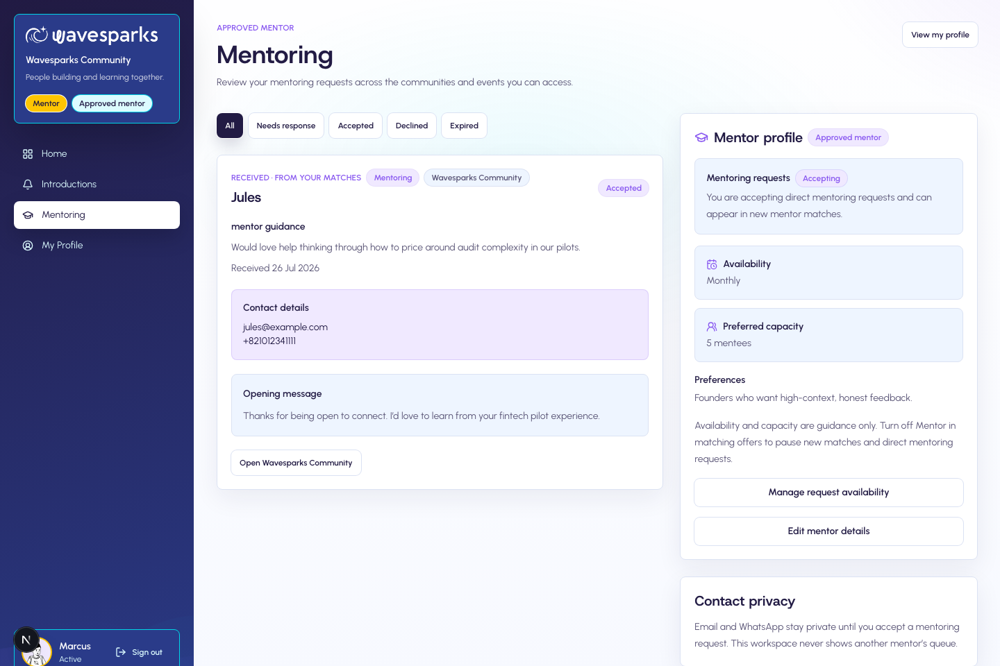
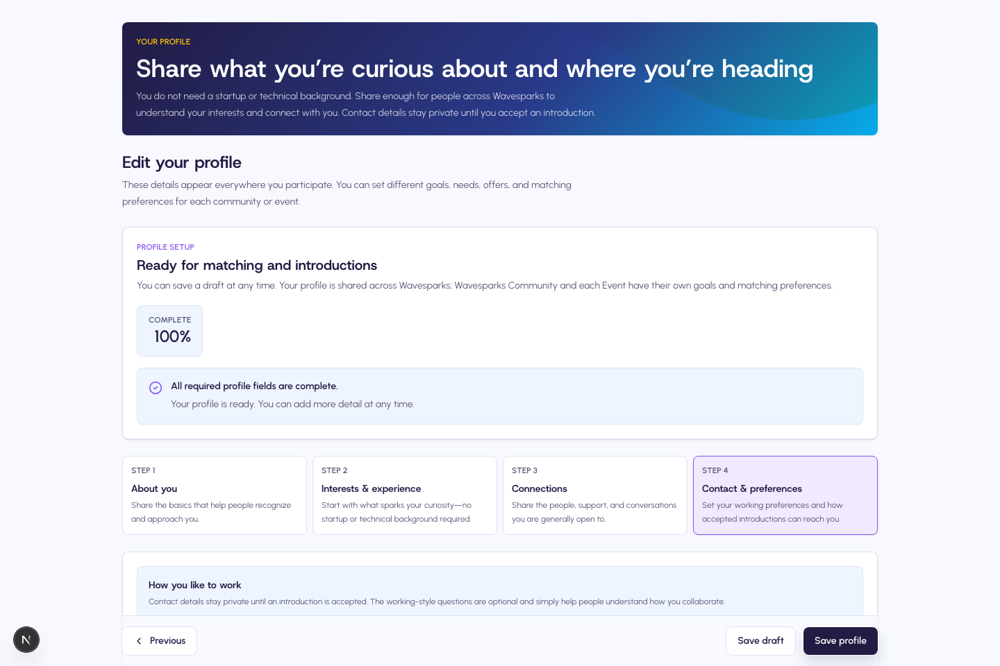
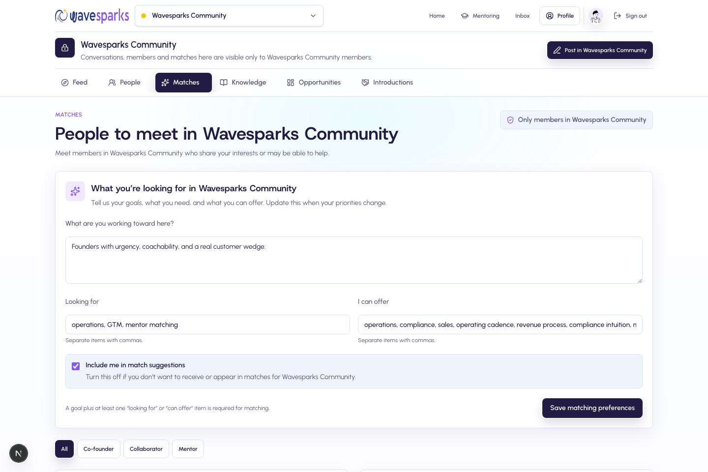

# WaveSparks Community Mentor 使用手册

版本：1.0
审计基线：2026-07-29 代码与当前界面
适用角色：已由组织批准的 WaveSparks Community Mentor

> Mentor 是 Member 身份上的独立认证状态，不是 Admin 角色。除本手册特别说明外，Mentor 也遵循 Member 的访问、Profile、内容和隐私规则。

## 1. Mentor 定位与完整旅程

WaveSparks Mentor 是由组织批准、在获授权 Space 内参与社区互动、展示专业资料、进入 Mentor matching 并接收 Mentoring introduction 的成员。

平台覆盖发现、匹配、请求、同意和联系方式交换；实际辅导安排、沟通、会议记录、目标跟进和成果评估在外部工具中完成。

典型生命周期：

1. Admin 创建或维护成员记录，并授予 `approved` Mentor 状态。
2. Mentor 接受 7 天有效的邀请，用对应已验证邮箱连接账号。
3. 完成 Member Profile 及 Mentor 专属资料。
4. 开启接受 Introduction，并把 `mentor_match` 加入 Offering。
5. 在获授权 Space 中参与社区、发布内容、配置匹配 intent。
6. 被成员发现，收到 General 或 Mentoring introduction。
7. 在 Mentoring workspace 查看队列，在来源 Space 接受或拒绝。
8. Accepted 后交换联系方式，在平台外开展辅导。
9. 根据可用性暂停新请求，持续维护资料和历史记录。
10. Mentor 资格撤销、Space 权限失效或账号删除时按规则退出。

## 2. 身份、权限与进入条件

系统把权限拆成三个维度：

- 组织角色：`member` 或 `org_admin`；
- Mentor 状态：`not_mentor`、`needs_review`、`approved`；
- Space 权限：是否对具体 Space 拥有 `active` access。

只有 `mentor_status = approved` 且账号 `connected` 时，才具备全局 Mentor 能力。进入具体 Space 仍需该 Space 的 active 权限，且 Space 必须为 `upcoming`、`active` 或 `ended`。

Approved Mentor 不自动成为 Admin，不能因此创建 Event、邀请成员、审批账号、导出资料、查看全局分析或执行内容 moderation。Admin 若要像普通成员一样发帖或参与 Matching，也必须显式加入相应 Space。

## 3. 获得 Mentor 身份与接受邀请

当前没有用户自助申请 Mentor 或自动认证流程。Admin 可在邀请成员时直接授予 Approved Mentor，或在成员连接后调整 Mentor 状态。

标准邀请流程：

1. Admin 创建受管成员，选择 Member 或 Approved Mentor，并分配至少一个 Space。
2. Clerk 发送身份邀请；链接有效期为 7 天。
3. 打开 `/org/[slug]/accept-invitation`，注册或登录。
4. 使用与邀请完全一致且已验证的邮箱。
5. 验证成功后，账号从 invited 变为 connected。

新建邀请不能直接设为 `needs_review`。用户不能自行加入 Space、把自己升级为 Mentor，或通过修改前端字段绕过服务端资格检查。

## 4. 完成 Profile 与 Mentor 专属资料

所有 Space 共用同一份全局 Profile。Profile complete 至少需要：

- Preferred name；
- Headline；
- Bio；
- Current focus；
- 至少一种 Looking for 类型；
- 至少一个 Skill tag；
- Introduction email。

Mentor 还应维护：

- Mentoring topics；
- 服务过的创业阶段；
- Functional strengths；
- Mentoring offers；
- Availability；
- Max mentees（0–100）；
- Mentorship preferences；
- 是否接受 Introduction；
- 是否在接受后共享 WhatsApp。

Mentor 专属字段只有在服务端确认 Approved 状态后才会保存。Profile 中的 Introduction email 是介绍联系方式，不会改变 Clerk 登录邮箱。

## 5. 开启或暂停新的 Mentoring 请求

要实际接收新的 Mentoring 请求，需要同时满足：

- Mentor 状态为 approved；
- 账号为 connected；
- `introOptIn` 已开启；
- 全局 Offering 包含 `mentor_match`；
- 目标 Space 权限 active；
- Profile 和该 Space 的 Matching intent 满足相应入口要求。

暂停方式：

- 关闭“接受 Introduction”：暂停所有新的 General 和 Mentoring introduction。
- 从 Offering 移除 `mentor_match`：暂停新的 Mentor matching 和直接 Mentoring request，但仍可保留普通 Introduction。

`maxMentees` 和 Availability 当前用于资料展示及匹配评分，不是系统强制容量上限。没有单独的休假、满员或候补名单状态；达到个人上限时请手动暂停 Offering 或 Introduction。

## 6. 在 Space 中参与社区

My Spaces 显示 Main Space、Your events 和 Past events。进入具体 Space 后，Mentor 和 Member 一样可以：

- 浏览 Feed、People、Matches、Knowledge、Opportunities、Introductions；
- 发布 General update、Question、Resource、Announcement、Opportunity、Looking for cofounder、Looking for mentor；
- 评论与 `@mention`；
- 关注成员、收藏帖子；
- 搜索成员，查看资料；
- 发起 General introduction。

Approved Mentor 发布 Opportunity 时可以使用 Mentor 来源标签。People 页面会展示 Approved Mentor 标识和 Mentor 专业资料。

内容限制与 Member 相同：标题最多 160 字符、正文最多 10,000 字符、评论最多 2,000 字符，最多 4 张 JPG/PNG/WebP 图片且每张 5MB。

当前不能自助编辑/删除帖子或评论，也没有点赞、举报、屏蔽、私信和独立 Project 管理。内容处理由 Admin 完成。

## 7. Mentor Matching

匹配按 Space 独立。Mentor 进入某个 Space 的 Matches 页面后，需要填写：

- Current goal；
- Looking for；
- What I can offer；
- Include me in match suggestions。

至少要有 Current goal，并在 Looking for 或 Offer 中填一项，intent 才完整。

作为 Mentor 匹配候选人通常还需：

- Approved Mentor、账号 connected；
- 当前 Space active；
- 全局 Profile complete；
- 当前 Space intent complete 并开启 Matching opt-in；
- `introOptIn` 与 `mentor_match` Offering 开启；
- Admin 已开启当前 Space 的匹配；
- Space 未归档。

匹配卡的 1–100 Fit index 综合语义、Skills、创业阶段、Availability、工作方式、地点等因素。Mentor 的阶段经验、Availability 和 Capacity 会参与结果。分数不是成功率、公开信誉、服务质量或学员评分。

可以标记 Helpful 或 Not relevant。Not relevant 会隐藏结果并保留 dismissal；当前反馈不是公开评价，也不会即时自动训练权重。

## 8. Mentoring Introduction

### 8.1 请求来源

Mentoring 请求可以从：

- Approved Mentor 的 People 详情页，选择 Mentoring；
- `mentor_match` 类型的匹配卡。

从帖子作者发起的 Introduction 始终是 General，不能伪装成 Mentoring。

服务端会重新确认双方在同一 Space、权限有效、资料完成、目标仍为 Approved Mentor、仍接受 Introduction 且仍提供 `mentor_match`。不能给自己发请求。

同一组织内，同一对成员同时只能有一个 pending Introduction，不论方向、类型或 Space。

### 8.2 请求内容与状态

请求人需要填写 Purpose、Note 和 Suggested opening message。状态为：

- `pending`：等待 Mentor；
- `accepted`：同意并交换联系信息；
- `declined`：拒绝，不交换联系信息；
- `expired`：资格、账号或访问条件失效等情况下由系统过期。

### 8.3 Mentoring workspace

账号级工作台 `/org/[slug]/mentoring` 汇总当前仍可访问 Space 的 incoming Mentoring requests，可按 All、Pending、Accepted、Declined、Expired 筛选，最多读取近期 40 条。

工作台只显示本人收到的 Mentoring 请求，不显示其他 Mentor 队列，也不是 Admin 看板。实际 Accept/Decline 操作在请求来源 Space 的 Introductions 页面完成。

### 8.4 接受或拒绝

1. 打开工作台，确认请求来自哪个 Space。
2. 阅读 Purpose、Note 和开场建议。
3. 进入来源 Space 的 Introductions。
4. 选择 Accept 或 Decline。
5. Accepted 后双方看到 Introduction email；WhatsApp 仅在持有人选择“接受后共享”时展示。
6. 使用双方同意的外部渠道安排首次沟通。

平台没有内置聊天、视频、Calendar 或会议室。接受仅代表同意建立联系，不会创建长期辅导关系记录，也不会授予新 Space 权限。

## 9. 辅导后的工作方式

当前产品不保存以下工作：

- 会议排期、提醒或签到；
- Mentee caseload 看板；
- 辅导目标、行动项和进度；
- 会议纪要或附件；
- 完成/终止辅导关系状态；
- 星级评分、Testimonial 或 outcome 数据。

建议 Mentor 在外部渠道中明确首次沟通范围、时区、会议频率、隐私边界和是否继续合作。不要在公共帖子中发布 Mentee 的敏感信息。

平台内 accepted/declined 历史会保留在账号级 Inbox；即使后来失去来源 Space 权限，部分历史仍可查看。Pending/expired 通常要求仍可访问来源 Space。

## 10. 通知和邮件

Mentoring 使用通用 Introduction 通知类型，主要包括 requested、accepted、declined。还可能收到 Post mention、Comment mention、Admin note、Manual introduction 和 Membership approved。

- 新请求通常由 Resend 发到 Mentor 的 Introduction email。
- 接受或拒绝后通常向请求人发送邮件。
- 发送前会重新检查账号和 Space 权限。
- Resend 未配置时，站内通知仍保留，邮件跳过并记录日志。
- 初始成员邀请由 Clerk 发送，不是 Resend。

当前没有通知偏好中心、Digest、推送、Mentoring 专属预约提醒或逾期跟进，也没有 Mentor 可见的邮件重试入口。

## 11. 数据、分析与导出

Mentor 当前没有个人分析仪表盘或自助导出。没有 Mentee 列表 CSV、Mentoring 请求 CSV、匹配记录导出或个人成效报告。

组织 Admin 可以导出全体成员 Profile 与联系方式，并查看 Mentor Offering。请只填写完成社区运营所需的数据，并遵循所在组织的隐私政策。

## 12. 资格、权限和账号变化

### 12.1 Mentor 资格被撤销

- 不再显示 Approved Mentor 标识和专属资料；
- 不再具备 Mentor matching 资格；
- Pending incoming Mentoring requests 自动变为 expired；
- Mentoring workspace 不可访问；
- 已 accepted/declined 的历史记录不会因此删除；
- 普通 Member 权限是否保留，取决于账号和各 Space access。

### 12.2 Space 权限失效

不能继续访问该 Space 的 Feed、People、Matches 和 pending 请求。已接受或拒绝的记录可能保留在账号历史中，但不会恢复 Space 权限。

### 12.3 Clerk 身份被删除

`user.deleted` Webhook 成功后，本地 Profile 和联系方式被匿名化，账号设为停用，Mentor 状态恢复为 `not_mentor`，关注、收藏、通知和匹配等关联数据删除，pending Introduction 过期。已发布帖子和评论保留，但作者显示 Former member。

应用没有自助退出 Space、删除本地账号或下载个人数据的按钮；需要时联系 Admin，并确认 Clerk 和本地 Webhook 两侧都已完成。

## 13. 隐私与职业边界

- Profile 和互动只向当前 Space 的有效成员开放；公开社交链接会显示在资料中。
- Introduction email 与获授权 WhatsApp 只在 accepted 后向参与双方展示；组织 Admin 仍可为运营查看。
- 头像使用公开资源 URL；不要上传证件、客户资料或保密文件。
- 在接受请求前，先核对 Purpose、边界和可用时间；需要拒绝时可直接 Decline。
- 辅导沟通发生在外部工具，组织应另行确定保密、记录、紧急事件和行为准则流程。
- 当前没有举报或屏蔽入口；出现不当行为时联系 Admin。

## 14. Mentor 当前不具备的能力

- 自助申请、认证或续期 Mentor；
- 自动获得 Admin 权限；
- 创建、编辑或管理 Event；
- 邀请成员或管理参与者；
- 项目 CRUD 或项目管理；
- Mentoring 日程、会话、进度、容量强制执行；
- 平台内聊天、通话或 Calendar 集成；
- Mentor 星级、公开评价、证书或积分；
- 个人分析和 Mentor 数据导出；
- 自助编辑/删除帖子、自助退出 Space 或删除本地账号。

## 15. 常见问题

### 我已经是 Approved Mentor，为什么看不到某个 Event？

Mentor 状态是全局资格，Space access 是独立授权。请让 Admin 检查该 Event 的 active access 和 lifecycle。

### 为什么别人不能给我发 Mentoring 请求？

检查账号 connected、Profile complete、`introOptIn`、`mentor_match` Offering、当前 Space access 和 Space Matching 是否都有效。

### Max mentees 达到上限后会自动停止吗？

不会。该值当前用于展示和评分。请手动移除 `mentor_match` 或关闭接受 Introduction。

### 为什么只能在 Space 中 Accept/Decline？

Mentoring workspace 是跨 Space 汇总视图，最终操作保留在来源 Space，以便重新验证双方权限和请求上下文。

### 接受后在哪里安排会议？

使用交换的邮箱或获授权 WhatsApp，在外部工具中安排。平台当前不提供日历或会话管理。

### Mentor 可以处理不当帖子吗？

只有同时具有 Admin 角色时才可 moderation。否则请把内容和 Space 信息交给 Admin。

## 16. Mentor 快速自检清单

- 我的账号已 connected，Mentor 状态为 approved。
- 我对目标 Space 有 active access。
- Member Profile 七项完成条件已满足。
- Mentor topics、阶段、Strengths、Offering、Availability 和 Capacity 准确。
- 我希望接单时开启 `introOptIn` 并提供 `mentor_match`。
- 每个参与 Matching 的 Space 都单独填写 intent 并 opt-in。
- 我会定期检查 Mentoring workspace 和来源 Space Inbox。
- 我理解 Accepted 后的安排、记录和成果跟进在平台外完成。
- 暂停接单时，我会关闭对应 Offering 或 Introduction。
