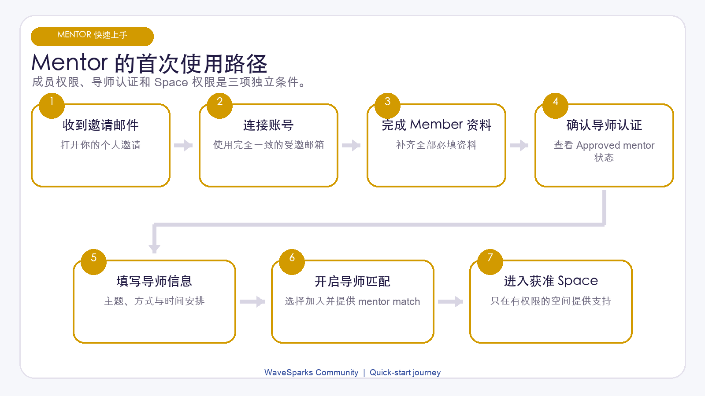
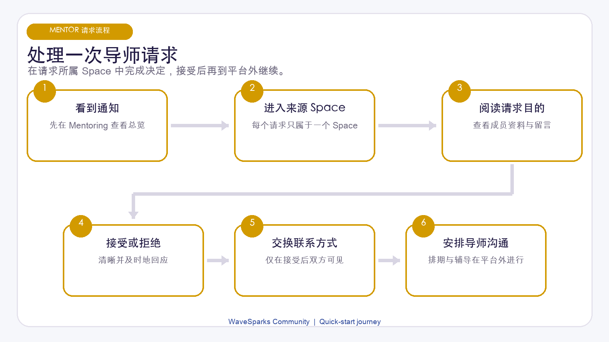

# WaveSparks Community Mentor 快速上手手册

版本：1.1 | 更新日期：2026 年 7 月 29 日 | 适用对象：由组织批准的 Mentor

这份手册会带你从收到邀请邮件开始，一步步完成设置，并处理第一次辅导请求。重点是告诉你接下来该做什么。

> Mentor 同时也是 Member。Mentor 资格会增加辅导相关功能，但不会让你自动成为 Admin，也不会让你自动进入所有 Space。

## 前 20 分钟完成这些事

第一次加入时，按顺序完成：

1. 在 7 天内打开邀请邮件。
2. 使用收到邀请的同一个邮箱注册或登录。
3. 确认账号已连接，并能看到预期的 Space。
4. 完成 Member Profile 的 7 个必填项。
5. 确认 Mentor 状态为 Approved。
6. 填写 Mentor 主题、经验、可提供的帮助和时间安排。
7. 开启 Accept introductions，并在 Offering 中加入 Mentor match。
8. 在每个希望获得推荐的 Space 中设置匹配意向。

## 1. 打开邀请邮件

组织 Admin 会通过邮件邀请你加入 WaveSparks。

1. 在收件箱中找到邀请邮件。
2. 在 7 天内打开邀请链接。
3. 新用户选择注册；已有账号选择登录。
4. 使用与邀请邮件完全一致的邮箱地址。
5. 按提示完成邮箱验证。
6. 继续进入组织页面。

如果链接已过期、邮箱不正确或没有收到邮件，请联系组织 Admin。Admin 可以检查邀请状态并重新发送。

不要用另一个邮箱创建第二个账号。系统需要通过收到邀请且已经验证的邮箱，把你的登录身份与组织成员记录连接起来。

## 2. 确认账号、Mentor 状态和 Space 权限

你能做什么，取决于三个互相独立的条件：

- Member Profile：共享的个人资料必须完成，才能正常参与社区。
- Mentor 状态：组织必须把你的状态设为 Approved，Mentor 功能才会出现。
- Space 权限：Admin 必须把你加入每一个需要进入的 Main Space 或 Event。

例如，即使你已经是 Approved Mentor，如果 Admin 没有把你加入某个 Event，你仍然看不到该 Event。

登录后：

1. 打开 My Spaces。
2. 检查 Main Space 和需要参加的 Event 是否出现。
3. 打开一个 Space，确认其首页可以正常加载。
4. 打开 Profile 设置，查看 Mentor 设置是否出现。
5. 如果缺少 Space 或 Mentor 设置，请让 Admin 检查你的资格和权限。

Mentor 资格不会提供 Admin 控制权。除非另外具有 Admin 角色，否则你不能邀请成员、管理 Event、导出资料或处理社区内容。

## 3. 先完成 Member Profile

Member Profile 是全局资料：在所有可访问的 Space 中使用同一份资料。

请完成以下 7 项：

1. Preferred name（常用姓名）。
2. Headline（个人标题）。
3. Bio（个人简介）。
4. Current focus（当前重点）。
5. 至少一种 Looking for 类型。
6. 至少一个 Skill tag。
7. Introduction email（介绍联系邮箱）。

资料应简短、具体，让别人快速看懂你的经验、当前重点和希望认识的人。

Introduction email 只会在你接受 Introduction 后显示给另一方。修改它不会改变你的登录邮箱。

在这 7 项完成前，你可以浏览部分页面，但 People、Matches、发帖、评论、关注、收藏和发起 Introduction 等功能会受到限制。

## 4. 填写 Mentor 资料

Mentor 状态为 Approved 后，在 Profile 设置中完成 Mentor 部分。

填写或检查：

- Mentoring topics（辅导主题）。
- 可以服务的创业阶段。
- Functional strengths（专业强项）。
- 可以提供的辅导帮助。
- Availability（可用时间）。
- Max mentees（最多 0 到 100 人）。
- Mentorship preferences（辅导偏好）。
- 是否在接受 Introduction 后共享 WhatsApp。

尽量写得具体。例如，“帮助早期 B2B 创始人做销售访谈”比“商业建议”更有用。

如果 Mentor 字段无法保存，先请 Admin 确认 Mentor 状态是否为 Approved。当前没有自助申请或自助批准 Mentor 的按钮。

Max mentees 和 Availability 会帮助别人理解你的可用容量，也可能影响匹配，但达到上限时系统不会自动停止新请求。

## 5. 开启辅导请求

如果希望收到新的 Mentoring 请求，需要开启两个全局设置：

1. 开启 Accept introductions。
2. 在 Offering 中加入 Mentor match。

两个设置作用不同：

- Accept introductions 控制是否接收新的 General 和 Mentoring Introduction。
- Mentor match 控制是否参与 Mentor 匹配并接收直接 Mentoring 请求。

如果要暂停所有新 Introduction，请关闭 Accept introductions。

如果只想暂停 Mentor 匹配和 Mentoring 请求，请从 Offering 中移除 Mentor match；普通 General Introduction 仍可保持开启。

## 6. 在每个 Space 设置匹配意向

每个 Space 的 Matching 设置互相独立。在 Main Space 设置完成，并不会让你自动加入某个 Event 的匹配。

在每一个希望获得推荐的 Space 中：

1. 打开该 Space。
2. 选择 Matches。
3. 填写 Current goal。
4. 在 Looking for 或 What I can offer 中至少填写一项。
5. 开启 Include me in match suggestions。
6. 查看产生的匹配建议。

Admin 还需要为该 Space 开启 Matching。

匹配卡上的 1 到 100 Fit index 会综合资料、意向、技能、经验、可用性等信息。它只是发现合适联系人的辅助指标，不是成功概率、公开评分或服务质量分数。

有帮助时选择 Helpful；不合适时选择 Not relevant 并隐藏。这个反馈是私密的，不是对另一位成员的公开评价。

## 7. 快速认识主要页面

你最常用的页面包括：

- My Spaces：Main Space、当前 Event 和可访问的历史 Event。
- Feed：动态、问题、资源、公告和机会。
- People：成员资料和 Approved Mentor 标识。
- Matches：当前 Space 的匹配建议和 Introduction 操作。
- Introductions：当前 Space 的请求。
- Mentoring：汇总所有可访问 Space 中收到的 Mentoring 请求。

完成 Member Profile 后，你可以像其他 Member 一样发帖、评论、提及成员、关注、收藏和发起 Introduction。

不要在帖子或评论中写入客户或 Mentee 的保密信息。当前 Member 不能自行编辑或删除帖子、评论；需要修正或移除时请联系 Admin。

<!-- pagebreak -->

## 8. 处理 Mentoring 请求

请求可能来自你的 People 资料页或 Mentor match。由帖子作者页面发起的请求始终属于 General Introduction。

收到请求后：

1. 打开通知或 Mentoring 工作台。
2. 记下请求来自哪个 Space。
3. 阅读 Purpose、Note 和建议的开场信息。
4. 判断请求是否符合你的专长、时间和边界。
5. 打开来源 Space 中的 Introductions。
6. 选择 Accept 或 Decline。

Mentoring 工作台会汇总你仍可访问的各个 Space 的 incoming requests。最终 Accept 或 Decline 要在来源 Space 完成，让平台再次确认双方仍有权限。

请求状态很简单：

- Pending：等待你决定。
- Accepted：双方可以看到获准共享的联系方式。
- Declined：请求结束，不交换联系方式。
- Expired：在完成决定前，访问权限或资格发生变化。

Accepted 后，双方都可以看到对方的 Introduction email。只有资料所有者选择“接受后共享”时，WhatsApp 才会显示。

## 9. 在 WaveSparks 之外继续辅导

Accept 表示同意联系，并允许交换联系方式。它不会在平台内创建一套持续管理的辅导计划。

使用邮箱、获授权共享的 WhatsApp 或双方同意的其他工具：

1. 发送简短的自我介绍。
2. 确认第一次沟通的主题和预期结果。
3. 对齐时区、形式和会议时间。
4. 约定保密与沟通边界。
5. 第一次沟通后，再决定是否以及如何继续。

WaveSparks 当前不提供站内聊天、视频会议、日历预约、会议纪要、目标与行动跟进、Mentee 管理、评分或辅导成果报告。

## 10. 持续更新你的可用性

建议每周完成一次：

1. 检查 Mentoring 工作台中的 Pending 请求。
2. 在来源 Space 中完成回复。
3. 检查 Mentor 主题、Offering 和 Availability。
4. 如果目标发生变化，更新相应 Space 的匹配意向。
5. 达到个人容量时，暂停新的请求。

Max mentees 只是参考信息，不是系统强制上限。需要自行移除 Mentor match 或关闭 Accept introductions。

## 11. 了解哪些变化会影响使用

如果 Mentor 资格被撤销：

- Approved Mentor 标识和 Mentor 资料停止显示。
- 不再收到 Mentor 匹配。
- Pending Mentoring 请求会过期。
- Mentoring 工作台不再可用。
- 如果 Space 权限仍有效，普通 Member 功能可以继续使用。

如果某个 Space 权限失效，你不能进入该 Space，也不能处理其中的 Pending 请求。Accepted 或 Declined 历史可能保留，但不会恢复访问权限。

如果账号被删除，个人资料会匿名化，Pending 请求会过期，已有帖子和评论会保留并显示为 Former member。删除账号或退出 Space 目前不是自助操作，请联系 Admin。

## 12. 常见问题处理

### 邀请链接打不开

检查链接是否在 7 天有效期内，并确认使用了收到邀请的邮箱。需要时请 Admin 重发。

### 已登录但看不到某个 Event

请 Admin 确认你是否对该 Event 拥有 active access。Mentor 资格本身不会授予 Space 权限。

### 看不到或无法保存 Mentor 设置

请 Admin 确认 Mentor 状态为 Approved，并且账号已经 connected。

### 别人无法向我发送 Mentoring 请求

逐项检查：Member Profile 已完成、Accept introductions 已开启、Offering 包含 Mentor match、目标 Space 权限有效，并且该 Space 已开启 Matching。

### 能看到请求但不能处理

进入请求的来源 Space，在其 Introductions 页面操作。如果来源 Space 无法打开，请联系 Admin。

### 已达到 Max mentees 但仍收到请求

Max mentees 不是自动上限。请移除 Mentor match 或关闭 Accept introductions。

### 需要举报不当行为或移除内容

联系 Admin，并提供 Space 名称和足以定位内容的信息。除非同时拥有 Admin 角色，否则 Mentor 没有内容处理权限。

## 13. 完成设置前最后检查

- 我使用正确且已验证的邀请邮箱完成了连接。
- 我的账号状态为 connected。
- Member Profile 的 7 个必填项已经完成。
- Mentor 状态为 Approved。
- Mentor 主题、经验、Offering 和 Availability 准确。
- 希望接收新请求时，Accept introductions 已开启。
- 希望接收 Mentoring 请求时，Offering 包含 Mentor match。
- 我对每个需要使用的 Space 都有 active access。
- 每个 Space 的匹配意向和 opt-in 都已单独设置。
- 我知道 Accept 和 Decline 要在请求来源 Space 中完成。
- 我知道会议安排和辅导记录会在 WaveSparks 之外继续。

当 Member Profile 已完成、Mentor 状态为 Approved、目标 Space 可见，并且辅导与匹配设置符合你的当前可用性时，你就可以开始了。
