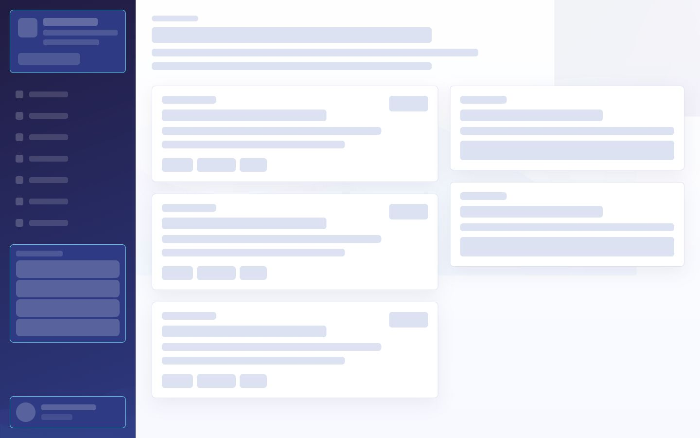
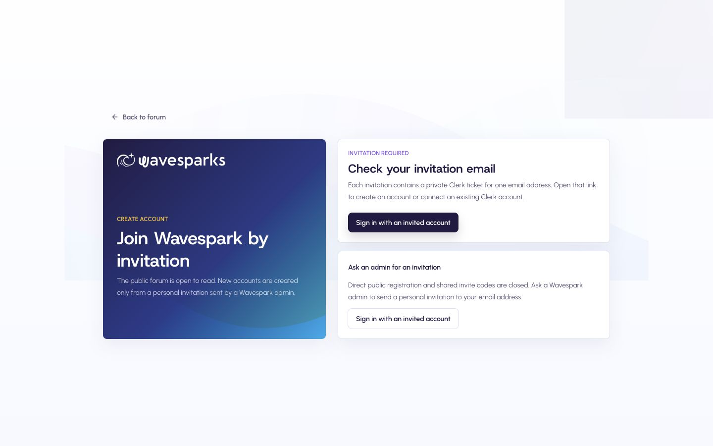
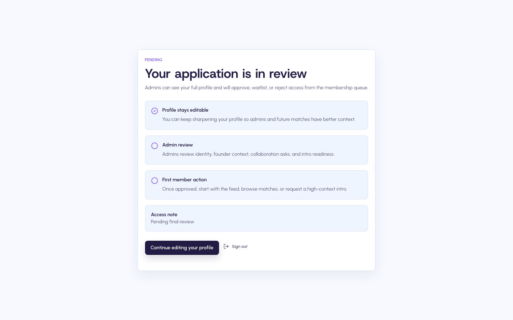
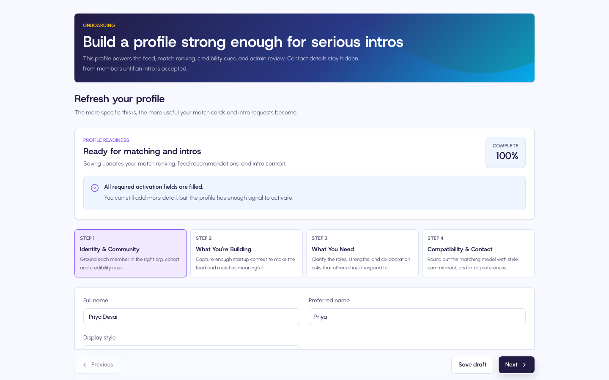
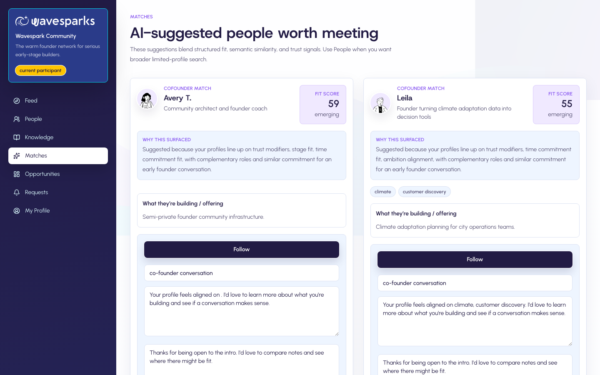
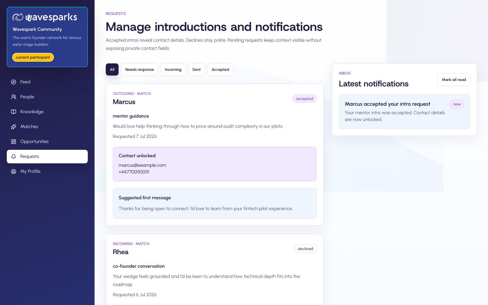

# Wavespark User Lifecycle Guide

This guide covers the complete member journey, from public reading and invitation through onboarding, community participation, introductions, suspension, and account deletion.

All screenshots use synthetic accounts and local test data.

## How account ownership works

Wavespark and Clerk have separate responsibilities:

| Area | System of record |
| --- | --- |
| Sign-in methods, password, primary email, active session | Clerk |
| Wavespark organization membership and role | Wavespark Admin, synchronized to Clerk |
| Application status, profile, posts, matches, and introductions | Wavespark |

Use the account menu to manage your Clerk credentials. Use Wavespark pages for community activity. You do not need to create, delete, or switch organizations in Clerk.

## Lifecycle at a glance

```mermaid
flowchart LR
  A["Read the public forum"] --> B["Receive a personal invitation"]
  B --> C["Open the invitation link"]
  C --> D["Create or sign in to a Clerk account"]
  D --> E["Pending or waitlist"]
  E --> F["Save profile drafts"]
  F --> G["Admin approval"]
  G --> H["Complete required profile context"]
  H --> I["Post, comment, follow, and browse matches"]
  I --> J["Request or receive an introduction"]
  J --> K["Recipient accepts"]
  K --> L["Contact details unlock for both participants"]
```

## 1. Read before joining

The Forum and public post pages are readable without an account. They remain readable if you are signed in but pending, waitlisted, rejected, suspended, or still completing your profile.

Public reading does not include member interaction. Posting, commenting, following, the People directory, Matches, Requests, and introductions require an approved membership and a ready profile.

## 2. Get a personal invitation

Wavespark does not support public registration or shared invitation codes.

1. An Admin enters your name, email, role, and initial community status.
2. Clerk sends a personal invitation to that email address.
3. The invitation link contains a private, expiring ticket.
4. Open the latest invitation email. Forwarded, revoked, expired, or already-used links may not work.

If you did not receive an email, check spam first, then ask the Admin to review your invitation status and use **Resend invite**. Do not register with a different email address.

## 3. Accept the invitation and sign in

Open the invitation link from your email. The link leads to the dedicated Wavespark invitation page and then Clerk:

- If the invited email has no Clerk account, complete account creation.
- If the email already belongs to a Clerk account, sign in to that account.
- If you are already active in another Clerk organization, Wavespark automatically activates the Wavespark organization during the handoff.

After sign-in, Wavespark checks for the local invitation or membership record. An unrelated Clerk account cannot create its own Wavespark membership and receives an access-denied message.

## 4. Understand your membership state

| State | What it means | What you can do |
| --- | --- | --- |
| `pending` | Your application is under Admin review. | Read public content and edit your profile. |
| `waitlist` | Your application is valid, but access is waiting for an opening or cohort decision. | Read public content and edit your profile. |
| `approved` | The membership decision is positive. | Complete the required profile, then use member tools. |
| `rejected` | The current application is closed. | Read public content, review the Admin note, and sign out. |
| `suspended` | Existing member access is paused. | Read public content, review the access note, and sign out. |

The status page explains the current decision and always provides a clear sign-out action.

## 5. Build and save your profile

You can save a draft at any time. Drafts do not unlock member interaction until all required activation fields are ready.

Required fields:

- Preferred name
- Headline
- Startup one-liner
- Startup description
- At least one "looking for" type
- At least one desired role
- At least one skill tag
- A valid email for introductions

Validation rules:

- Email fields must contain a valid email address.
- LinkedIn, GitHub, website, and X links must begin with `http://` or `https://`.
- Numeric values must be whole numbers inside the displayed range.
- Empty required content cannot be used to unlock the community.

When information is missing, Wavespark saves the draft, returns you to the earliest relevant step, and lists the missing fields.

## 6. Enter the approved community

Member interaction requires both conditions:

1. Membership status is `approved`.
2. Profile readiness is complete.

Once both are true, you can publish posts and comments, follow approved members, search the limited People directory, browse Knowledge and member-only Opportunities, review Matches, and use introduction requests.

## 7. Use Matches and People safely

Matches combine structured fit, profile similarity, and community trust signals. A match is a suggestion, not an automatic introduction.

Use **Follow** to prioritize a member's activity. Use an introduction request when you have a concrete reason to meet. Include the conversation purpose, why this person is relevant, and a useful first message.

## 8. Request and accept introductions

An introduction can originate from a match, member profile, post, or Admin-curated connection.

Before acceptance:

- Both profiles remain limited.
- Private email and WhatsApp details stay hidden.
- The recipient can accept or decline with the original context visible.

After the recipient accepts:

- Contact details unlock for the requester and recipient only.
- Other members and Admin list views do not receive those private contact fields.
- Both parties receive an updated request state and notification.

## 9. Privacy and account controls

Use the Clerk account menu to update your primary email, credentials, or account settings. Clerk primary-email changes synchronize back to the matching Wavespark user record.

Wavespark keeps contact details gated unless an introduction is accepted. Public forum content remains readable by design.

If your Clerk account is deleted:

- Your Wavespark user and profile are anonymized.
- Your display name becomes `Former member`.
- Your email is replaced by a unique, non-deliverable placeholder.
- Contact details, Clerk IDs, follows, saves, notifications, matching data, and pending introductions are cleared or terminated.
- Existing posts and comments remain as anonymous community history.

## 10. Sign out

Use **Sign out** in the account or status area. Signing out closes the active Wavespark session but does not delete your Clerk account or community history.

## Troubleshooting

| Symptom | What to do |
| --- | --- |
| Invitation link is invalid | Ask an Admin to confirm the invited email and resend the invitation. |
| Signed in with the wrong email | Sign out and use the exact invited email address. |
| Access says no active invitation | The Clerk account has no matching local Wavespark record. Contact an Admin. |
| You land on another organization | Open the Wavespark sign-in flow again. The handoff should activate Wavespark automatically. |
| Approved but member tools stay locked | Complete every field listed in Profile readiness. |
| Pending or waitlisted | Continue editing your profile and wait for the Admin decision. |
| Suspended or rejected | Review the Admin note. Public reading remains available. |
| Contact details are missing | The receiving member must accept the introduction first. |

## End-to-end member checklist

- [ ] Open the personal invitation email.
- [ ] Create or sign in to the Clerk account for the invited email.
- [ ] Confirm the Wavespark handoff reaches your status or profile page.
- [ ] Save profile drafts and complete every readiness field.
- [ ] Wait for approval if your state is pending or waitlist.
- [ ] Publish or comment after access unlocks.
- [ ] Browse People or Matches and follow useful members.
- [ ] Send a contextual introduction request.
- [ ] Confirm contacts stay hidden before acceptance and unlock after acceptance.
- [ ] Sign out when finished on a shared device.
