# Wavesparks User Lifecycle Guide

This guide explains how invitations, My Spaces, Main Community, Events, profiles, matching, and introductions fit together.

## The model in one sentence

Your Clerk account connects you to Wavesparks, and a separate invitation controls access to each Main Community or Event Space.

| Area | Scope |
| --- | --- |
| Sign-in, password, primary email, session | Clerk account |
| Global role and safety status | Wavesparks organization account |
| Main Community access | Main Community only |
| Event access | That Event only |
| Core profile | Shared across every Space |
| Goal, needs, offers, and matching opt-in | Saved separately in each Space |
| Posts, people, follows, matches, and intros | The current Space |

## Lifecycle at a glance

```mermaid
flowchart LR
  A["Receive a personal invitation"] --> B["Create or sign in to a Clerk account"]
  B --> C["Open My Spaces"]
  C --> D["Read an assigned Event or Main Community"]
  D --> E["Complete the global core profile"]
  E --> F["Post, comment, view People, follow, and request intros"]
  F --> G["Complete intent for this Space"]
  G --> H["Receive AI matches inside this Space"]
  H --> I["Optionally receive separate Main Community access"]
```



## 1. Join by personal invitation

Wavesparks has no public registration or shared invitation code.

An Admin assigns your email to Main Community, an Event, or both. If the email is new to Clerk, Clerk sends a private, expiring account invitation. If you already have a Clerk account, Wavesparks connects it directly and sends a sign-in notification.

Open the newest invitation with the exact invited email. A forwarded, revoked, expired, or already-used ticket may not work. If no email arrives, check spam and ask the Admin to inspect the row-level invitation status or resend it.

You accept the Clerk organization invitation once. After the account is connected, every active Space entitlement already assigned to you becomes available independently.

## 2. Start at My Spaces

After sign-in, `/org/wavesparks` opens **My Spaces**. It does not combine posts from different communities.

The page groups:

- **Main Community** — the permanent invitation-only network
- **Active Events** — upcoming and currently active Events you can enter
- **Past Events** — ended Events that remain available

You may belong to multiple Events and Main Community simultaneously. Each card opens a separate community with its own content, people, and matches.

If you have Event access but not Main access, the Main card shows **Invite only**. It does not reveal Main posts, member names, participant counts, or previews, and it has no self-serve application button.

There is no anonymous community feed. Signing in without an active entitlement does not unlock content.

## 3. Understand independent access

Effective access requires all of the following:

1. Your Clerk organization account is connected.
2. Your account is not globally suspended or deprovisioned.
3. Your entitlement for this exact Space is active.
4. The Space lifecycle permits member access.

Event access never grants Main Community access. Main access never reveals an Event you did not attend. Removing one entitlement does not affect your other Spaces.

### Event lifecycle

| Event state | What you experience |
| --- | --- |
| Upcoming | You can enter when your active entitlement is available. |
| Active | Full Event access according to your profile readiness. |
| Past Event | The date has ended, but content, interaction, and matching continue. |
| Archived | The Event is hidden and member access is closed; its data is retained by Admins. |

Only archive closes a completed Event. A Past Event is still a working community.

## 4. Always know which Space you are using

Community URLs include the Space explicitly:

```text
/org/:orgSlug/s/:spaceSlug/feed
/org/:orgSlug/s/:spaceSlug/people
/org/:orgSlug/s/:spaceSlug/matches
/org/:orgSlug/s/:spaceSlug/knowledge
/org/:orgSlug/s/:spaceSlug/opportunities
/org/:orgSlug/s/:spaceSlug/requests
```

The header shows the current Space name, whether it is Main Community or an Event, its dates, and its lifecycle. Use the Space switcher to move between Main, Active Events, and Past Events.

Compose always displays **Posting to {Space}** before submission. One post belongs to one Space. It is never cross-posted automatically, and its comment thread is not copied elsewhere.

Old organization-level links return to My Spaces unless there is exactly one unambiguous Space you can access.

## 5. Read first, then complete your core profile

As soon as your account is connected and an Event entitlement is active, you can read that Event's content. You do not need to finish onboarding before reading.

Complete the global core profile before you can:

- Publish posts or comments
- View the People directory or member profile details
- Follow another member
- Send an introduction request
- Participate in AI matching

Core profile information includes your identity, professional context, venture information, skills, experience, work preferences, and private introduction contact details. The Profile page explains that changes apply in every Main Community and Event because there is only one core profile.

Private email and WhatsApp details are never used as public directory fields or embedding input.

## 6. Set intent separately in each Space

The Matches page stores a separate Space intent containing:

- Your current goal in this community
- What you are looking for here
- What you can offer here
- Whether matching is enabled here

Completing an intent in one Event does not complete it in another Event or in Main Community. You can opt out of matching in one Space without leaving its content or changing matching elsewhere.

Matching begins only when your core profile is complete, the current Space intent is complete, matching is enabled for that Space, and you have opted in.

## 7. Keep community activity in context

Every feed, People directory, Knowledge item, Opportunity, follow, match, feedback record, and pending introduction belongs to a Space.

- **People in {Space}** lists only active participants in that Space.
- **Matches within {Space}** considers only eligible members in that Space.
- A person you share across two Spaces may produce different matches and explanations in each.
- Following someone in an Event does not follow them in Main Community.
- Adding you to Main does not copy your Event posts, matches, follows, or feedback.
- A saved-post or notification link checks your access again before showing content.

The same global profile may appear in multiple Spaces, but the local intent and local activity stay separate.

## 8. Request and accept introductions

An introduction starts from a match, member profile, post, or Admin-curated connection and retains its source Space. If the same two people share several Spaces, they can still have only one unresolved request at a time.

Before acceptance:

- Private contact details remain hidden.
- The recipient sees the purpose and context.
- The request does not grant access to another Space.

After acceptance, contact details unlock only for the two participants. The accepted introduction remains in private account history even if one participant later leaves the source Space. It still does not grant Main Community, Event, content, or roster access.

## 9. Use the global Inbox safely

Profile and Inbox are account-level so you can reach them from any Space. Content, match, and introduction notifications display a Space label.

Opening a notification rechecks your current account status, Space entitlement, and Space lifecycle. If access was removed or the Event was archived, the linked content remains unavailable even though the notification once existed.

## 10. Main Community invitations after an Event

An Admin may use **Add to Main Community** after an Event. This creates a separate active Main entitlement immediately; you do not accept a second Clerk organization invitation.

Your Event remains unchanged and available according to its own lifecycle. Main starts as a new community boundary with its own feed, people, follows, intent, and matches.

## 11. Suspension, removal, and account deletion

- A Space suspension or removal affects only that Main Community or Event.
- A global account suspension overrides every Space without merging or deleting their rosters.
- An archived Event becomes unavailable to participants but retains its data for administrators.

If your Clerk account is deleted, Wavesparks anonymizes the account rather than rewriting community history. Display identity becomes `Former member`, private contact and authentication data are removed, pending interactions are terminated, and existing posts or comments remain attributed to the anonymized author.

## Troubleshooting

| Symptom | What to do |
| --- | --- |
| Invitation link is invalid | Ask an Admin to confirm the email and create a fresh invitation. |
| Signed in with the wrong email | Sign out and use the exact invited email. |
| My Spaces shows no accessible card | Ask the Admin to verify the destination Space and active entitlement. |
| Main Community is locked | Main requires a separate Admin invitation; Event access does not include it. |
| An expected Event is missing | Confirm its entitlement; archived Events are intentionally hidden. |
| A Past Event is missing | Ask whether the Event was archived rather than ended. |
| You can read but cannot post or view People | Complete every required core-profile field. |
| Matches are unavailable | Complete the core profile and this Space's intent, then confirm matching opt-in. |
| The same person has different matches elsewhere | Matching uses each Space's intent and activity independently. |
| A notification link is denied | Your effective access to its labeled Space may have changed. |
| Contact details are missing | The receiving member must accept the introduction first. |

## Member checklist

- [ ] Open the personal invitation with the exact invited email.
- [ ] Connect the Clerk account and arrive at My Spaces.
- [ ] Confirm only assigned Main Community and Events are accessible.
- [ ] Read the current Space and verify its name in the header.
- [ ] Complete the global core profile before interacting.
- [ ] Complete a separate intent in every Space where you want matches.
- [ ] Confirm posts, follows, matches, and intros stay in their source Space.
- [ ] Treat Past Events as active communities unless they are archived.
- [ ] Confirm private contacts stay hidden until an introduction is accepted.
